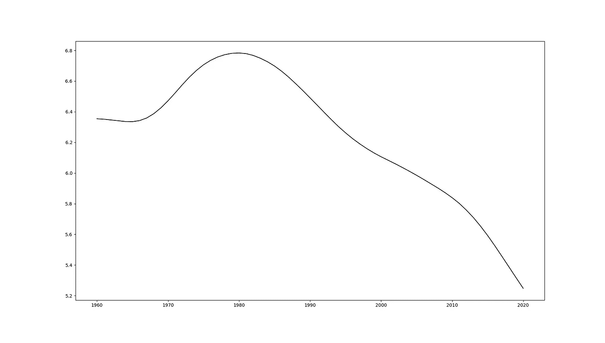
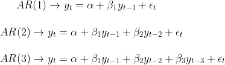
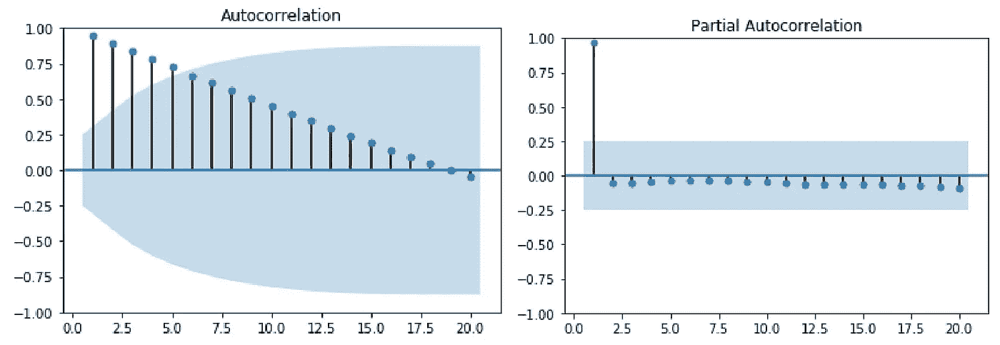
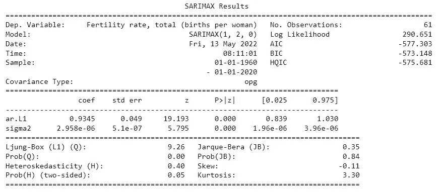

# Arima 模型的时间序列分析

> 原文：<https://medium.com/codex/time-series-analysis-with-arima-models-cc2dc937f411?source=collection_archive---------7----------------------->

图片来源: [Hakom](http://Hakom.at)

时间序列分析包括分析一段时间内的数据。例如，分析一种加密货币从 1 月到 12 月的趋势，预测非洲国家未来 5 年的 GDP，分析一个国家过去 50 年的生育率等。这是数据科学家必须掌握的一项重要技能，因为许多现实生活中的数据都与时间相关。它应用于多个领域，包括医药保健、金融和气象。

## 读取和浏览数据

[**熊猫**](https://pandas.pydata.org/) 库对于读取和探索 python 中的数据是高效的。当读取时间序列数据时，使用 [**parse_dates**](https://pandas.pydata.org/pandas-docs/stable/reference/api/pandas.read_csv.html?highlight=read_csv) 参数来指示日期时间列是很重要的。pandas 的 [**DateTime**](https://pandas.pydata.org/pandas-docs/stable/reference/api/pandas.to_datetime.html?highlight=to_datetime#pandas.to_datetime) 函数也可以用于已经加载的数据。

数据探索是时间序列数据获得数据概貌的必要步骤。数据通常使用线图来可视化，这有助于检查趋势和季节性。例如，上面导入的数据图显示了多年来的下降趋势。描述性统计，如平均值和标准偏差，也被计算以了解数据的性质。

图片来源:作者

## 平稳性和扩展的 Dickey-Fuller 检验

平稳时间序列是均值和方差不依赖于时间的时间序列数据。数据不具有趋势性或季节性。然而，大多数时间序列数据是非平稳的，因为它们具有趋势性和季节性，并且依赖于时间。对于上面使用的例子，数据是不稳定的，因为它有一个趋势。由于预测非平稳数据是困难的，所以对数据进行变换以使其平稳。

识别非平稳数据最常用的方法是使用一种称为**增强 Dickey-Fuller 检验** (ADF)的统计检验。零假设是时间序列不是平稳的，这对于小于 0.05 的 p 值是不成立的。

差分通常用于将非平稳时间序列转换为平稳时间序列。差分时间序列只是从当前时间序列中减去先前的时间序列，在数学上表示为:δ**yₜ=yₜ-yₜ₋₁.**有时，我们可能需要多次应用差分来获得平稳性。

## AR (p)模型

自回归(AR)模型使用过去的观察值作为回归方程的输入来预测下一步。根据时间序列的性质，它们可以是由 p 表示的不同顺序。选择正确的 AR(p)会产生最佳模型。

自相关和偏自相关图(ACF 和 PACF)通常用于选择 AR 模型的正确阶数。当 PACF 在滞后 p 处截止时，ACF 缓慢“衰减”

图片来源:作者

基于上面的 ACF 和 PACF 图，我们可以推断 AR 模型具有阶 p=1，因为 ACF 图缓慢衰减，而 PACF 图在滞后 p=1 时截止。

## MA(q)模型

q 阶移动平均模型 MA(q)将下一个观测值预测为过去观测值的平均值。使用 ACF 和 PACF 图也可以获得 q 值。PACF 曲线缓慢衰减，而 ACF 曲线在滞后 q 处截止

## **ARMA (p，q)模型**

有时，单独使用 AR(p)或 MA(q)模型可能就足够了。但是，可能需要将这些模型结合起来，形成自回归移动平均模型 ARMA(p，q)。p 和 q 的值是使用 ACF 和 PACF 图通过应用分别用于导出 AR(p)和 MA(q)的相同原理来选择的。

**ARIMA (p，d，q)车型**

ARIMA 代表自回归综合移动平均线。对于平稳的时间序列数据，ARMA 模型就足够了。然而，对于非平稳时间序列(在大多数现实生活数据中占主导地位)，ARIMA 模型更为理想。ARIMA (p，d，q)中的 I(d)指定了在时间序列中实现平稳性所需的差分次数。该模型用于根据以前的观察结果进行预测。在 Python 中，我们可以利用[**stats models**](https://www.statsmodels.org/stable/index.html)**中的[**SARIMAX**](https://www.statsmodels.org/dev/generated/statsmodels.tsa.statespace.sarimax.SARIMAX.html)**函数来计算时间序列数据的 ARIMA。该函数也可用于 SARIMA 模型，该模型适用于具有季节性的时间序列数据。****

****应用于数据的 ARIMA 模型可以根据生成的结果进行评估。**结果摘要**显示统计摘要，如 Prob(JB)、Ljung-Box (L1)、Prob(Q)等。此外，它还提供了碱性信息准则和贝叶斯信息准则。在使用 ACF 和 PACF 图计算模型的阶数之后，通常的做法是使用其他阶数来测试 ARIMA 模型，以检查具有最佳预测结果的模型。****

********

****一种流行的方法是计算每个模型的 AIC 和 BIC。一般的经验法则是，AIC 和 BIC 越低，模型越好。通常，AIC 更适合选择最佳预测模型，而 BIC 更适合选择最佳解释模型，因为它会降低模型的复杂性。****

> ****在这篇博文中，我们探讨了使用 ARIMA 模型和统计工具进行时间序列预测的方法，例如增强的 Dickey Fuller 检验、使用碱性信息标准和贝叶斯信息标准进行差分和模型评估。使用的代码和数据可以在[这里](https://github.com/awojidetola/Time-Series-Forecasting-with-Arima)找到。****