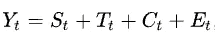
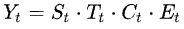
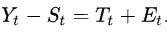
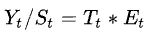

# 时间序列数据分解

> 原文：<https://medium.com/codex/time-series-data-decomposition-b51819f15e23?source=collection_archive---------3----------------------->

[乔治·莫里纳](https://www.pexels.com/@georgemorina)图片来自免费图片

时间序列是在连续的等距时间点上列出或索引的一系列数据点。时间序列用于统计学、信号处理、模式识别、计量经济学、数理金融学、天气预报、地震预测、脑电图、控制工程、天文学、通信工程，以及大量涉及时间测量的应用科学和工程领域。

时间序列是面板数据的一种类型。两者之间的关键标识符是维度，因为面板数据是多维的，而时间序列数据集是一维的面板。如果时间数据字段使数据不同于其他记录，则该数据集是时间序列数据集，而如果时间数据字段需要一个与时间无关的附加标识符来使记录不同于其他记录，则它清楚地表明它是面板数据集。与时间无关的标识符可以是航班号、图书 id、学生 id、员工 id 等。

时间序列可以分解成更小的组成部分，这将更容易让我们深入了解数据。通过分解，我们可以分别分析每个组成部分，更深入地了解数据集有助于更好地预测，即借助现在和过去的数据预测未来。

时间序列的分解可以用时间序列模式和噪声来完成。

**时间序列模式具有趋势性、季节性和周期性。**

## 趋势:

趋势是时间图中时间序列的模式，它显示了数据相对于时间的移动。有 3 种趋势:

1.  **上升趋势:**此处数据形态运动将向上。
2.  **下降趋势:**此处数据模式将向下移动。
3.  **水平/静止趋势:**此处，数据模式没有移动或静止。

电影上映后不久，它会有一个上升趋势，然后几天后或一个月后，它会有一个水平趋势，后来，它会有一个下降趋势。t 时刻的趋势分量表示为 Tt，通常被认为是长期趋势。

## 季节性:

当时间序列中的模式在一个固定的时间间隔内出现变化时，这种变化被称为季节性。季节性可以是每年、每月、每周、每天或一天中的特定时间。季节模式总是固定的或者有一个已知的长度。

为了理解季节性，时间序列可以用季节图来表示。无需将时间图分解为季节图，就能让他们理解潜在的季节模式。例如，如果我们绘制几年的股票价格，时间图将显示每年的季节性，但每年的季节性图可以通过显示在剩余部分中更明显的尖峰来显示每月的季节性，这些尖峰在早期可能不可见。时间 t 的季节性分量表示为 St

零售额通常在 9 月至 12 月间增长，在 1 月至 2 月间下降。

## 循环:

周期性成分是指围绕趋势的波动。与具有固定和已知长度的季节性模式不同，周期性模式没有固定的周期，持续时间通常至少为 2 年。在时间 t 的循环分量表示为 Ct。

## 噪音:

噪声是指时间序列中除趋势、季节性和周期性之外的剩余成分，它描述随机或不规则的影响。时间 t 的不规则分量表示为 e t。

有了这些时间序列组件，我们可以创建加法或乘法模型。

## 加法模型:

在相加模型中，所有分解的成分加在一起，这是一个线性模型。

其中 Yt 是时间点 t 的数据

## 乘法模型:

在该模型中，所有分解的分量相乘，并且本质上是非线性的。乘法分解在经济时间序列中很常见。

其中 Yt 是时间点 t 的数据

## 季节性调整:

季节模式总是固定的或有一个已知的长度，它有时会妨碍或误导对一个系列的解释。一旦这些被移除，那么就可以对**非季节性**成分进行更好的分析。

季节性调整是去除时间序列中季节性成分的方法。该方法依赖于用分解的组件创建的模型。通常在分解中趋势和周期性被结合在一起称为趋势-周期性或者有时甚至被称为**趋势**，即使它有周期性成分。所以我们可以把 Tt 和 Ct 合并成 Tt。

如果是相加模型，则从原始时间序列中减去季节性成分，

Tt 是 Tt 和 Ct 的结合

在乘法模型中，原始时间序列除以季节分量。

然而，乘法模型可以通过执行对数函数转换成加法模型。

季节性调整的几种方法有 X-13-ARIMA、X-12-ARIMA、MoveReg(用于周数据)、STAMP 等

**感谢阅读！！！！如果这篇文章对你有帮助，欢迎鼓掌，分享和回复。**

## 参考

[https://en.wikipedia.org/wiki/Time_series](https://en.wikipedia.org/wiki/Time_series)