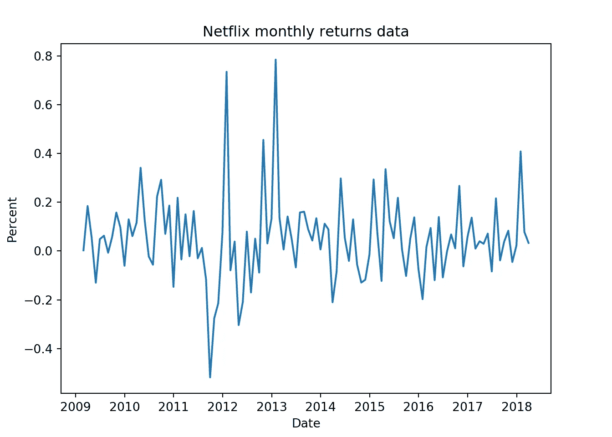
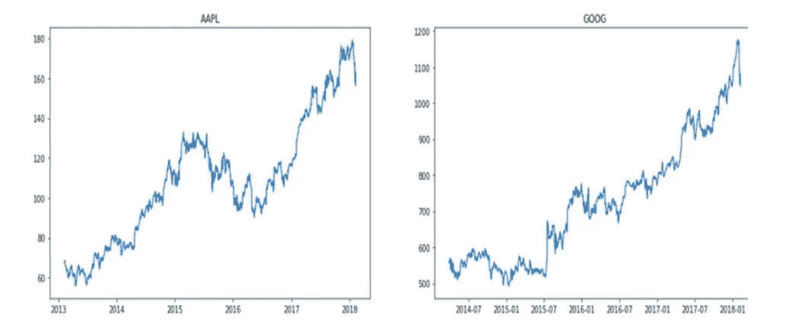
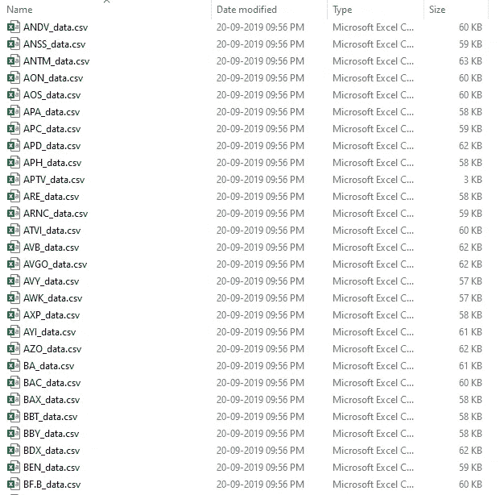
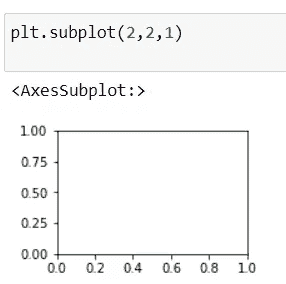
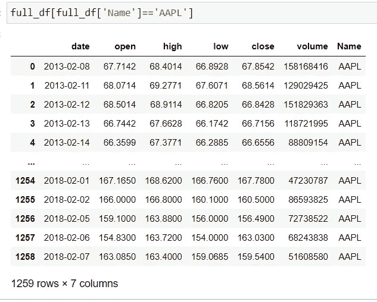
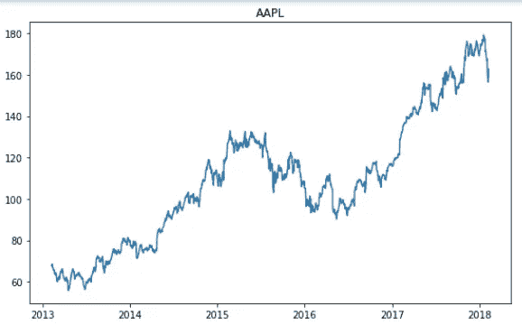

# 时间序列项目(股票市场案例研究)

> 原文：<https://medium.com/codex/time-series-project-stock-market-case-ae14b04c17d1?source=collection_archive---------3----------------------->

杰里米·贝赞格在 [Unsplash](https://unsplash.com?utm_source=medium&utm_medium=referral) 上的照片

在本帖中，我们将对股票市场进行分析。在 S&P，代表着。标准普尔 500 指数，简称标准普尔 500，是一个跟踪在美国上市的 500 家大公司股票表现的股票市场指数。

## 什么是时间序列？

所以简单来说，时间序列就是一系列按时间顺序索引的数据点，或者你可以说。时间序列是**通过在一段时间内重复测量获得的定义明确的数据项的观察值的集合**。例如，测量一年中每个月的零售额将包含一个时间序列。

那么，你能对这些股票数据做什么样的分析呢？假设你要分析每只股票在一周内的日收益率。

**分析每日回报**

假设你在 y 轴和 x 轴上有年收益。如您所见，我们在 2013 年看到了最高的百分比，在 2012 年年中，您看到了最低的值。这是一种可以对数据进行的分析。

## 比较股票价格

你可以做的另一个分析是对比股价，这是对每个股票公司的另一种分析。所以不浪费时间，让我们开始吧。

**下载数据集**

Kaggle 下载- [点击我](https://www.kaggle.com/datasets/singole/stocks-data-individual-stock-5-years)

为了简单起见，代码是从我的 [Jovian 个人资料中嵌入的。](https://jovian.ai/shubhamingole/notebooks)

# 1.分析股票收盘价和成交量趋势

**导入必要的库**

**创建我们的主数据框**

如果您出于简化和节省时间的目的查看我们的数据库文件，我们将每个公司的 CSV 文件分开。我们现在将重点分析排名前四的公司:'**亚马逊**，' '**微软**，' '**谷歌**和**苹果。你可以选择所有的公司或者你喜欢的任何一家。**

我们总共有超过 500 家公司的数据

将 4 家公司的数据合并成一个。

**数据的形状**

**数据类型:**

如果你看下面的图片，日期列的数据类型是错误的，这是一个对象类型。我们需要将数据类型指定为日期时间。

**将数据类型更改为日期时间**

## 分析所有股票的收盘价

让我们开始写第一份问题陈述。为此，我们的数据集中总共有 4 只股票；我们将分析与日期相关的每个数据集的收盘价，以便我们可以从图表中看到哪一年的收盘价是低还是高。

存储公司的名称

绘制图形

让我们来理解上面的代码。

在第一行中，我们定义图形大小。

第二行是`for i,company in enumerate(tech_list,1):`,我们用枚举函数进行循环，如果你在第一次迭代中通过了 tech_list，它将给出 i=1 和 company = 'AAPL '。

第 3 行 `plt.subplot(2,2,i)`我们正在绘制一个空图，其中 i =1

为了更好地理解，我手动将 i=1 放到 showcase 中

第四行`df= full_df[full_df['Name']==company]`对于每家公司，我们正在创建一个名为 df 的临时数据框，如果你能想象它会像下图这样。

第 5 行`plt.plot(df['date'],df['close'])`在这一行，我们只是使用临时数据框名称 df 绘制 plt。

第 6 行`plt.title(company)`它只是给我们的图表起了个标题，在第一次迭代中，它给出的图表将会是这样的

这是第一次迭代，同样的方式，循环将再次循环，并给出所有的输出。

从上图可以看出，2016 年年中收盘价有所下降。

**2。分析每天交易的股票总量**

为此，我们将使用 **Plotly**

如果你需要查看 2015 -2017 年的交易量，你可以画一个正方形，然后自动放大它，每月获得更多细节。

请查看下面的视频，了解如何使用它。

# **2。分析每日回报**

问题陈述

1.  分析股票的每日价格变化
2.  分析封闭特征的月均值

让我们读一下数据集，我们将只处理亚马逊的一个数据集。

正如我们所看到的，没有告诉我们每日价格变化的特征

我们正在创建一个新的栏目，告诉我们每天的价格变化。让我们看看数据集是什么样子的。如您所见，添加了一个新列。

**让我们也来看看每日回报率的百分比**

使用我们之前导入的 Plotly，我们将绘制图表

通过这个我们可以知道哪一年的回报是最低和最高的。

## 分析封闭特征的月均值

我们将使用同一个数据库，我们将只制作数据库的副本，这样原始数据集就不会受到干扰。

将作为对象的日期列转换为日期时间。

**重置索引到当前日期**

我们将索引设置为日期。假设您想要获取某个时间间隔的日期，我们可以很容易地传递日期范围并获取它，如下所示。

**用每月的平均值重新采样数据**

重采样用于按照时间间隔采样我们给定的范围值。如果你想了解更多关于重采样的信息，请观看下面的视频。

[**点击我查看视频**](https://youtu.be/l4dvMiSDBzs)

是时候绘制数据了

正如我们在图表中看到的那样，收盘价格不断上涨。中间有一些落差。

**根据年份重新取样**

# 3.执行多变量分析

问题陈述

1.  分析这些科技公司的股价是否相关。
2.  分析每只股票的每日回报，以及它们之间的相互关系。
3.  科技公司的风险价值分析。

## 分析这些科技公司的股价是否相关

我们总共有 4 家公司，所以我们将一起分析它们，看看科技公司之间是否有任何相关性。

我们将分别导入所有数据集，以便我们可以合并该公司的所有收盘价是否相关。

让我们定义一个空数据集，这样我们就可以将上述所有公司的收盘价联系在一起并进行分析

如果你看到下面，我们现在有每家公司的所有收盘价单独在一列，现在很容易绘制图表

我们正在绘制结对图

绘制热图

如果你看一下上面的图表，就会发现亚马逊、谷歌和微软之间有很高的相关性。这意味着我们可以说，如果任何一家公司的股价下跌，有 97%的机会，其他两家公司的股价也会下跌。

你也可以考虑数据集中的其他公司，自己进行分析。

## 分析每只股票的每日回报，以及它们之间的相互关系。

为了分析日收益率，我们必须分别计算每只股票的日收益率，为此我们将使用公式**((收盘价-开盘价)/收盘价*100)。**

我们将使用 4 家公司的相同数据集

首先，我们创建一个名为 **data** 的空白数据名称，然后我们使用上述公式计算每只股票的日收益率。将对每种股票分别执行这一步骤。

绘制结对图

**热图**

正如我们从上面的热图中看到的，谷歌和亚马逊的每日回报之间有很好的相关性。我们也可以看到一些微软和谷歌。

## 科技公司的风险价值分析。

让我们绘制一个分布图来看看数据的创建

通过这个，我们可以知道我们 68 %的数据在第一个标准差之间

我们的第二个标准差告诉我们，95%的数据位于-2.37 到 2.37 之间

我们的第三个标准差告诉我们，99.7%的数据位于-3.56 到 3.56 之间

**让我们检查一下我们的分位数值**

所以它会返回我-1.42，基本上就是说，90%的时间里，我的每日损失不会超过这个-1.42。这就是这个分位数的基本结论。

这都是我今天的观点。尝试探索数据。尽量多考虑不同的股票，从你这边分析。我希望你喜欢这个博客，并从它中学到一些东西。

一定要关注，喜欢，分享

谢谢你

**参考**

威风凛凛—[https://jovian.ai/shubhamingole/notebooks](https://jovian.ai/shubhamingole/notebooks)