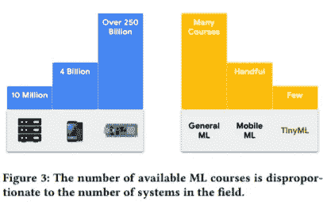

# TinyML 是机器学习中最被低估的领域，这就是为什么

> 原文：<https://medium.com/codex/tinyml-is-the-most-underrated-field-in-machine-learning-and-this-is-why-7076aed78b4f?source=collection_archive---------13----------------------->

## TinyML 有着非凡的潜力来重塑我们的现在和未来

Robynne Hu 在 [Unsplash](https://unsplash.com?utm_source=medium&utm_medium=referral) 上的照片

哈佛大学和谷歌一个月前发布的这项研究表明:

> TinyML 方法消除了传统 ML 的障碍，例如合适的计算硬件的高成本和数据的可用性。- Reddi 等人，利用 TinyML 拓宽应用机器学习的途径，2021 年

关于这一点:嗨，伙计们，我是安娜·布劳恩，你们大多数人都知道我是人工智能和人工智能的狂热爱好者。每天都有人问我，哪个机器学习子领域在职业前景方面最好，或者最适合初学者。事实上，这是一个非常重要且难以回答的问题，因为 ML 的许多子领域似乎正在成为趋势，无论是计算机视觉、语音识别等等。今天，我在这里向你展示一个你可能还没有听说过的人工智能子领域，它包含了所有的人工智能流行词，并有可能重塑我们的现在和未来: **TinyML** 。

在这篇博文中，你将了解到:

*   你为什么要关心 TinyML？
*   TinyML 是什么？
*   TinyML 和普通 ML 有什么区别？
*   TinyML 怎么用？
*   为什么要学 TinyML？

# 你为什么要关心 TinyML？

可用的 ML 课程数量与该领域的系统数量不成比例([来源](https://arxiv.org/pdf/2106.04008.pdf))

在全球范围内，嵌入式设备的数量远远超过云和移动设备的数量(如图 3 所示)。有超过 2500 亿个嵌入式设备，这是一个有 10 个零的数字。除以地球上的 79 亿人，这意味着地球上每个人有 31.6 个嵌入式设备。**事实上，在这个地球上，嵌入式设备的数量是云设备的 25000 倍。让那件事深入人心。**

现在，假设我们想在这些设备上运行一个 ML 模型，这是一个很好的想法，因为嵌入式系统通常携带许多传感器，并聚集大量数据。但是现在它变得棘手了:大多数 ML 课程只关注一般的 ML，它不能用于嵌入式系统(在这篇博文的后面会有更多的介绍)。这意味着，大多数 ML 工程师不知道如何在嵌入式设备中实现他们的 ML 模型。只有少数课程包含移动 ML，而专注于 TinyML 的课程就更少了。事实上，我只遇到过一个好的和几个灾难性的。

总之，在嵌入式设备中使用 ML 有很大的潜力，但是很少或者根本不知道如何实现这一点。让我们改变这一点。

由[萨汉德·巴巴里](https://unsplash.com/@sahandbabali?utm_source=medium&utm_medium=referral)在 [Unsplash](https://unsplash.com?utm_source=medium&utm_medium=referral) 上拍摄的照片

# TinyML 是什么？

微型机器学习(TinyML)是一个新兴领域，位于机器学习和嵌入式系统的交叉点。嵌入式系统是一种计算设备，通常很小，或者很小，以极低的功率运行，能够依靠像硬币电池这样的东西运行几天，几周，几个月，有时甚至几年。
你看，TinyML 包括算法、硬件(专用集成电路)、能够执行片上传感器(视觉、音频、IMU、生物医学等)的软件。)以极低的功耗(通常在 mW 范围及以下)进行数据分析，从而支持各种不间断使用案例，并以电池供电设备为目标。

马库斯·温克勒在 [Unsplash](https://unsplash.com?utm_source=medium&utm_medium=referral) 上拍摄的照片

# TinyML 和普通 ML 有什么区别？

现在，为什么我们不能将通用 ML 用于所有设备，包括嵌入式设备？

机器学习是一个已经存在了一段时间的时髦词，对于需要理解的混乱数据有许多有用的应用。机器学习应用无处不在，它们需要大量数据。你在 Medium 上的每一次互动都被输入到一个 ML 算法中，以便更好地预测你想在这个平台上消费哪些内容，以及你喜欢哪些创作者。

机器学习所需的这些海量数据通常存储在“云中”，这意味着在全球某个地方的大数据中心。数据中心很棒，它们支持强大的计算能力，并提供高带宽。

然而，它们有一个显著的缺点:**高延迟**。这意味着如果你想访问运行在数据中心的任何 ML 应用程序，你必须首先把数据发送到那里，因为它在很远的地方。
数据中心提供了大量的计算能力，但这需要时间。

此外，数据中心还有许多其他特征，这些特征不一定是缺点，而是局限性:

云 ML 系统对比移动 ML 系统对比 TinyML 系统([来源](https://arxiv.org/pdf/2106.04008.pdf))

正如你从这个表中看到的，基于云的 ML 系统通常运行在 CPU 上，需要大量的内存，惊人的存储量，大量的能量，并且成本很高。这些是**大量的资源**。运行在 CPU 上的移动 ML 系统具有明显更低的功耗和价格，但也具有更少的内存和存储。当谈到 TinyML 时，事情变得非常有趣。如您所见，TinyML 系统运行在 MCU 或微控制器单元上。这些微型处理器基本上不花钱，而且**需要的电力比基于云的 ML 系统少 5000 倍。但是它们的可用内存和存储也比 CPU 或 GPU 少得多。正如你所看到的，微控制器在功率和价格方面都很棒，但你已经可以假设在其上部署 ML 会有点棘手，因为它们只有这么少的存储空间。**

然而，ML 的这些挑战可以很容易地通过各种技术来解决，我将在我的下一篇博客文章中向您展示。

照片由[思想目录](https://unsplash.com/@thoughtcatalog?utm_source=medium&utm_medium=referral)上的 [Unsplash](https://unsplash.com?utm_source=medium&utm_medium=referral)

# TinyML 怎么用？

让我们用一些例子来说明 TinyML 的清晰定义，这会让您对这个主题更加感兴趣:

1.  也许你听说过美敦力公司开发的世界上最小的心脏起搏器 Micra。想象一下，如果这个设备有机器学习功能，它可能会主动告诉你你的心脏在做什么，或者为你做些什么，让你过上更好、更健康的生活。
2.  再举个例子:想想埃隆·马斯克在用 Neuralink 做什么。Neuralink 旨在将芯片植入人脑内部，以便它们能够发送信号来了解大脑活动。通过测量神经元发出的电信号，我们也许能够了解我们大脑的情况。通过这样做，我们也许能够治愈疾病，比如治疗抑郁症。
3.  这是另一个例子:木薯每天为超过 5 亿非洲人提供食物。然而，这种作物不断受到各种疾病的侵袭。所谓的 Nuru app 帮助农民识别和治疗这些疾病。通过在手机上使用 TensorFlow Lite 运行机器学习，该应用程序无需访问互联网即可实现实时缓解，而访问互联网是许多偏远农民的关键要求。[ [3](https://grow.google/intl/europe/story/transforming-farmers%E2%80%99-lives-with-just-a-mobile-phone) ]

Micra 和 Neuralink 的芯片植入物有什么特别之处？嗯，你可能不想每天晚上拿出你的起搏器来充电，就像你用你的智能手机一样。这意味着，我们常见的机器学习技术不足以解决这些用例。这就是 TinyML 的用武之地。

照片由[莱昂](https://unsplash.com/@myleon?utm_source=medium&utm_medium=referral)在 [Unsplash](https://unsplash.com?utm_source=medium&utm_medium=referral) 上拍摄

# 为什么要学 TinyML？

现在，您已经了解了 TinyML 是什么，为什么它有很大的相关性，如何将其与常规 ML 区分开来，以及 TinyML 的惊人用例。为了让您对这个主题更加感兴趣，我现在将解释为什么您应该从今天开始学习 TinyML:

1.  **TinyML 适合所有人:** TinyML 非常适合初学者，让他们接触 ML。TinyML 对于有经验的 ML 实践者来说也是很棒的，可以扩展他们的技能集，以有效地设计微小的模型，将它们部署在微小的设备上，以及这样做需要什么软件栈。
2.  TinyML 提供了比普通 ML 更多的用例，因为它可以在更多的设备上使用，如上图所示。
3.  关于 TinyML 的知识很少:普通 ML 的课程和学习资料比 TinyML 多得多。这意味着学习 TinyML 更难，但它仍然是可能的，如果你有关于 TinyML 的知识，你在你的职业生涯中有很大的优势，因为这种知识是如此罕见。因为 TinyML 上的在线信息非常少，所以我在 YouTube 和 Medium 上开始了一个新的系列，为您提供将 TinyML 模型实际部署到微型设备上所需的所有信息，所以如果您还没有订阅，您一定要订阅，这样您就不会错过以下几集。
4.  **TinyML 使你能够创建更环保的 ML 算法:**在这篇 2019 年的[论文](http://arxiv.org/abs/1906.02243)中，麻省大学的研究人员对训练多个像 GPT-2 这样的大型 AI 模型进行了生命周期评估。他们发现，这个过程可以排放超过 626000 磅的二氧化碳，相当于 **~普通汽车**一生排放量的 5 倍(这还包括汽车本身的制造)。故事寓意:ML 有大问题；目前一点都不环保。学习 TinyML 会给你很多关于创建更小模型的实践和知识，需要更少的能量**[2](https://arxiv.org/pdf/1906.02243.pdf)**】****

**我希望这篇博文能让你兴奋地学习更多关于 TinyML 的知识！欢迎在评论中告诉我，你对 TinyML 有哪些问题，你对这个新兴领域有什么特别感兴趣的！**

**来源:**

**Vijay Janapa Reddi、Brian Plancher、Susan Kennedy、Laurence Moroney、
Pete Warden、Anant Agarwal、Colby Banbury、Massimo Banzi、Matthew Bennett、Benjamin Brown、Sharad Chitlangia、Radhika Ghosal、Sarah Grafman、Rupert Jaeger、Srivatsan Krishnan、Maximilian Lam、Daniel Leiker、Cara Mann、Mark Mazumder、Dominic Pajak、Dhilan Ramaprasad、J. Evan Smith、Matthew**

**[ [2](https://arxiv.org/pdf/1906.02243.pdf) ] *Emma Strubell，Ananya Ganesh，Andrew McCallum:NLP 中深度学习的能源和政策考虑，在计算语言学协会(ACL)第 57 届年会上。意大利佛罗伦萨。2019 年 7 月***

**[ [3](https://grow.google/intl/europe/story/transforming-farmers%E2%80%99-lives-with-just-a-mobile-phone) ] *只用一部手机改变农民的生活，谷歌博客帖子***