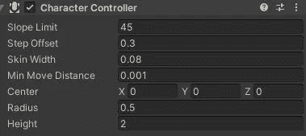
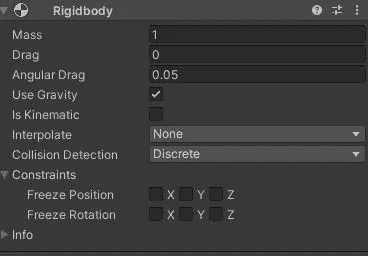
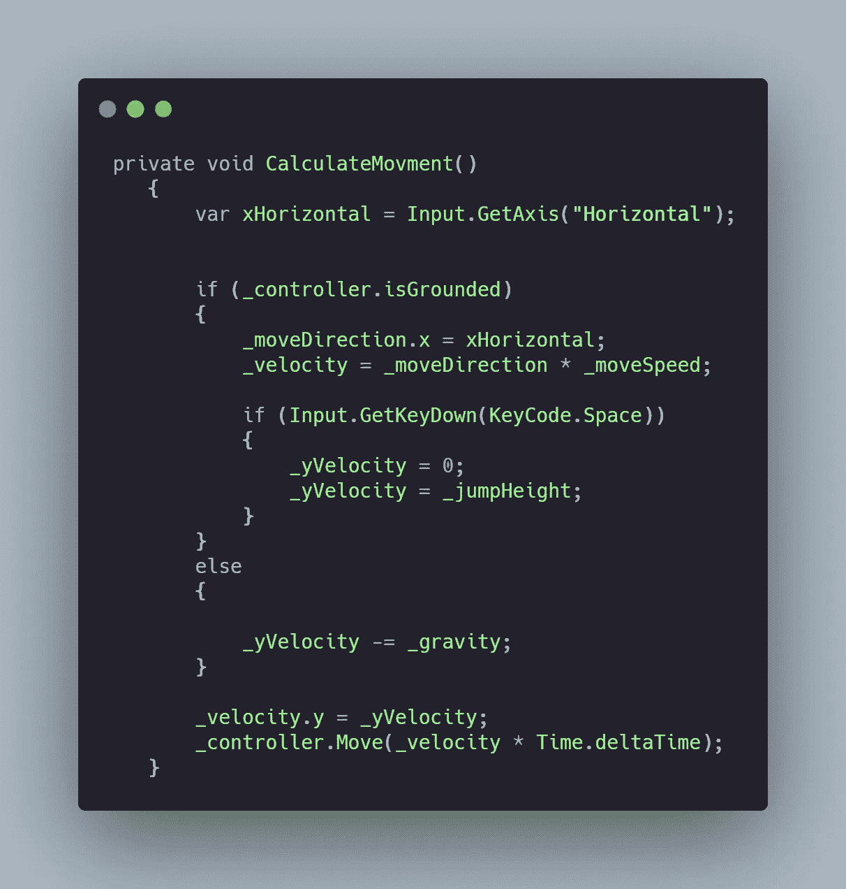
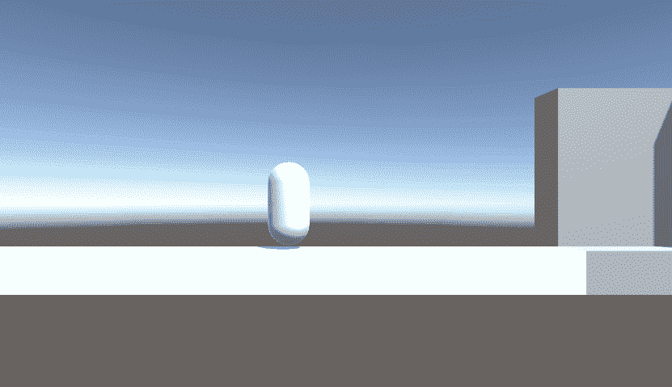

# 日积月累:Unity 中的角色控制器

> 原文：<https://medium.com/codex/tip-of-the-day-character-controller-in-unity-4516644f695?source=collection_archive---------1----------------------->


约书亚·阿拉贡在 [Unsplash](https://unsplash.com?utm_source=medium&utm_medium=referral) 上拍摄的照片

一旦开始一个新项目，你可能要做的第一件事就是研究你的虚拟形象的动作，问题就来了。我应该使用角色控制器还是刚体？

## 两者的区别:



两者的主要区别在于控制的自由度。角色控制器给你的玩家一些速度和一个碰撞器，但是没有物理，而刚体控制器控制你的玩家的物理。



换句话说，通过使用角色控制器，你要对发生在你的角色身上的每一个物理交互负责。你必须编码所有的东西。使用刚体移动化身允许 unity 控制物理交互。

## 如何设置一个角色控制器？

角色控制器有一个非常方便的方法叫做“移动”，它采用一个可以乘以速度的方向向量。

首先你必须给你的播放器添加*角色控制器*组件，然后创建一个 C#脚本来控制移动。

1.  让我们创建一些变量:
    A-Speed 控制玩家速度
    B-jump height 控制玩家能跳多高
    C-Gravity(-1)添加重力物理
    D-两个私有向量 3s，方向和速度
    E-最后一个 float yVelocity 控制 y 轴的速度

2.抓住角色控制器，这样我们就可以控制它

```
CharacterController _controller;private void Awake()
    {
        _controller = GetComponent<CharacterController>();    
    }
```

3.在更新中，设置将在 x-asis 上返回玩家输入的 float

```
var xHorizontal = Input.GetAxis("Horizontal");
```

4.控制器给你一个手的方法来查看玩家是否被接地，我们将使用这个方法来允许玩家在地板上移动和跳跃。
伪代码:将方向向量的 x 轴赋给水平输入，然后基于速度赋速度。

```
if (_controller.isGrounded)
        {
            _moveDirection.x = xHorizontal;
            _velocity = _moveDirection * _moveSpeed;
```

5.为了跳跃，我们在接地时检查玩家输入，将 yVelocity 重置为 0，然后将其设置为 jumpHeight。这将使你跳得更平稳，并抵消跳跃瞬间的重力。

```
if (_controller.isGrounded)
        {
            _moveDirection.x = xHorizontal;
            _velocity = _moveDirection * _moveSpeed;if (Input.GetKeyDown(KeyCode.Space))
            {
                _yVelocity = 0;
                _yVelocity = _jumpHeight;
            }
        }
```

6.在从控制器调用 Move 方法之前，如果没有固定，请确保将重力应用到 yVelocity，最后在所有这些操作之后，将速度向量的 y 轴指定给 yVelocity。

最终的动作代码应该是这样的。



从这里开始，您可以通过使用"*OnControllerColliderHit*"方法，在此基础上进行扩展，添加一个双跳，甚至是一个翻墙跳。

