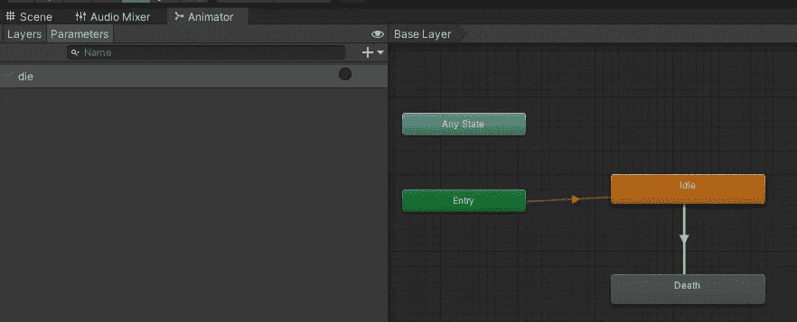
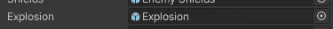
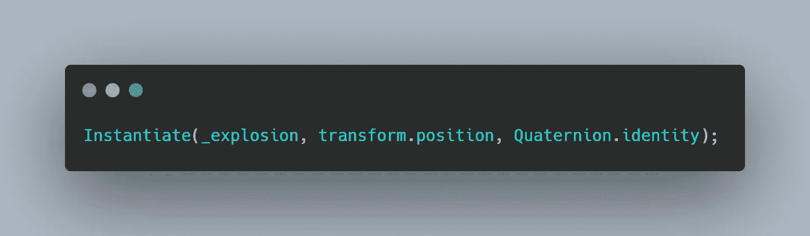
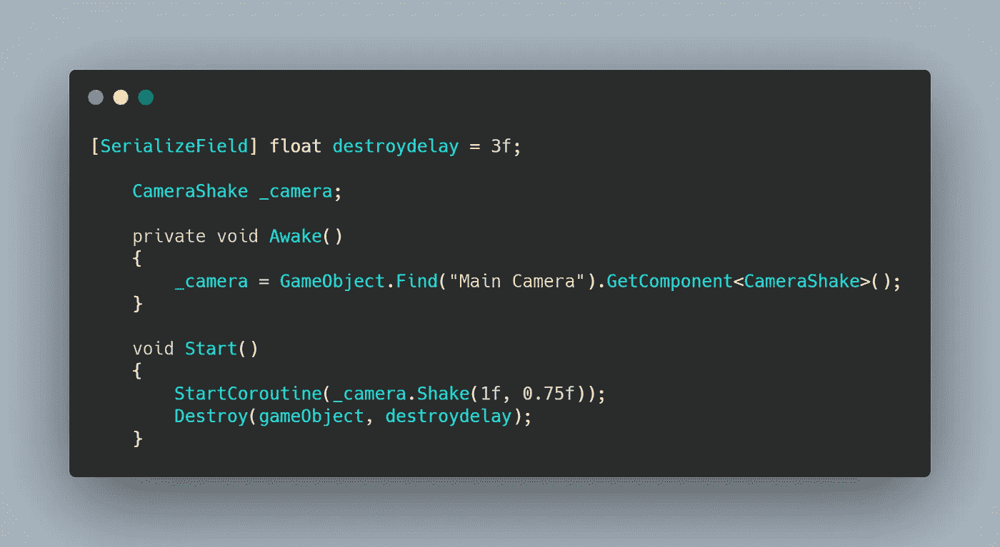
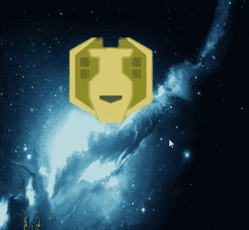

# 日积月累:让他们在 Unity2D 中爆炸

> 原文：<https://medium.com/codex/tip-of-the-day-make-them-blow-up-in-unity2d-c0f3911d16bd?source=collection_archive---------19----------------------->

每个游戏最好的部分之一就是杀死敌人。更好的是让它们爆炸。使用太空射手迷你项目，这里有两个快速的方法来做到这一点。

## A.使用精灵表动画

如果你有敌人爆炸的精灵表，你可以用 Unity 动画来设置它。我们已经在这篇[动画文章](/codex/tip-of-the-day-putting-life-in-sprite-in-unity2d-6694f5182f4b)中涵盖了。



用一个参数来触发死亡爆炸

## B.预设和实例化爆炸

在这种情况下，您有一个预先制作的爆炸(或者是动画爆炸，或者是在粒子系统中制作的爆炸，我们将在后面介绍如何制作)。


首先创建一个空的游戏对象，将你的爆炸附加到它上面，然后预设它。(非常重要:预制它)

在你的敌人脚本中，序列化一个游戏对象——调用 is _ explosion——并在检查器中将预设附加到它(不要在场景中附加爆炸，但预设爆炸或这将不起作用)

```
[SerializeField] GameObject _explosion;
```



附加爆炸预制件

在敌人的死亡方法中，实例化爆炸，因为这将允许它存在于等级中，即使在敌人被摧毁之后。



例如，您可以用不同位置偏移量实例化任意多次。

这是一个非常重要的步骤，为了避免爆炸造成层级混乱并保持流畅的游戏性能，创建一个特殊的脚本，其唯一目的是在短暂延迟后摧毁爆炸游戏对象。您可以在任何需要的地方使用这个脚本。



在这里，我们通过简单的相机抖动将它个性化为爆炸。[请随意查看这里的文章。](https://novusxdev.medium.com/tip-of-the-day-simple-2d-camera-shake-in-unity-521d454ac89b)



让它爆炸