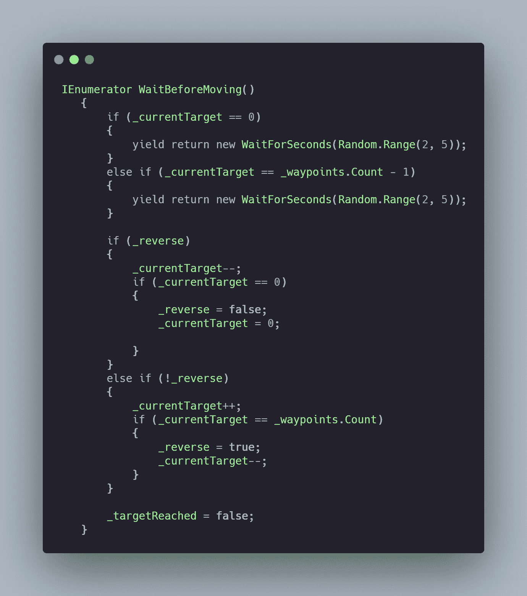

# 日积月累:Unity3D 中的模块化 AI 航路点系统

> 原文：<https://medium.com/codex/tip-of-the-day-modular-ai-waypoint-system-in-unity3d-9c14ca30a1ef?source=collection_archive---------12----------------------->

在你的游戏中，很多时候你希望你的敌人在两个或更多点之间的某个区域巡逻，也许让他们在移动到下一个路点之前停一会儿。


> 让我们看看如何实现这一点！

首先，让我们开始为敌人 AI 创建一个新的 C#脚本，它将负责移动你的敌人。(这种方法取决于你的游戏在你的关卡中使用导航网，在你的敌人身上使用导航网代理。)

现在获取 NavMeshAgent 并创建一个包含航路点的列表。

```
[SerializeField] private List<Transform> _waypoints;NavMeshAgent _agent;private void Awake()
    {
        _agent = GetComponent<NavMeshAgent>();
    }
```

同样，让我们创建一个 int“_ current target”并将其设置为 0。这将代表我们创建的列表的索引。因此，在开始时，当前航点索引为 0，这是第一个航点。

```
private int _currentTarget = 0;
```

让我们考虑一下我们将在更新方法中应用的逻辑。

1.  我们需要检查检查器中是否设置了航路点
2.  如果有航路点，那么我们告诉 navMeshAgent 将敌人移动到 _currentTarget 索引(开始时将为 0)
3.  我们需要知道敌人是否在目标航路点的一定距离内，那么他已经到达了目标
4.  我们需要知道下一个航路点是什么


为了知道下一个航路点，我们将创建一个协程“WaitBeforeMoving”。*这里的逻辑是什么？*

1.  让我们创建一个 bool 并调用 is _reverse，以便让敌人在路点之间正确循环。
2.  如果 AI 是第一个和最后一个点，我们让他等一会儿(如果你想让他在每个点都停下来，你可以改变这一点)
3.  如果他没有倒车，我们增加航路点索引
4.  如果他在倒车，我们就减少航路点索引。



从这里，你可以很容易地扩展这个方法，例如有一个警告状态，或者基本上你想要的任何东西。这只是骨干。