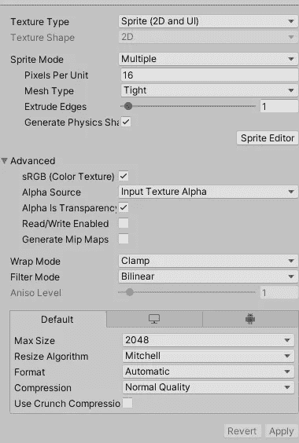

# 日积月累:在 Unity2D 里给雪碧注入生命

> 原文：<https://medium.com/codex/tip-of-the-day-putting-life-in-sprite-in-unity2d-6694f5182f4b?source=collection_archive---------20----------------------->

Unity 2D 引擎使用应用于游戏对象的精灵来赋予它们形状和纹理。通常精灵是一个简单的不动的图形图像。

雪碧中的雪碧系列

为了给精灵制作动画，你需要创建一个精灵表。sprite sheet 基本上是一个包含几个较小图像的图像，其中每个图像基本上是动画中的一帧。使用 Unity Animation 组合这些图像可以使角色或对象具有动画效果。

> 那么，你将如何制作这些精灵的动画呢？

A.选择你的 sprite 表，并确保纹理类型设置为 Sprite(2d & UI)，然后进入 Sprite 编辑器。在编辑器中，您可以手动分割每个图像，也可以让 unity 自动分割。

B.打开动画窗口，选择要制作动画的游戏对象，并确保附加了精灵渲染器，然后在动画窗口中单击创建动画。

C.这是简单的拖放精灵，你切片的精灵到动画窗口，并调整他们的速度。

拖放动画

D.现在不用进入太多的细节，在创建动画之后，Unity 将创建一个 Animator 控制器，它将是父对象上的一个组件。打开动画窗口，在那里你可以调整动画播放的条件。这里有一个例子:

您可以为通过代码控制的每个动画过渡设置参数

Unity 动画系统非常友好，易于使用，通过足够的练习，你可以用它做许多令人惊奇的事情。

