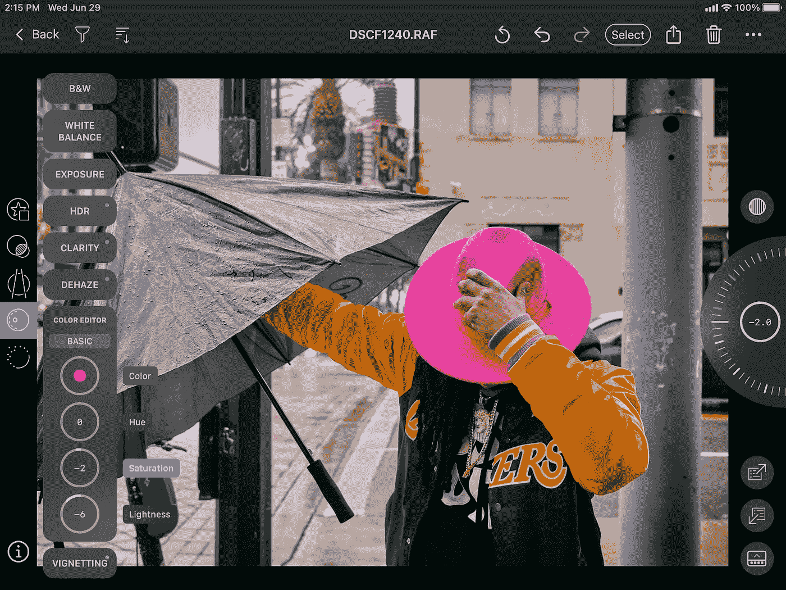

# 在 iPad 上快速使用新的 Capture One 应用程序的提示

> 原文：<https://medium.com/codex/tips-for-a-fast-start-with-the-new-capture-one-app-on-the-ipad-f1a301583fbd?source=collection_archive---------5----------------------->

在 iPad mini 5 上用 Capture One 编辑图片。照片由德里克故事。

终于！捕捉一个图像处理软件已经移动化。

多年来，Mac 上的 C1P 一直是我最喜欢的 RAW 处理器，尤其是在编辑我的富士 X100V 照片时。现在，他们用 iOS 版的 Capture One 为 iPad 带来了同样的高标准。