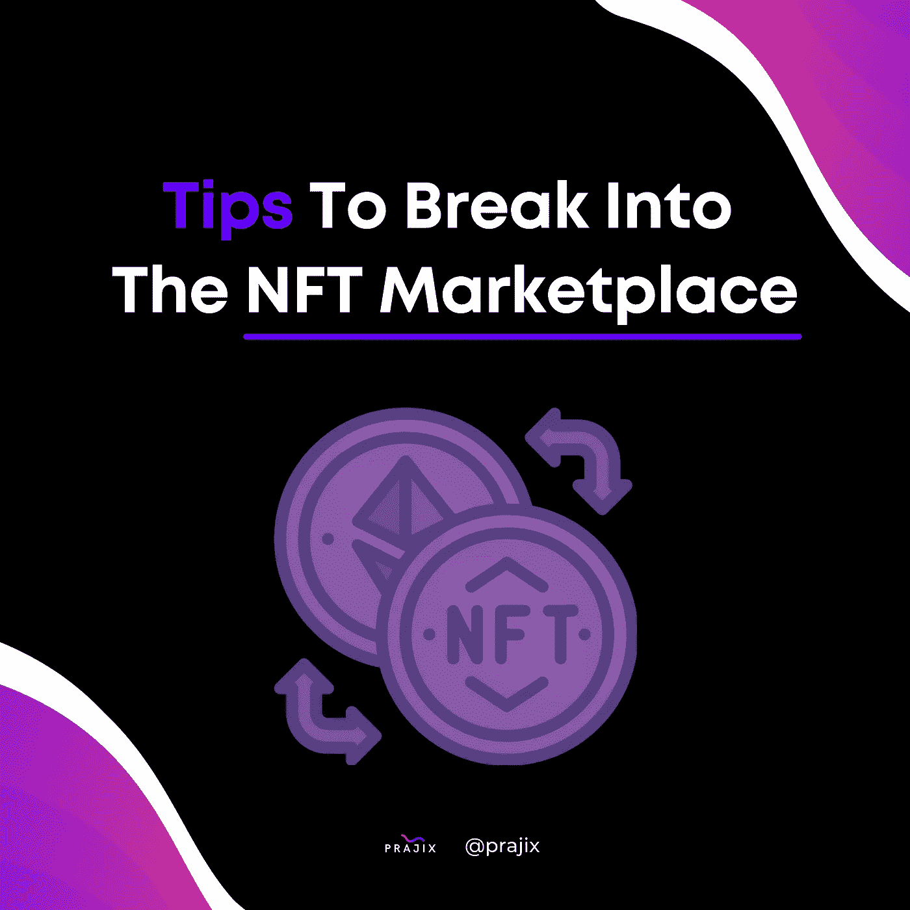

# 打入 NFT 市场的秘诀

> 原文：<https://medium.com/codex/tips-to-break-into-the-nft-marketplace-b5067d32709a?source=collection_archive---------20----------------------->

NFT(不可替代的代币)现在是一种受欢迎的商品，一些艺术品的售价高达数百万美元。这一趋势为各种背景的设计师、数字创作者和艺术家创造了新的激励，让他们以前所未有的方式从自己的作品中获利。世界各地的艺术家都在试图找出他们如何打入这个行业，并开始为他们的才华得到补偿。我们为雄心勃勃的创造者们整理了一份建议清单，告诉他们如何在广阔的 NFT 交易市场立足。

**顶级平台**

**OpenSea**

目前最受欢迎的数字交易平台。OpenSea 易于导航，拥有 150 多个可接受的支付令牌，是进入 NFT 市场的理想起点。

**稀有**

一个灵活的平台，不仅接受艺术，而且视频，收藏品和音乐可以在这里交易。唯一的问题是，Rarible 要求用户使用其建立在以太坊区块链上的个人加密令牌 RARI 进行交易，这个令牌在 OpenSea 上是可以接受的。你可以信任 Rarible，因为它与 Adobe 合作，以确保 arists 创作的安全性。

如果你正在阅读这篇文章，我相信你对区块链领域感兴趣，所以我们写了一篇文章，带你了解如何成为一名区块链开发者。更好的是，我们甚至写出了关于 [**如何开发区块链网络的步骤**](/me/stats/post/197bb864e1cd?source=main_stats_page) 供那些在特定职业道路上前进的人使用。

**超级罕见**

艺术、视频和 3D 图像都可以在 SuperRare 的多面交易平台上交易。他们要求创建者用他们自己命名的加密令牌进行交易。SuperRare 正着手利用其代币建立一个充满活力的市场，并吸引最杰出的人才。

**阿协商场**

Axie 因其沉浸式和梦幻般的用户体验而脱颖而出。Axie Marketplace 是视频游戏 Axie Infinity 的在线平台。用户使用 NFT 作为 axis，神话生物，他们可以被训练来对抗其他用户的 axis，并获得胜利奖励。你可以控制你的 Axies 去统治别人，占领土地，建立你的帝国。

你将需要使用他们的加密令牌，Axie Infinity 令牌(又名 Axie 碎片)，这是使用以太坊区块链建造的，可以在广泛的 NFT 市场上交易。

**如何销售 NFT**

创建一个以太币钱包:以太币钱包是一个网上银行账户，你可以在里面储存以太币。确保你的钱包支持 [ERC-21。](https://eips.ethereum.org/EIPS/eip-721)

您可以在 MyEtherWallet 上注册，下载密钥库文件，设置您的私钥，并保存您的 EtherWallet 文档以进行身份验证。

之后，你只需将钱存入你的钱包，在 NFT 市场应用程序上创建账户并链接你的钱包，然后开始交易。

**营销你的 NFT:**

建立一个社区:除了最流行的社交媒体网站，在 BitCoinTalk、Telegram 和 Medium 等网站上创建账户，分享关于 NFT 交易的教育帖子。通过回复评论和帮助他们解决最紧迫的问题，与你的追随者保持联系。

在多个应用程序/网络上列出 NFT:广撒网，增加出售你的 NFT 的机会。

问我任何问题会话:由于 NFT 仍然是一个相对较新的概念，所以不乏困惑的旁观者试图获得对该行业更全面的了解。你可以在 Youtube、Instagram、抖音等视频平台上举办这些会议。

**其他提示**

参与 NFT 社区

跟随你欣赏的有潜力成长和发展的艺术家。加入 Silva 和 ThankYouX 主持的聊天，与 NFT 艺术家建立关系。

要真诚

随着 NFT 市场继续大幅增长，市场的竞争力将继续增强。现在，随着设计的涌入，创造真正的保持独特的 NFT 是你的首要任务。流行代币的衍生作品如此之多，以至于它们完全迷失在其中。如果你能创造出适合你所选择的市场的特别出众的 NFT，那么你就有机会成功。

有关更多信息:

[https://www.entrepreneur.com/article/366540](https://www.entrepreneur.com/article/366540)

[https://www.singlegrain.com/marketing/nft-marketing/](https://www.singlegrain.com/marketing/nft-marketing/)

[https://www . fool . com/the-ascent/crypto currency/NFT-market places/](https://www.fool.com/the-ascent/cryptocurrency/nft-marketplaces/)

**什么是 Prajix？**

对你来说，掌握编码世界的最好方法是把这个世界放在你的指尖。我们的使命是让世界各地的开发者通过在线协作来彻底改变我们希望拥有的未来。

我们允许开发人员在我们的平台上创建或加入项目想法，他们可以在我们的协作室中找到志同道合的个人进行团队合作。

我们正努力将全世界最有价值的程序员、编码员和开发人员的网络建设到一个地方，创建一个技术发电站，帮助全球的个人和社区。

如果你对此感兴趣或者想了解更多，请访问我们的网站:[https://www.prajix.com](https://www.prajix.com)