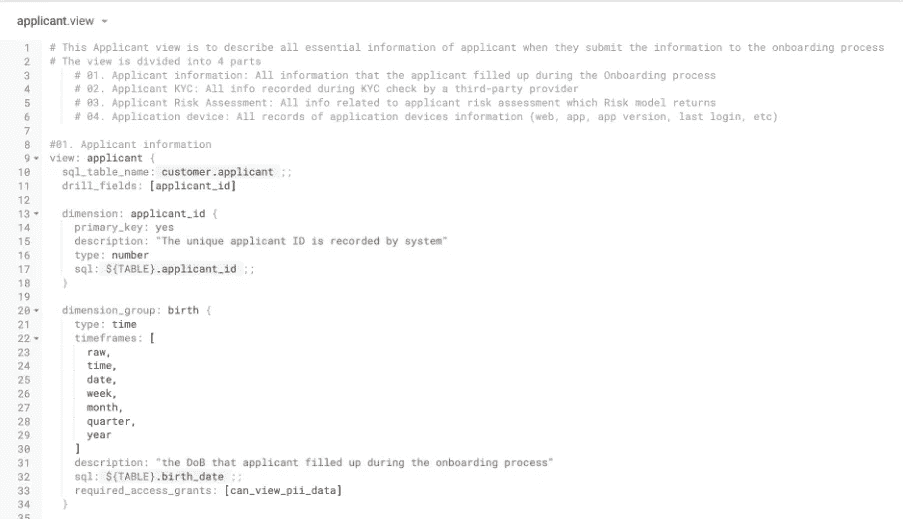

# 掌握 LookML 代码的技巧

> 原文：<https://medium.com/codex/tips-to-master-lookml-code-14cc93b91ded?source=collection_archive---------4----------------------->

一个旺所有 BI 工具，个人认为， [**Looker**](https://www.looker.com/) 是我最喜欢的一个。由于 Looker 在 2019 年被谷歌收购，现在是 GCP(谷歌云平台)的一部分，其功能越来越实用。在这篇文章中，我将分享我的最佳技巧来提高 [**LookML 代码**](https://cloud.google.com/looker/docs/what-is-lookml#lookml_is_case-sensitive) 技能。让我们打开你的开发模式，检查你是否有这些做法。

查看[更多关于 LookML](https://cloud.google.com/looker/docs/what-is-lookml#lookml_is_case-sensitive) 和 [LookML 概念](https://cloud.google.com/looker/docs/lookml-terms-and-concepts)的基本信息

# **1。仅建立有效的维度和度量**

Looker 是一个自助工具。我们的目标是构建内部用户(我们的同事)可以轻松使用的最佳可视化工具。有时，数据(来自数据源的表)可能很大，但是，LookML 开发人员的工作是确定哪些度量(维度和度量)是重要的。

> 总是问“这个尺寸(或度量)是必要的吗？”，“这是在别的地方出现的吗？”

**明智选择维度的两大优势:**

*   节省时间:当字段在同一个浏览器中多次出现时，我从内部用户那里得到了许多令人困惑的反馈。
*   **节约成本:**人有不同的方法可以得到相同的结果。当内部用户在不同的视图中使用相同的维度时，成本会高得多。

比如我有 2 个表**快照 _ 用户**和**用户 _ 日常**。 **Snapshot_user** 描述的是最近一次(今天)所有用户的信息，而 **user_daily** 描述的是每天所有用户的信息(例如:同一个用户 A 周一消费了 20 美元，周二消费了 30 美元，周三消费了 40 美元)。

但是，两个视图都有用户的姓名和用户的出生日期。将会发生不同的查询(假设 PII 不是我示例中的一个因素):

> 从快照用户中选择用户名、用户名

而有人可以用**更高的查询成本**得到相同的结果

> 选择用户。用户名，用户每日。用户出生日期
> 
> 从快照 _ 用户作为用户
> 
> LEFT JOIN user_daily USING(用户标识)

# **2。构建您的视图和模型**

在编写 LookML 代码多年之后，我一直向我的团队建议的一个技巧是，当我们构建一个大视图(比如说大于 50 个维度和度量)时，最好从一开始就构建您的视图。

示例:申请人视图的结构

*   当其他开发人员阅读您的代码时，更容易查看大视图中的内容。
*   另一方面，开发人员也更容易在关键部分搜索特定的维度或度量。假设我只想检查 **03。申请人风险评估**，那么它只会在视图中出现两次:( 1)在视图结构的开头,( 2)在代码的开头。

# **3。遵循 LookML 标准，并始终有描述！**

和前面的建议一样，在整理好你的视图结构后，一致性和标准是非常重要的实践。就个人而言，我对所有 LookML 开发者有两点强烈建议:

*   对每一个维度都要有描述，并测量你的体型。了解您的数据、指标的定义和使用情形是非常重要的。即使是显而易见的名称:“applicant_id”，有时，id 也会由不同的提供者返回，并且会影响实际的结果。

来源:查看布鲁克林数据的 LookML 样本指南

*   遵循 Looker 的标准指南。Looker 包含许多关于 [**组织模型文件**](https://github.com/brooklyn-data/co/blob/main/looker_style_guide.md#models)**[**命名聚合**](https://github.com/brooklyn-data/co/blob/main/looker_style_guide.md#aggregate-functions)[**排序参数**](https://github.com/brooklyn-data/co/blob/main/looker_style_guide.md#ordering-dimension-and-measure-parameters) 的精彩训练。我相信这对自我练习非常有用。**

# ****4。同行代码审查流程****

**为了实现上面的三个实践，我建议团队总是有一个好的**代码审查过程**。开发人员有时可能会遗漏一些东西。分析工程师团队应该总是有一份好的**指南清单**，要么参考[旁观者指南](https://cloud.google.com/looker/docs/lookml-validation)，要么参考[经验](https://github.com/brooklyn-data/co/blob/main/looker_style_guide.md#general-guidelines)。**

****

**查看更多关于[有影响力的 LookML 代码评审](https://www.spectacles.dev/post/lookml-code-reviews)**

**我推荐一些必备的清单:**

*   **维度/度量的目的**
*   **检查 [LookML 验证](https://cloud.google.com/looker/docs/lookml-validation)**
*   **SQL[是如何完成的——检查连接。如果有时您的 SQL 过于复杂，无法定义一个维度，而该指标可以多次使用，我们应该将它提交给](https://github.com/brooklyn-data/co/blob/main/sql_style_guide.md#brooklyn-data-co-sql-style-guide) [DBT](https://docs.getdbt.com/guides/legacy/best-practices) (该链接将推荐最佳 DBT 实践)**
*   **描述和风格**

**以上是我每天构建一个好的 LookML 代码的个人实践。也让我知道你的建议**