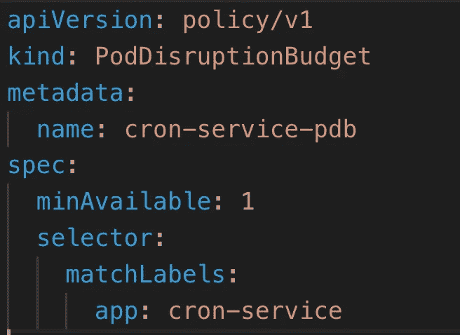

# 在 Kubernetes 上使用 Spring Boot 可靠地运行 Cron 作业的技巧

> 原文：<https://medium.com/codex/tips-to-run-cron-jobs-reliably-using-spring-boot-on-kubernetes-bb28052e8972?source=collection_archive---------1----------------------->

詹姆斯·哈里逊在 [Unsplash](https://unsplash.com?utm_source=medium&utm_medium=referral) 上拍摄的照片

Spring Boot 提供了一种非常简单的方法，使用 [Spring Scheduler](https://www.baeldung.com/spring-scheduled-tasks) 在应用程序中设置 Cron 作业。它可以很容易地打包到一个容器中，并部署在 Kubernetes 上，它的工作非常有魅力。

我们所有的生产应用程序都使用 Spring Scheduler 来运行 cron 作业。一个警告是，应用程序可以在单个 pod 上运行，因为它缺乏在多个实例上同步调度的能力，这有效地降低了 cron 作业的弹性和可靠性。

# 我们如何解决这个问题？

## **运行多个 pod 副本**

Shedlock 非常方便，因为它提供了一种在多个实例上同步作业的方法，确保我们计划的作业在同一时间只运行一次。

我发现这篇由 Baeldung 撰写的[文章](https://www.baeldung.com/shedlock-spring)对于在您的 Spring Boot 项目中快速启动 Shedlock 非常有用。

**还不完美……**

现在我们能够在 K8s 上运行多个 pod 副本。一切看起来不错。唉，在一个晴朗的日子，我们注意到一个问题，当集群中有一个计划的 Kubernetes 升级时，管理员以翻转的方式清空节点，不幸的是，我们的两个 cron 服务 pods 都被安排在同一个节点上，因此它们在同一时间关闭，因此计划的作业没有运行。

## **使用 PDB**

为了减轻这种情况，我们在 Kubernetes 中尝试了一个名为 [Pod 中断预算](https://kubernetes.io/docs/tasks/run-application/configure-pdb/) (PDB)的功能，它可以防止这种自愿的管理操作被暂停，并确保我们在任何给定的时间都有最小数量的 Pod 在运行。

拥有上述 PDB 可以确保我们在任何给定的时间点总是有一个有保证的 pod 在 K8S 集群中运行。

生产环境中的所有生产作业现在都在以可恢复的方式运行:)

> 如果你喜欢这篇文章，请花点时间为我鼓掌👏(可以多次鼓掌)，关注我，甚至请我喝咖啡[https://www.buymeacoffee.com/abhiandy](https://www.buymeacoffee.com/abhiandy)