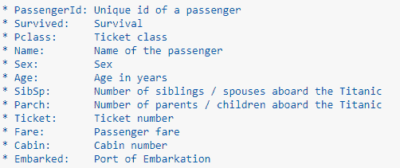
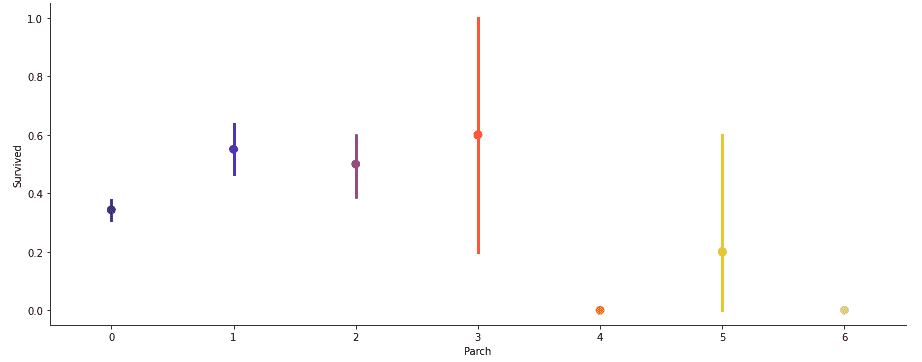

# 泰坦尼克号——使用机器学习预测存活率

> 原文：<https://medium.com/codex/titanic-predicting-survival-rates-using-machine-learning-3e83c56af29f?source=collection_archive---------4----------------------->

根据我上一篇文章的类似主题，我探索并试图理解 1912 年泰坦尼克号灾难的场景。使用许多特征，例如票的类型、年龄、家庭等等；我试图预测这一事件的存活率。

# 介绍

1912 年 4 月 15 日凌晨，豪华轮船泰坦尼克号在处女航中撞上冰山后，在北大西洋纽芬兰海岸沉没。在船上的 2240 名乘客和机组人员中，超过 1500 人在这场灾难中丧生。泰坦尼克号激发了无数的书籍、文章和电影(*包括 1997 年由凯特·温丝莱特和莱昂纳多·迪卡普里奥主演的电影《泰坦尼克号》*)，这艘船的故事作为一个关于人类傲慢的危险的警示故事进入了公众的意识。现在，我将试着预测这场灾难的存活率。

# 问题定义

泰坦尼克号是一艘由白星公司运营的英国客轮，1912 年 4 月 15 日在从南安普敦到纽约的处女航中撞上冰山后沉没在北大西洋。据估计，船上有 2，224 名乘客和船员，其中超过 1500 人死亡，这是当时最致命的沉船事件之一，也是迄今为止和平时期最致命的超级邮轮或游轮沉没事件。随着公众的关注，这场灾难成了许多艺术作品的素材，也是灾难电影类型的基础素材。

我们的主要目标是预测泰坦尼克号上的任何一名乘客是否能在沉船中幸存。

# 数据分析

在这个项目中，我们有一个数据集，其中包含泰坦尼克号上每位乘客的详细信息。它还有一个名为“幸存”的列，用来显示这个人是否幸存。

给定的数据集包含 891 行和 12 列。下面给出了每列的描述和类型。

数据集有 891 个示例和 11 个特征+目标变量(幸存)，其中 2 个特征是浮点数，5 个是整数，5 个是对象。

数据描述

正如我们所见，数据集包含 891 个条目，这意味着 891 名乘客在船上，但如果您比较实际乘客总数，会发现大约有 2，224 名乘客，这意味着我们的数据集不完整，它只是实际数据中的样本。

上面我们可以看到 38%的数据在泰坦尼克号中幸存。

我们还可以看到乘客年龄从 0.4 岁到 80 岁不等。除此之外，我们已经可以检测到一些包含缺失值的特征，比如“年龄”特征可以处理它们。此外，我们可以看到，这些要素的范围差异很大，我们需要将其转换为大致相同的比例。我们还可以发现更多的特征，这些特征包含我们需要处理的缺失值(NaN =非数字)。

从上表中，我们可以注意到一些事情。首先，我们需要将许多特征转换成数字，这样机器学习算法

它还包含一些缺失的值。让我们看看那些缺失的值。

缺少值

已装载特征只有两个缺失值，可以很容易地填充。处理“年龄”特性要复杂得多，它缺少 177 个值。“小屋”功能需要进一步调查，但看起来我们可能要从数据集中删除它，因为它的 77%丢失了。

# 探索性数据分析

*   **变量之间的相关性:**我们可以看到变量之间并没有太大的相关性。只有列性别与目标变量的负相关性最小。

空值计数

*   **可视化变量:**

**存活数**相对于**年龄**

乘客— **幸存**对**未幸存**比率

从上面的直方图中，我们可以得出结论，男性的存活概率在 20 至 35 岁之间，而女性的存活概率在 15 至 40 岁之间。幸存的男女比例在女性中更大。

在**出发港开始旅程的乘客的生存机会 S** vs **船票等级**

在**启运港开始旅程的乘客的生存机会 C** vs **船票等级**

在**启运港 Q** vs **船票等级**开始旅程的乘客生还几率

从上面的点图中，我们可以说，从 S 和 Q 出发的女性比从 C 出发的女性有更高的生存机会。对于男性来说，从 C 出发的女性比从 Q 和 S 出发的男性有更高的生存机会。

同样清楚的是，Pclass 1 和 p class 2 中的男性或女性具有最高的生存概率。

**票级** vs **年龄**

从上面的方框图中，我们可以观察到，头等舱和二等舱的富裕乘客实际上比三等舱的乘客年龄稍大。也许这是由于积累财富需要时间。

**存活率**相对于**家庭成员登船数量**

在这里，我们可以看到，随着泰坦尼克号上兄弟姐妹/配偶数量的增加，生还的机会越来越小。

在这里，我们可以看到，有 3 个父母/孩子的人有最高的生存机会。

# 预处理流水线

数据预处理是机器学习中产生高度准确和深刻结果的主要步骤。数据质量越高，产生的结果越可靠。**不完整、嘈杂和不一致的数据**是真实世界数据集的固有特性。数据预处理有助于通过填充缺失的不完整数据、平滑噪声和解决不一致来提高数据质量。

*   **数据不完整**可能是由多种原因造成的。由于误解或仪器缺陷和故障，可能无法保存适当的数据。
*   **噪声数据**可能因多种原因出现(具有不正确的特征值)。用于数据收集的仪器可能有故障。数据输入可能包含人为或仪器错误。也可能发生数据传输错误。

数据预处理涉及许多阶段。

*   **数据清理**试图估算缺失值，移除异常值。
*   **数据集成**将来自多个来源的数据集成到一个数据仓库中。
*   **可应用数据转换**，如标准化。例如，归一化可以提高涉及距离测量的挖掘算法的准确性和效率。
*   **数据缩减**可以通过删除冗余特征来缩减数据大小。可以使用特征选择和特征提取技术。

**处理空值**

有时，某些列包含空值，用于指示缺少或未知的值，或者该值可能不存在。

在列**中出现空值年龄**和**舱室**

在我们的数据集中，有两列包含空值，即年龄和客舱。我们可以处理年龄列，但是对于客舱列，空值的数量大于 70%，所以最好删除此列。

我们可以用帮助 Pclass 列替换 Age 列中的空值，即我们计算每个 Pclass 列的平均年龄，并替换相应 Pclass 的人的年龄。

**将标签转换成数字**

在机器学习中，我们通常处理在一列或多列中包含多个标签的数据集。这些标签可以是单词或数字的形式。为了使数据可理解或以人类可读的形式，训练数据通常用文字标注。

在我们的数据集中，有姓名、性别、机票、登机等列。这些列必须用一个热编码或标签编码器来处理。

列名和标签与目标变量无关。因此我们将删除这些列。对于列性和列性，我们使用标签编码器转换成数字列。

**标签编码器**是将标签转换成数字形式，从而转换成机器可读的形式。然后，机器学习算法可以以更好的方式决定这些标签必须如何操作。这是监督学习中结构化数据集的一个重要预处理步骤。

python 中的标签编码可以从 Sklearn 库中导入。Sklearn 提供了一个非常高效的编码工具。标签编码器使用 0 和 n_classes-1 之间的值对标签进行编码。从我们的数据集中取一个例子。

# 构建机器学习模型

为了构建机器学习模型，Sklearn 模块中有几个模型。

Sklearn 提供回归和分类两种模型。我们数据集的目标变量是预测欺诈是否被举报。因此，对于这类问题，我们使用分类模型。

但在将数据集拟合到其模型之前，我们首先必须分离预测变量和目标变量，然后将该变量传递给 train_test_split 方法，以创建随机测试和训练子集。

> **什么是 train_test_split** 是 sklearn 模型选择中的一个函数，用于将数据组拆分为训练数据和测试数据两个子集。有了这个函数，就不需要手动划分数据集了。默认情况下，sklearn train_test_split 会对这两个子集进行随机分区。但是，您也可以为操作指定随机状态。它给出四个输出 x_train、x_test、y_train 和 y_test。x_train 和 x_test 包含训练和测试预测变量，而 y_train 和 y_test 包含训练和测试目标变量。

在执行 train_test_split 之后，我们必须选择模型来传递训练变量。

我们可以建立尽可能多的模型来比较这些模型给出的精度，并从中选择最佳模型。

我选择了 5 种型号:

*   **来自 sklearn.linear_model 的 Logistic 回归:** Logistic 回归是一种监督学习分类算法，用于预测目标变量的概率。目标或因变量的性质是二元的，这意味着只有两种可能的类别 1(代表成功/是)或 0(代表失败/否)。在数学上，逻辑回归模型预测 P(Y=1)为 x 的函数。这是最简单的 ML 算法之一，可用于各种分类问题，如垃圾邮件检测、糖尿病预测、癌症检测等。

*   **来自 sklearn.ensemble 的 RandomForestClassifier】正如我们所知，森林是由树木组成的，更多的树木意味着更健壮的森林。类似地，随机森林算法在数据样本上创建决策树，然后从每个样本中获得预测，最后通过投票选择最佳解决方案。这是一种比单一决策树更好的集成方法，因为它通过平均结果来减少过拟合。**

*   【sklearn.neighbors 的 KNeighborsClassifiers:K-nearest neighbors(KNN)算法使用“特征相似度”来预测新数据点的值，这进一步意味着新数据点将根据其与训练集中的点的匹配程度来分配值。

*   **支持向量分类器:**支持向量机是一种受监督的机器学习算法，可用于分类或回归挑战。但多用于分类问题。在 SVM 算法中，我们将每个数据项绘制为 n 维空间中的一个点(其中 n 是您拥有的要素数量)，每个要素的值是特定坐标的值。然后，我们通过找到能够很好地区分这两类的超平面来执行分类。

*   **来自 sklearn.naive_bayes 的 GaussianNB:**Naive bayes 算法是一种基于应用 Bayes 定理的分类技术，它强烈假设所有预测器都是相互独立的。简而言之，假设一个类中某个特性的存在独立于同一个类中任何其他特性的存在。它是最简单的朴素贝叶斯分类器，假设来自每个标签的数据来自简单的高斯分布。

# **从模型中得出的结论**

我们得到了我们的最佳模型，即逻辑回归，其准确率为 86.7%。这里，我们的模型预测 176 个阳性病例中的 162 个真阳性病例和 119 个真阴性病例中的 94 个真阴性病例。

它预测 176 个阳性病例中的 14 个假阳性病例和 119 个病例中的 25 个假阴性病例。它给出了 82.8%的 f1 分数。

**理解什么是精确回忆和 f1 分数和准确度**

*   **F1 得分**:这是精确度和召回率的调和平均值，比精确度矩阵更能衡量错误分类的情况。

*   **精度:**隐含为从所有预测阳性病例中正确识别阳性病例的度量。因此，当假阳性的成本很高时，它是有用的。

*   **召回:**是从所有实际阳性病例中正确识别出阳性病例的度量。当假阴性的成本很高时，这一点很重要。

*   **准确性:**更明显的度量之一，它是所有正确识别的案例的度量。当所有的类都同等重要时，它最常用。

**混乱矩阵**

混淆矩阵是一个表格，通常用于描述一个分类模型(或“分类器”)对一组真实值已知的测试数据的性能。

> **注:**
> 
> **TN/真阴性:**病例阴性，预测阴性。
> 
> **TP/真阳性:**病例阳性，预测阳性。
> 
> **FN/假阴性:**病例为阳性但预测为阴性。
> 
> **TN/真阴性:**病例为阴性但预测为阳性。

# **超参数调谐**

机器学习中的超参数优化旨在找到给定机器学习算法的超参数，这些参数在验证集上测量时提供最佳性能。与模型参数相反，超参数由机器学习工程师在训练之前设置。随机森林中的树的数量是超参数，而神经网络中的权重是在训练期间学习的模型参数。我喜欢将超参数视为要调整的模型设置，以便模型可以最优地解决机器学习问题。

我们将使用 GridSearchCV 进行超参数调优。

**GridSearchCV**

在 GridSearchCV 方法中，机器学习模型针对一系列超参数值进行评估。这种方法被称为 GridSearchCV，因为它从超参数值的网格中搜索最佳超参数集。

**ROC 曲线:** AUC — ROC 曲线是在各种阈值设置下对分类问题的性能测量。ROC 是概率曲线，AUC 代表可分性的程度或度量。它告诉我们这个模型在多大程度上能够区分不同的类。AUC 越高，模型预测 0 为 0 和 1 为 1 的能力越强。以此类推，AUC 越高，模型在区分患病和未患病患者方面就越好。

用 TPR 对 FPR 绘制 ROC 曲线，其中 TPR 在 y 轴上，FPR 在 x 轴上。

# 评论

我们从数据探索开始，对数据集有所了解，检查缺失的数据，了解哪些特征是重要的。在这个过程中，我们使用了 *seaborn* 和 *matplotlib* 来做*可视化*。在数据预处理部分，我们计算缺失值，将特征转换为数值，将值分组并创建一些新特征。后来，我们开始训练 5 种不同的机器学习模型，选择了其中一种(逻辑回归)。然后，我们讨论了逻辑回归的工作原理，了解了它对不同特性的重要性，并通过优化其超参数值来调整其性能。最后，我们查看了它的混淆矩阵，并计算了模型的精度、召回率和 f 值。最后我们绘制了模型的受试者工作特征曲线，并计算了 AUC 值。

当然，仍有改进的空间，如通过相互比较和绘制特征并识别和去除有噪声的特征，进行更广泛的特征工程。另一个可以改善整体结果的事情是对几个机器学习模型进行更广泛的超参数调整。你也可以做一些整体学习。

# 其他人

*   趣味阅读:[泰坦尼克号生存故事](https://www.biography.com/news/titanics-100th-anniversary-6-survivor-stories-20799733)
*   [水槽背后的秘密](https://www.usnews.com/news/national/articles/2008/09/25/the-secret-of-how-the-titanic-sunk#:~:text=In%201985%2C%20when%20oceanographer%20Robert,again%20in%20the%20public%20imagination.)
*   理解:[泰坦尼克号生存分析](https://rstudio-pubs-static.s3.amazonaws.com/93031_67e7a901cbdf488b8622cfc1979329ea.html)作者李晟