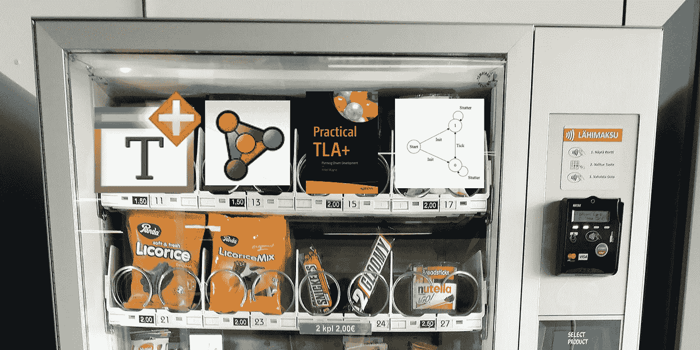

# TLA+自动售货机

> 原文：<https://medium.com/codex/tla-vending-machine-a53b17e7e68f?source=collection_archive---------28----------------------->

最近，TLA+的一个新成员在 [r/tlaplus](https://www.reddit.com/r/tlaplus/) subreddit 中寻求关于自动售货机规格的帮助。寻找一个借口来伸展我的专业写作肌肉，并多次确认我不会只是做某人的作业，我决定尝试一下。

这个自动售货机有一些正式的方法。

我在撰写规范的过程中学到了一些东西，我认为这会成为一篇好文章。作为一个使用 TLA+/PlusCal 才几个月的人，这可能是我迄今为止尝试过的最复杂的规范，因为我大部分的学习都是在简单的电路或数据结构上。有一个很长的规格说明书(至少 10 个具体项目)是很好的，有很多不同的决策路径，听起来像是企业会放在需求中的东西。对于一个非正式的(英语)规范来说，这台机器相当简单。

[Reddit 上的规格](https://www.reddit.com/r/tlaplus/comments/v91f4k/specifications_for_vending_machine_and_a_traffic/ibvs3m8/?utm_source=reddit&utm_medium=web2x&context=3)

[TLA+规格](https://gist.github.com/thesammiller/36c4dd2694b5e80fc7acb3afb0bec96e)

请注意:我并不自称是 TLA+的专家。我不知道这个规范在很多方面是业余的。我欢迎任何反馈！

我最后用了大约十一个状态来覆盖各种屏幕和输入(不包括初始状态)。有两个继续点，应该有一个更好的方法来重用一些逻辑。我将不得不研究操作符来更好地抽象代码。可以添加一些琐碎的东西，比如 print 语句，但是要考虑适当的变量，我不想用一堆字符串把 IDE 搞得乱七八糟。

我发现了一个非常关键的错误。起初，机器只是在钱足够的情况下才取钱，但是规范要求用户继续取钱。因为用户已经放弃了他们的钱，所以我需要一个新的变量来保存钱，在钱完全存入机器之前，把它保存在一个像缓存一样的临时存储器中。忘记重置缓存钱了(懂吗？)到零，当用户取消交易并取回他们的钱时。那么会发生什么呢？用户会拿回他们的钱，而机器仍然会认为它的缓存里有钱！用户可以永远这样做，永远不必为一个项目付费！我想象中的自动售货机生意可能会被毁了…如果不是因为 TLA+。

这是完整规范的部分实现(就像我说的，很长，好吗？).需要货币和零钱。我的第一次尝试创造了一个状态空间爆炸，从十万个状态到一亿个状态。我肯定把事情搞砸了。我确实认为让用户使用 25 美分硬币的做法有点愚蠢，但是机器只出售以美元为增量的商品。我希望我可以抽象出货币的实现，但是我可以想象一个企业对全货币的实现会更严格一些。

我最终得到了一个有 290，863 个州(126，565 个不同的州)的模型。在扩展功能时，我最终遇到了一个不变量，它确保用户永远不会为不可用的项目付费。这最终揭示了缓存资金的错误。这只是一行代码。

除了不变量，我还设置了一些时间约束。在系统的早期版本中，没有“继续”选项，我设置了一个活跃度属性，以确保有钱的用户得到一个项目。我最后不得不用 continue 逻辑来放松它。通过 5088 个分发项目状态，用户可以获得他们的项目。但是这可能是一个值得重写的约束。

编写规范花了我一天一夜的时间。幸运的是，其他一些人已经在 Reddit 上发帖，所以我可以使用他们的一些解决方案，比如 IsAvailable 函数。除此之外，我不认为我使用的任何东西比 [TLA+视频课程](https://lamport.azurewebsites.net/video/videos.html)中的视频 5 更复杂。作为一个背景起点，阅读[实用 TLA+](https://www.amazon.com/Practical-TLA-Planning-Driven-Development/dp/1484238281) 真的很有帮助。

我很惊讶测试自动售货机中可能出错的地方是多么容易……我很高兴我没有因为让一个错误进入生产而被我虚构的自动售货机公司解雇。