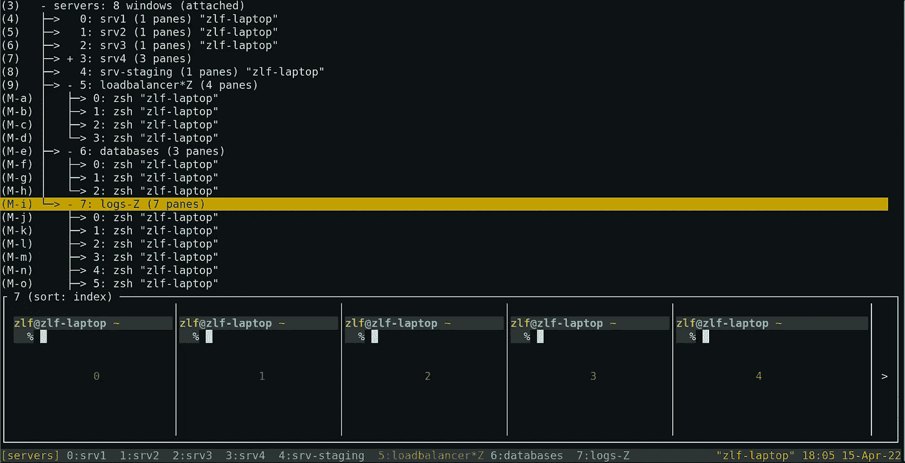

# Tmuxinator 配置文件生成器

> 原文：<https://medium.com/codex/tmuxinator-config-file-generator-41b93fa03728?source=collection_archive---------8----------------------->

你用过 tmuxinator 和 tmux 一起工作吗？您必须为您想要的每个会话编写自己的配置文件。如果有一个运行中的 tmux 会话有很多窗口和窗格，该怎么办？手动生成配置文件需要一些时间。在本文中，我将创建一个脚本，它将从正在运行的 tmux 会话中生成一个 tmuxinator 配置文件。



# 介绍

> tmux 是一个终端多路复用器。它可以让你在一个终端的几个程序之间轻松切换，分离它们(它们在后台保持运行)并重新连接到不同的终端。

我假设你已经在使用 tmux，否则先看看我关于[开始使用 tmux](https://azolf.medium.com/start-using-tmux-3d6ce41ed138) 的文章。

> tmuxinator 是一个 ruby gem，可以让您轻松地创建和管理 tmux 会话。

你可以在他们的 [GitHub 库页面](https://github.com/tmuxinator/tmuxinator)上了解更多。

我使用 tmux 已经有几年了，这是我打算安装在任何操作系统上的第一个软件包。有一次，我运行了一个巨大的 tmux 会话，有如此多的窗口和窗格，这个会话被意外终止了。你能想象吗？然后我开始使用 tmuxinator，它可以自动执行我的普通 tmux 会话，这样我就不需要每次都从头开始创建它们。创建一个定制的 tmuxinator 文件是非常容易的，你可以通过阅读他们的文档来轻松完成。但是，如果您已经有一个正在运行的 tmux 会话，就没有办法为它生成 tmuxinator 配置文件，您需要自己创建它。

我将创建一个脚本，它将从正在运行的 tmux 会话中生成一个 tmuxinator 配置文件。

# 环境

现在，我已经创建了一个名为`servers`的示例 tmux 会话，包含几个窗口和窗格。

您可以使用下面的命令获得在您的会话中运行的窗口列表，我的如下所示。

```
$ tmux list-windows -t servers0: srv1 (1 panes) [136x36] [layout 6254,136x36,0,0,53] [@42](http://twitter.com/42)
1: srv2 (1 panes) [136x36] [layout 6255,136x36,0,0,54] [@43](http://twitter.com/43)
2: srv3 (1 panes) [136x36] [layout 6256,136x36,0,0,55] [@44](http://twitter.com/44)
3: srv4 (3 panes) [136x36] [layout 718b,136x36,0,0[136x18,0,0,56,136x8,0,19,57,136x8,0,28,59]] [@45](http://twitter.com/45)
4: srv-staging (1 panes) [136x36] [layout e251,136x36,0,0,60] [@46](http://twitter.com/46)
5: loadbalancer (4 panes) [136x36] [layout 6f5c,136x36,0,0[136x18,0,0{68x18,0,0,61,67x18,69,0,64},136x17,0,19{68x17,0,19,62,67x17,69,19,63}]] [@47](http://twitter.com/47)
6: databases- (3 panes) [136x36] [layout 95a1,136x36,0,0[136x18,0,0,65,136x17,0,19{68x17,0,19,66,67x17,69,19,67}]] [@48](http://twitter.com/48)
7: logs* (7 panes) [136x36] [layout 74ff,136x36,0,0[136x4,0,0,68,136x4,0,5,74,136x4,0,10,72,136x3,0,15,73,136x8,0,19,69,136x4,0,28,70,136x3,0,33,71]] [@49](http://twitter.com/49) (active)
```

在这个会话中，我有 7 个窗口和 18 个窗格。

因为你正在使用 tmuxinator，所以我假设你已经在你的系统上安装了一个 ruby 版本和`bundler`。

首先，创建一个 Gemfile 来管理与`bundle init`的依赖关系。现在，让我们将下面一行添加到我们需要的 Gemfile 中，然后运行`bundle`来安装它。

```
gem "erb"
```

现在你的 gem 文件应该是这样的。

```
# frozen_string_literal: truesource "[https://rubygems.org](https://rubygems.org)"git_source(:github) {|repo_name| "[https://github.com/#{repo_name](https://github.com/#{repo_name)}" }gem "erb"
```

# 编码…

现在你应该创建一个名为`generate.rb`的 ruby 文件。在这个文件中，我们将添加下面的代码行以供将来使用。

```
require 'erb'
```

现在，我们将从 STDIN 输入中获取会话名称，并确保它已被提供。

```
session = ARGV[0]if session.nil? || session.empty?
  puts "Provide a session name"
  return 1
end
```

然后，我们将准备一个 tmux 命令来获取在给定会话上运行的窗口列表。

```
cmd = 'tmux list-windows -t ' + session.to_s + ' -F "window: \'#{window_name}\', panes: \'#{window_panes}\'"'
```

你可以在这里阅读所有的 tmux 命令。

> **list-windows**[**-a**[**-F***format*][**-F***filter*[**-t***target-session*]
> (别名: **lsw** )
> 如果给定了 **-a** ，则列出服务器上的所有窗口否则，
> 列出当前会话或*目标会话*中的窗口。
> **-F** 指定每一行的格式和 **-f** 一个过滤器。仅显示过滤器为真的
> 窗口。参见
> *格式*部分。

我们正在定制带有`-F`标志的 tmux 命令输出。

> - **窗口名**窗口名
> - **窗口窗格数**窗口中的窗格数

我们之前运行的`servers`会话的命令如下所示。

```
$ tmux list-windows -t servers -F "window: '#{window_name}', panes: '#{window_panes}'"window: 'srv1', panes: '1'
window: 'srv2', panes: '1'
window: 'srv3', panes: '1'
window: 'srv4', panes: '3'
window: 'srv-staging', panes: '1'
window: 'loadbalancer', panes: '4'
window: 'databases', panes: '3'
window: 'logs', panes: '7'
```

现在，我们将执行命令，将输出行分成一个数组，并确保会话存在。

```
windows = %x(#{cmd}).split("\n")
return 1 if windows.count == 0
```

现在我们要在 regex 的帮助下将这些字符串转换成一个散列数组。

```
result = []
windows.each do |window|
  data = window.match(/window: '(?<window_name>.*)', panes: '(?<panes_count>\d+)'/)
  result << {
    name: data['window_name'],
    panes: data['panes_count'].to_i
  }
end
```

到目前为止，我们已经获得了结果变量中的所有信息。您可以检查该变量，应该会看到如下内容

```
[{
  : name => "srv1",
  : panes => 1
}, {
  : name => "srv2",
  : panes => 1
}, {
  : name => "srv3",
  : panes => 1
}, {
  : name => "srv4",
  : panes => 3
}, {
  : name => "srv-staging",
  : panes => 1
}, {
  : name => "loadbalancer",
  : panes => 4
}, {
  : name => "databases",
  : panes => 3
}, {
  : name => "logs",
  : panes => 7
}]
```

我们需要将这个变量传递给一个`erb`模板来获取我们的配置文件。

# 创建模板

> ERB 为 Ruby 提供了一个简单易用但功能强大的模板系统。使用 ERB，可以将实际的 Ruby 代码添加到任何纯文本文档中，以便生成文档信息细节和/或流程控制。

现在让我们创建一个名为`template.erb`的文件，如下图所示。我们正在一行一行地检查那个。

```
 1 name: <%= session %>
  2 windows:
  3 <% result.each do |window| %>
  4   - <%= window[:name] %>:
  5       panes:
  6       <% window[:panes].times do %>
  7           - ls
  8       <% end %>
  9 <% end %>
```

这个文件将为给定的会话名生成一个有效的 tmuxinator 配置文件。第一行定义了 tmuxinator 的会话名。

然后我们使用关键字`windows`来定义我们的窗口。我们将遍历结果变量并添加窗口名。然后，对于每一个窗格数量，我们用一个简单的`ls`命令作为默认命令将其添加到该窗口中。您可以在这里或者在生成文件之后定制命令。

# 最后一步

现在我们有了模板文件，我们需要传递变量并获取配置文件。

```
ERB.new(File.read('template.erb')).result(binding)
```

然后我们可以将输出写入一个文件。

```
file_name = "#{session}.yml"
File.write(file_name,
           ERB.new(File.read('template.erb')).result(binding)
          )puts "Write the config file"
puts "#{Dir.pwd}/#{session}.yml"
```

现在你可以用一个 tmux 会话名运行你的脚本，然后你会看到一个名为`servers.yml`的文件，如下所示。

```
ruby generate.rb servers# servers.ymlname: servers
windows:- srv1:
      panes:

          - ls- srv2:
      panes:

          - ls- srv3:
      panes:

          - ls- srv4:
      panes:

          - ls

          - ls

          - ls- srv-staging:
      panes:

          - ls- loadbalancer:
      panes:

          - ls

          - ls

          - ls

          - ls- databases:
      panes:

          - ls

          - ls

          - ls- logs:
      panes:

          - ls

          - ls

          - ls

          - ls

          - ls

          - ls

          - ls
```

现在，您可以轻松地定制想要在每个窗格上运行的命令，或者轻松地添加更多配置，并根据您的喜好进行定制。

```
# generate.rbrequire 'erb'session = ARGV[0]if session.nil? || session.empty?
  puts "Provide a session name"
  return 1
endcmd = 'tmux list-windows -t ' + session.to_s + ' -F "window: \'#{window_name}\', panes: \'#{window_panes}\'"'windows = %x(#{cmd}).split("\n")
return 1 if windows.count == 0result = []
windows.each do |window|
  data = window.match(/window: '(?<window_name>.*)', panes: '(?<panes_count>\d+)'/)
  result << {
    name: data['window_name'],
    panes: data['panes_count'].to_i
  }
endfile_name = "#{session}.yml"
File.write(file_name, ERB.new(File.read('template.erb')).result(binding))puts "Write the config file"
puts "#{Dir.pwd}/#{session}.yml" 
```

我还创建了一个 [Gitlab 库](https://gitlab.com/azolf/tmuxinator-config-file-generator)，你可以克隆并使用它。愿意的话可以随意交流和扩展。