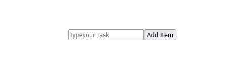

# 带有 React 类和功能组件的待办事项应用程序

> 原文：<https://medium.com/codex/to-do-list-app-with-reactjs-class-and-functional-components-3822f261e994?source=collection_archive---------1----------------------->

大家好😊，今天我们将使用 ReactJs 创建一个简单的 Todo-list 应用程序，使用它的两个主要组件:函数组件和类组件


格伦在 Unsplash 上拍摄的照片

在这篇文章中，我们将使用类组件。

***你凸轮检出功能组件方式*** [***此处***](/@onlygod/to-do-list-app-with-react-functional-and-class-components-f7cb3d33b72e) ***！！***

# 我将使用的工具:

*   [Visual Studio 代码](https://code.visualstudio.com/)(文本编辑器)
*   [Nodejs](https://nodejs.org/en/) (npm 8.1.2 +)

## 特征

*   创建任务
*   列表任务
*   编辑任务
*   删除任务

# 所以让我们开始吧！！！🚀🚀

# 1.设置项目

在这里，我们正在使用终端创建我们的项目应用程序，确保您已经在全球范围内安装了 [Nodejs](https://code.visualstudio.com/) 和 [create-react-app](https://create-react-app.dev/docs/getting-started/)

```
npx create-react-app <project_name_here> 
```

使用 vscode 打开项目目录，现在在您的终端上通过运行下面的命令启动您的服务器

```
yarn start // for those using yarnnpm start // for those using npm
```

现在打开***app . js****文件中的 ***src*** 文件夹你会看到功能组件的做法👇🏼*

*功能组件(App.js)*

*要将其更改为类组件，只需粘贴下面的代码👇🏼*

*类组件(App.js)*

*接下来用 return 语句中的这个附加模板更新***app . js****a*gain*

*同样用下面的 *替换 ***App.css 中的样式*****

*App.css*

*现在，您可以通过在终端中运行 ***纱线启动*** 来检查您的浏览器*

**

*[http://localhost:3000/](http://localhost:3000/)*

# *2.创建待办任务和列表任务*

*好了，让我们进入功能，我们将从创建任务开始。因此，首先我们需要使用 ***构造函数*** *来构造我们在类组件中的状态，这个构造函数在 react 组件挂载之前被称为*，*

*现在让我们更新我们的待办事项应用程序，如下所示*

*App.js (CreateTodo)*

*   *从上面的代码中，我们看到，我给构造函数添加了两个状态: **value** 和 **todos** ，它们将分别处理添加 todo 项的文本输入的 onChange 和存储 todos。*
*   *你也会注意到我添加了一个 **onAddTask** 函数来处理添加 todo 项的逻辑，我把它变成了一个对象，在它被存储之前包含了一个**名称**和一个 **id** 。*
*   *最后，我们添加了一个无序列表标签来显示待办事项列表*

*现在刷新您的浏览器，尝试添加一个任务，看看结果如下👇🏼*

**

*[http://localhost:3000/](http://localhost:3000/)*

# *3.删除待办任务*

*接下来让我们添加一个函数来删除一个待办任务，按照下面的代码来做👇🏼*

**App.js (DeleteTodo)**

*   *从上面的代码中，我添加了一个函数 ***onDeleteTask*** ，它接收待办事项的 id，过滤待办事项，然后删除该事项。*
*   *接下来我添加了一个 onClick 处理程序，***this . on delete task***到删除按钮。*

*现在再次刷新您的浏览器，尝试删除一个任务，以查看如下结果👇🏼*

**

*[http://localhost:3000/](http://localhost:3000/)*

# *3.编辑待办任务*

*现在要编辑一个任务，我们将添加几个状态，到**a****editing:false，*** *和 states 来保存 todo id(****currentId)***和 todo name ( **currentValue****

```
**constructor() {
super()
this.state = ({
 todos: [],
 value: "",
 editing: false,
 currentid: "",
 currentValue: ""
});**
```

*   **因此，要用上面声明的编辑状态更新您的 todo 模板，请将下面的代码粘贴到您的 return 语句中**

**待办事项-模板-已更新**

*   **接下来添加切换处理程序( ***onToggleEdit*** )，你会看到它将 editing 设置为 true 并接受当前 todo 对象，然后将其值存储在 ***currentid*** 和 ***currentValue*** 中。**

```
**onToggleEdit = (todo) => {
 this.setState({ editing: true })
 this.setState({ currentid: todo.id })
 this.setState({ currentValue: todo.name })}** 
```

**接下来，我们为 input 添加 onChange 处理程序(***onEditInputChange****)*，它只是由用户将当前值设置为值类型。**

```
**onEditInputChange = (e) => {
 this.setState({ currentValue: e.target.value })
}**
```

**现在添加 onSubmit 处理程序(***onSubmitEditTodo***)来处理 Todo 项目的提交**

```
**onSubmitEditTodo = (e) => {
 e.preventDefault()
 this.onEditTodo(this.state.currentid, this.state.currentValue)
 this.setState({ editing: false })}**
```

**从上面的代码中，我们看到它简单地获取 currentid 和 currentValue，并传递给下面的 **onEditTodo** 函数，👇🏼该方法循环遍历所有待办事项，找到待办事项 id 并更新其值**

```
**onEditTodo = (id, newValue) => {
 this.state.todos.map(todo => {
  if (todo.id === id) {
      todo.name = newValue;}})}**
```

**现在为了测试它，更新 onClick 和 onsubmit 处理程序的函数，如下所示**

**待办事项-模板-已更新-2**

**现在让我们试着编辑一个 todo 我们的浏览器如下**

****

**[http://localhost:3000/](http://localhost:3000/)**

**现在点击**编辑**按钮我们看到了这个项目，接下来让我们更新它**

****

**[http://localhost:3000/](http://localhost:3000/)**

**现在我们看到待办事项 1 已经更新了🥳🥳**

**有任何错误，不用担心，下面是完整的源代码👇🏼**

**App.js**

**谢谢你的时间，♥️**

# ****去哪里找我👇****

**你可以跟随我来到❤️**

**您也可以在上找到我👉[Github](https://github.com/Onlynfk)/[Instagram](https://www.instagram.com/onlyg.codes/)/[LinkedIn](https://www.linkedin.com/in/onlygod-o-b64084166/)🔥**