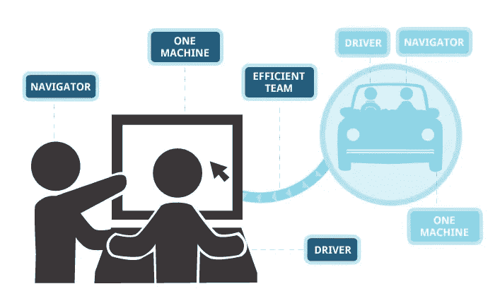
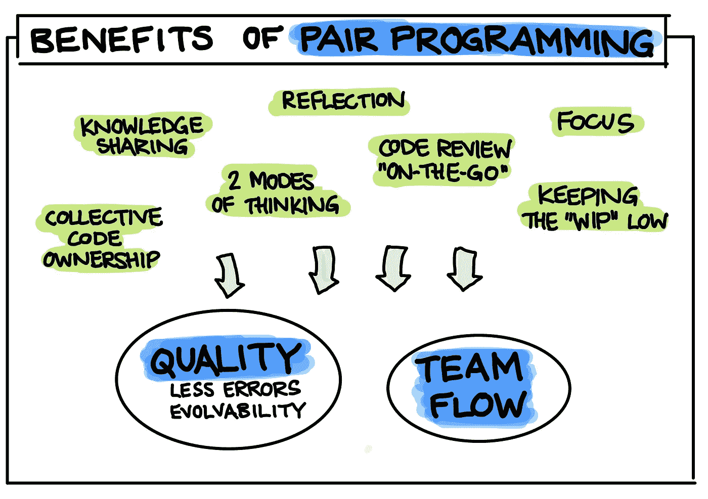

# 配对程序还是不配对程序？这是一个问题…

> 原文：<https://medium.com/codex/to-pair-program-or-to-not-pair-program-that-is-the-question-458a6c4cd349?source=collection_archive---------13----------------------->

结对编程是大多数开发人员在进入一些教育机构开始他们的编程之旅时听到的一个术语。当他们中的大多数人开始第一份工作时，他们已经完全忘记了这一点。

让我们从这里开始:什么是结对编程？

结对编程

结对编程是指两个程序员在一个工作站上编程。控制键盘的程序员被称为“驱动者”，而另一个仍然积极参与编码但专注于整体任务的程序员被称为“导航者”。两人根据预先确定的时间框架轮流交换角色，直到手头的任务完成。

**那么我们为什么要结对编程呢？**

结对编程的好处

我第一次体验结对编程是在我还不知道结对编程这个术语的时候。在我攻读工程学位期间学习计算方法时，我们完成了使用 MATLAB 求解复杂的纳维尔-斯托克斯方程的小组作业。我和我的搭档不会分而治之，而是坐在同一台计算机前，一个人编写代码，而另一个人研究文档，搜索后续步骤并发现代码错误，这些错误将花费大量时间在稍后单独调试。我们会不时交换，这样我们两个都“编码任务”。

直到几年后我加入了我的 Web 开发训练营，我才听到这个官方术语。我立刻就被吸引住了。作为一个几乎没有编程经验的人，在没有指导的情况下做大型项目可能是一个令人生畏的挑战，即使你知道自己在做什么。结对编程的好处非常明显。作为不确定的新手，结对编程给了我们好处，让另一个人向我们保证我们在正确的轨道上，或者如果我们不在，逻辑上反驳我们。随着我们大声说出我们的方法，计划任务变得更加容易，我们的信心增加了，总的来说任务完成的速度更快了。当我们作为一个 3 人小组开发我们的第一个全栈应用程序时，我们继续采用这种方法，因为一起编程和现场理解代码比查看其他人创建的功能花费数小时理解他们的逻辑要容易得多。bug 被发现得更快，当遇到问题时，解决方案来得更快。此外，知识得到了传播，因为不是每个参加训练营的人都处于同一水平。最后，它非常有趣！在网上课堂上，通过虚拟的方式去认识人是相当困难的。这为建立友谊的同时一起工作提供了途径。

**那么为什么工作场所没有采用它呢？**

公司在过去的十年里使用结对编程

说公司没有采用它是不正确的。随着敏捷软件开发的迅速普及和大型项目协作需求的不断增长。结对编程越来越受欢迎。像脸书、Shopify、Snap、Grubhub、Peloton 和 Vimeo 这样的公司都在某种程度上利用了结对编程。然而，这似乎不是一个全行业的趋势。

禁止公司雇佣 it 人员的第一个也是最明显的原因是雇佣两个人来做一个人的工作。虽然可以说开发时间可能会更长，但最终的代码总体上会更高质量和更安全，从而在调试和重构过程中节省时间。因此，总的来说，它可能不会像人们想象的那样慢 50%，但它仍然会导致任务完成得更慢。

第二，这会导致独立开发人员的减少，因为一些人可能只有在和其他人一起编码时才有信心。如果一个初级开发人员(他正在努力学习)和一个高级开发人员在一起，也会导致不安全感和冒名顶替综合症。

第三，简单的任务不需要结对编程，这会降低生产率。如果两个开发人员都可以自信地编写产品级代码，那么将他们配对来完成这项任务将是低效的。

第四，结对动态严重影响结对编程的结果。如果两个程序员静静地坐在一起，而一个人编程，另一个人看着，这只会破坏练习的目的。

然而，最大的原因似乎是大多数程序员似乎更喜欢独自工作。无论是因为他们不喜欢向别人解释他们在做什么，还是因为这打断了他们的“心流”，或者也许他们只是没有找到合适的合作伙伴来一起编程。看起来结对编程可能不是每个人都喜欢的。

那么结对编程中有哪些该做和不该做的事情来避免常见的陷阱呢？

待办事项:

*   总是大声和你的伴侣说话，解释你在做什么和为什么
*   尊重并敞开心扉倾听你的伴侣。进行合乎逻辑的文明讨论，而不是争论
*   经常交换角色，但不要在交换时间已到或双方同意之前
*   问很多问题来挑战现状
*   获得合适的协作工具

不要:

*   将键盘推到导航器上或从驱动程序中抓取，并使用计时器来保持与角色切换的一致性
*   如果你是一个新手，不要和另一个完全的新手一起编程，因为你们两个会互相介绍和强化不好的实践
*   有一个“看大师工作”的场景，初级开发人员敬畏地看着高级开发人员独自工作
*   陷入激烈的冲突和争论，这可能会导致沟通完全中断
*   尝试结对编程每一个简单的问题，共同的问题不需要两个头脑来解决，因此应该单独处理

那么，这一切会给我们带来什么呢？

随着远程工作(尤其是在技术领域)成为新的规范，全球疫情导致了工作环境的巨大变化。这种变化导致开发人员变得前所未有的孤立。我相信结对编程可能是未来的解决方案，因为它有助于员工相互交流，发展关系和适当的团队动力。它消除了知识孤岛，增加了团队弹性，并帮助新成员更快地适应代码库。它提高了代码的整体质量，减少了重构，降低了 bug 发生率。它还可以缩短反馈循环，因为结对编程可以导致“实时代码审查”。如果使用正确，结对编程可能是一个有效的工具，将您的开发团队带到下一个级别。

如果你想在这种远离家庭生活的远程工作中尝试结对编程[，点击这里](https://github.com/kkemple/awesome-pair-programming)获得一个很好的资源来获得你需要的工具。

参考资料:

[1]莫汉库马尔，b .(未注明)。*你试过结对编程吗？* C#角。2022 年 6 月 4 日检索，来自[https://www . c-sharp corner . com/article/have-you-tryed-pair-programming/](https://www.c-sharpcorner.com/article/have-you-tried-pair-programming/)

[2] *关于结对编程*。martinfowler.com。(未注明)。2022 年 6 月 4 日检索，来自[https://martinfowler.com/articles/on-pair-programming.html](https://martinfowler.com/articles/on-pair-programming.html)

[3]m .安达克尔(2021 年 5 月 26 日)。*了解成功的公司如何使用结对编程*。深度合作博客。2022 年 6 月 4 日检索，来自 https://www . co screen . co/blog/what-you-can-learn-from-how-successful-Companies-use-pair-programming/#:~:text = Companies % 20 like % 20 peloton % 2C % 20 stash % 2C % 20g rubhub，Pivotal % 20 labs % 2C % 20 和%20Sparta%20Science。