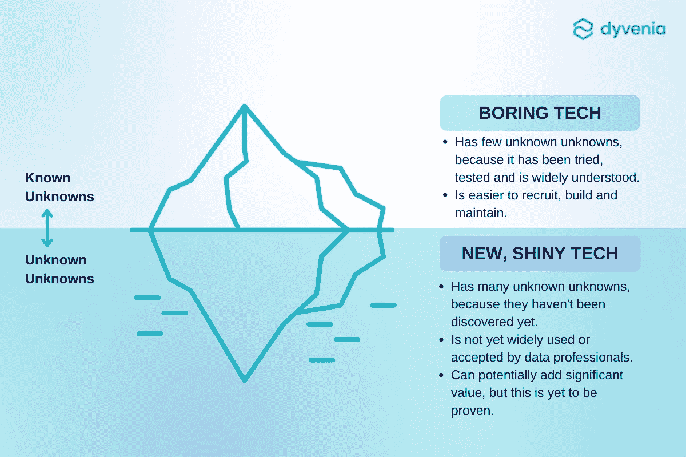

# 要扩展分析，首先选择无聊的技术

> 原文：<https://medium.com/codex/to-scale-analytics-choose-boring-tech-first-c952325d755c?source=collection_archive---------22----------------------->

## 这项久经考验的可靠技术，通常被称为“无聊技术”，正在卷土重来。

它提供了简单性，并得到了非常了解它的专业人员的支持。企业经常被驱使采用现代和尖端的工具，但这只会使他们的过程复杂化。为了更好地满足业务需求，组织将需要返回到经过试验和测试的方法。阅读更多内容，了解无聊的技术如何帮助你扩大业务规模。

我的第一份会计工作仍然历历在目。我当时 26 岁，在金融领域从事复杂的计算，叫做:资本化方差。作为公司存货评估的一部分，资本化差异考虑了生产材料的价格变化。由于时间偏移，这些计算可能会变得有点棘手。

当我第一次计算这些数字时，我害怕极了，因为这些数字将被直接送给首席财务官。当时，我必须在 Excel 中管理所有这些数字。压力非常大。在所有致力于整合季度业务结果的会计师、分析师和财务总监中，我的计算是对该季度的运营收入和盈利能力影响最大的一个。

我记得当时想这一切是多么的不必要。当计算可以很容易地自动化时，为什么我要被迫承受压力？我继承了一个 Excel 电子表格来计算不必要的复杂差异。由于这个原因，通常只有非常资深的金融分析师才被允许使用它们。尽管我资历不足，但还是给了我一些工作表，我只是害怕自己会犯错误。

毕竟，文件中有死公式，日期标签是错误的，运行模拟需要在多个工作表中更改数据。很容易得到错误的估计。这时我意识到，新技术是让计算更快、更透明、更不容易出错的解决方案，但它只有在带来更低复杂性的情况下才有用。降低技术的复杂性是关键，利用无聊的技术是确保这一点的最佳方式。

为了消除不必要的复杂性，我采取了以下步骤:

*   我从**清理数据**开始
*   然后我转移到数据模型，使建模逻辑**透明和简单**
*   最后一步是**使用普通 Excel**

我很想加入 VBA 宏(或者更好的是 Python)来自动化流程，但是，我知道我的继任者可能没有任何 VBA 的经验，也可能无法理解我的“更酷的技术”

结果是，大写的方差变得如此容易，以至于我最终能够将电子表格交给更多初级人员。我设法显著降低了复杂性，提高了工作满意度。

# 扩大规模，让事情变得更简单…用无聊的技术

通过**优先去除不必要的复杂性**，扩展组织的工作方式与改进组织流程是一样的。“无聊技术”可能看起来有点[模糊](https://boringtechnology.club/#1)，但它指的是**已经存在很长时间并被广泛理解的经过测试的软件**。

只有在首次采用无聊的技术并使你的数字组织成熟之后，你才能考虑采用更复杂的技术。只有在绝对必要并且有明确目的的情况下，才应该这样做。

无聊科技帮助我们回答了一个关键问题:

如何让我的工作变得更简单、更高效？

通过避免不切实际的不必要的技术，你可以使你的工作更容易和更有效率。新奇的新功能永远不会超过可持续发展解决方案。

SQL 数据库是无聊技术的例子，因为它们已经存在了几十年。大多数数据专业人员知道如何使用它们，并且它们经过了实战考验。

另一方面，Kubernetes 并不是无聊的技术，因为它的使用时间还不够长。它可以为 DevOps 增加很多价值，但也没有被数据专业人员广泛使用或接受。这意味着维护它是一项挑战，而且它会显著增加数据操作的复杂性。尽管如此，Kubernetes 可以成为无聊的技术！如果我们将它标准化，支持一个简单的部署系统，并从中去除不必要的复杂性，那么它就像任何东西一样，可以由一个不太熟练的工人来操作。

# 无聊技术的已知和未知

例如，卢卡·罗西说，任何技术都有利弊。将这些解释为已知和未知的框架，我们有:

*   **已知胜**——我们知道它擅长的事情。
*   **已知失败**——我们知道它不擅长的事情。
*   **未知的失败** —它不擅长的事情，但我们仍然不知道。

根据他的定义，无聊的技术是好的技术，它能解决几乎所有的问题:

*   **许多已知的成功案例** —它被广泛采用和支持
*   **许多已知的失败** —限制是众所周知的，并有文件记录
*   很少有未知的失败——我们对它了如指掌，因为我们已经尝试了太多的事情

新技术有许多未知的未知，因为它们还没有被发现，而无聊的技术已经被测试并被广泛理解。

# 无聊技术非常普遍

无聊技术如此普遍，以至于新技术在很多情况下都试图与之兼容。

将您的数据分析解决方案迁移到云的最简单方法之一是结合使用数据湖和 SQL。这样，您可以使用新技术扩展到数 Pb 的数据，但您仍然可以让使用优秀的旧 SQL 的人使用您的数据。

如果让我猜的话，我会说今天 80%的分析仍然是在 SQL 中完成的。SQL 是在 70 年代发明的，它是一种古老但已确立的查询和操作数据的方法。许多职业道路上的数据专业人员都知道 SQL **、**，那些不知道的人可以在几周内学会。

你也可以用更简单的统计工具做很多事情。这些工具可以很好地在 R 或 Python 等编程语言中实现。它们已经存在了一段时间，多年来在现实世界中的使用使它们变得更加坚固。

# 无聊的技术是缓解人才短缺的最佳方式

使用 boring tech 最显著的优势之一是，它允许你利用拥有技术和领域知识的巨大人才库。

无聊的技术往往拥有更广泛的人才库，这有两大原因:

1.  它们存在的时间更长，所以人们有更多的时间去理解它们
2.  它们非常简单，所以人们可以很快学会如何使用它们。

挑选技术的一个更好的方法是检查你公司内部已经拥有的人才类型，以及你和你的公司可以从就业市场吸引的人才类型。这是一项具有挑战性的工作，因为每个公司都希望像谷歌或苹果那样酷，但这些公司面临的数据挑战与大多数其他公司非常不同。

# 但是没有规模！

首先，您可以将单个数据库实例扩展到几 TB 和数千用户。理想吗？有时是，有时不是。你应该选择最适合你的情况的，而不是大众此刻所宣传的。关键的一点是**非常好地编目和管理数据**；把自己想象成图书管理员。**数据的变化没有技术的变化快**。

我相信技术将会继续发展，但坚实、乏味的技术仍将是基础。SQL 已经存在；许多编程语言也是如此。但是许多其他基于 UI 的技术将会继续发展，只要你使用它们进行开发，这是没有问题的。

记得在云之前，有大数据和 Hadoop。Hadoop 是一套革命性的工具，使公司能够分析越来越大的数据集。但是 Hadoop 很复杂，所以一些创业公司创立了 Hadoop 来简化它。其中之一就是 [Cloudera](https://www.cloudera.com/) 。如果您的公司在 2016-2017 年之前进入数据科学领域，它可能会选择本地 Hadoop 和 Cloudera 这样的供应商。然而，世界在短短几年内就发生了变化，Hadoop 内部部署失去了其黄金标准的地位。相反，只在云上运行成为了第一名。如果你的公司在 Hadoop/Cloudera 上，你可能在仅仅五年后就被迫迁移到另一种技术。但是有一个好消息:您的底层数据可能没有改变！您的公司可能已经使用相同的数据结构几十年了。

记住:数据就像冰川，它变化非常缓慢。

# 好的，那么，我什么时候可以使用新技术？

对我来说，最困难的事情之一是跟上所有新技术的发展，并能够估计这项新技术是否/何时值得一试。我试着谨慎地使用新词。不管怎样，我在 [dyvenia](https://www.cloudera.com/) 的整个团队都在不断开发新的工具和技术，但即便如此，我们还是尽可能地使用无聊的技术。

理想情况下，在采用新技术之前，我想让**先证明它的价值**。就像在我的大写差异故事中，很多时候价值可以通过首先从现有工具和过程中去除复杂性来增加。

另一种引入新技术的方法是先在一些非关键项目上进行测试。这样，组织可以开始消化技术的“新”部分。

随着时间的推移，新技术应该谨慎地采用，有计划地围绕价值和流程进行非常有力的沟通。这里的目标是尽量减少失败的机会，增加成功的机会。这需要一种不同的心态，不是采用新技术期望惊人的结果，而是采用它接受风险并准备应对潜在的未知失败。

# 结论

企业低估了钻探技术。通常他们的目标是将最新的技术整合到他们公司的系统中。不幸的是，这通常是随意进行的，因为很少考虑钻孔技术的好处，即已建立的技术。拥有成熟技术的企业利润更高，因为它们更容易招募、构建和维护。

这就是为什么我强烈建议使用无聊的技术栈。你的工作是解决客户的问题。你用什么技术并不重要。相反，专注于满足你的客户，并从无聊技术带来的速度和可扩展性中受益。

本文由 dyvenia 公司的首席执行官阿莱西奥·西维蒂洛撰写。

*如果您对有关数据分析、数据工程和数据领导力的更多信息感兴趣，请关注我们。*