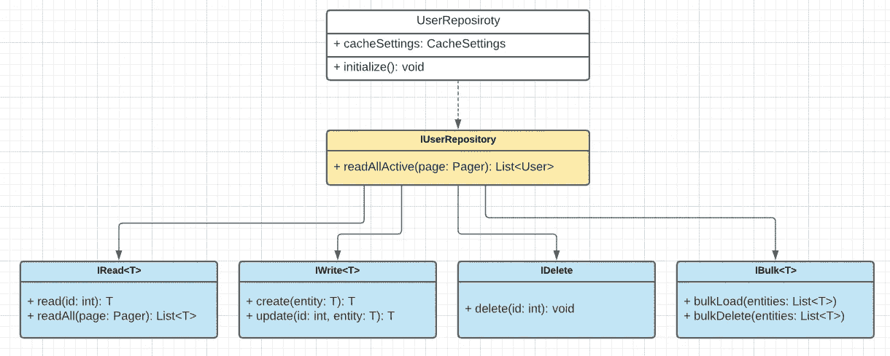
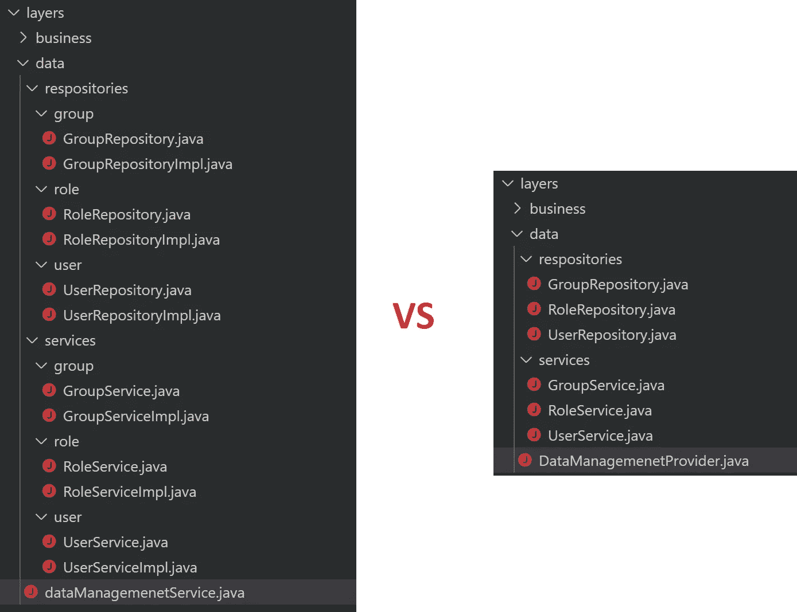

# 到固体还是不到固体，这是一个问题

> 原文：<https://medium.com/codex/to-solid-or-not-to-solid-thats-the-question-81474ef1b99e?source=collection_archive---------12----------------------->

艾米丽·莫特在 [Unsplash](https://unsplash.com?utm_source=medium&utm_medium=referral) 上的照片

软件开发中最广泛使用的设计规则是坚实的原则。如果开发模式可以被认为是任何架构决策的面包，那么坚实的原则就是它的黄油。我不能提醒单采访没有问题的固体，以及不能提醒单大拉要求没有指向固体违规。我们所有的开发过程都基于尊重坚实的原则。我们所有的编码规则都严格遵循这些规则。

它们真的那么完美吗？遵循这些原则真的能帮助我们避免设计和开发过程中的严重缺陷吗？哦，等等，我知道还有一个机构要求他们的成员严格遵守规定的规则来保护自己——教堂。

# **单一责任**

> 一个[类](https://en.wikipedia.org/wiki/Class_(computer_programming))的改变不应该有一个以上的原因。换句话说，每个类应该只有一个责任。

这里最模糊的原则。这里的“单身”是什么意思？这是对用户资源完全 CRUD 支持的表示，还是只是对单个动作的验证？因为这里没有严格的界限—1k 行的文件和 10 行的文件都可能违反这个原则。这个规则中最累人的是，你在 pull request 中的大部分建议，很容易被一句“违反单一责任”打脸。因此，在实践中，它可以用来保护任何类型的设计决策，因为没有严格的阈值可以比较。这往往是非常主观的，只是代表个人的感觉，所以几乎是争议的地方，结果减缓了开发过程。

# **打开-关闭**

> 软件实体…应该对扩展开放，但对修改关闭

中立原则。在应用于依赖模块时有无可争议的优点，但在用于独立的类和模块时有很大的缺点。

当你的模块可以作为依赖项使用时——由于许多因素(bug 修复、特性需求变化等)而改变它的行为是危险的。这种变化会自动传播到父模块，也可以改变它的行为。因此，一旦模块 API 成为公共，就应该保护它不被修改。

但是这个规则对于包私有或者内部使用的类和模块没有意义。如果你有正确的测试金字塔和良好的测试覆盖率——所有影响行为的模块变化都将在不同的层次上被捕获。你不需要仅仅为了符合这个原则而创建超类或重新设计基类来支持动态扩展——你是在引入复杂性而没有任何好处。保持简单——如果这个变更的唯一用户是您，并且您有很好的测试覆盖率来保护行为变更，那么就改变它。

# **界面偏析**

> 许多特定于客户端的接口比一个通用接口要好。

让我们回顾一些简化的例子，当单一目的的存储库被表示为原子契约的组合时。想象一下这个原子是由安全考虑驱动的——特定的组件可能只需要特定的数据管理权限，比如“只读”。这种设计从各个角度来看都是好的——它是由“接口隔离”原则驱动的，并且符合安全要求。

业务层可能需要可用的 *IRead <用户>* 接口的实现，所以对实现保持不可知。从测试的角度来看，这样做很好，可以很容易地用自定义实现替换接口。

但是以后您可能需要负责管理现有用户的服务，所以写和删除功能都是必需的。这一要求让我们不高兴，因为在设计中产生了变化——我们需要创建更复杂的层次结构，例如引入 *IWriteDelete* 接口作为 *IDelete* 和 *IWrite* 接口的父节点，或者将写入和删除合并到单个 *IWrite* 功能中。最终，各种各样的用例迫使我们将我们的原子能力归纳为下游依赖项将使用的单一工作单元— *IUserRepository* 。所以从设计的角度来看，我们所有的原子将只是漂亮的图片和浪费时间的活动，从长远来看没有实际用途。所以保持简单——设计你的界面来代表工作单元，而不是特定的动作。这种接口的细粒度或粗粒度特性将由领域模型驱动，而不是抽象原则。

# **依赖倒置**

> 依靠抽象，而不是具体。

下面提醒一下这样做的原因。当使用依赖接口时——可以在任何时候(甚至是运行时)轻松地更改实现，而无需更改源代码。因此，您可能有 PostgreSQL 和 MsSQL 驱动程序实现，但所有者与保持不可知的实现细节，将只依赖于合同这两个支持。很酷的模式…来教学生。

让我们提醒一下，我们真正需要支持单个契约的多个实现的频率是多少？我可以预测，在我们支持的所有服务中，不会超过 1%。所以在 99%的情况下，我们使用只有一个可能实现的抽象？所以 99%的类复制(接口+实现)只是为了匹配这个规则？不错不错。

我能理解我们使用的 IoC 容器何时需要接口绑定。然后我们没有太多的自由，但应该遵循图书馆的要求。但实际上，大多数广泛使用的 DI 框架(例如 Spring、Inversify)并不太关注你使用的依赖类型——它可以基于接口或实现本身为你的实现绑定。仅仅为了满足一些抽象的规则而复制文件会使项目变得更大更复杂。保持简单——当你真的想有植入不可知的联系时，依靠接口。如果你只有一个可能的实现，你想在这里隐藏什么？

# 结论

我在这里不是呼吁拒绝模式，只关注业务需求。不，模式、规则和实践是产生和支持复杂解决方案的基本规则。像基本的 OOP 原则一样，它们应该是任何设计的基础。但不要只关注最广为人知的一套原则。请注意，没有单一的完美解决方案——始终评估不同的做法，通常你的赢家会是 KISS。