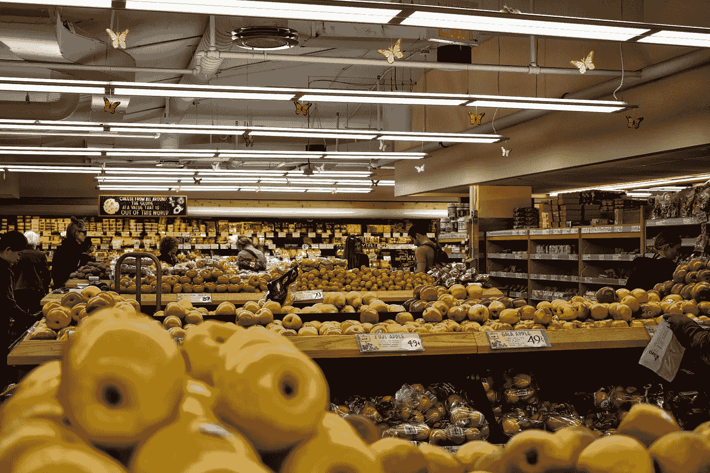

# 要理解编码，请去超市

> 原文：<https://medium.com/codex/to-understand-coding-visit-the-supermarket-2caa786075b4?source=collection_archive---------4----------------------->

罗布·麦克斯韦在 [Unsplash](https://unsplash.com/s/photos/supermarket?utm_source=unsplash&utm_medium=referral&utm_content=creditCopyText) 上的照片

如果你是编程新手，或者考虑将编程作为一个新的职业，那么开始编程似乎是一个巨大的挑战。阅读十篇不同的关于编程语言的文章，你肯定会得到关于哪种编程语言“最好”的二十种不同观点但是考虑一下:如果有一种“最好的”语言，人们难道不会蜂拥而至，把其他的都抛在脑后吗？

在我的职业生涯中，我使用了许多编程语言，我发现理解任何编程语言的最好方法是从一个完全不同的角度来理解它。

例如，假设你想去超市买些食物。你会走路吗？开自行车？也许是辆车？虽然这听起来一点也不像编程，但正是这种真实世界的问题帮助人们*理解*学习如何编码的过程。然而，在我们开始之前，让我们更深入地探索一下我们的场景。

如果商店在十英里之外，你可以开车去买杂货。如果商店就在隔壁，你可以走路去。如果商店就在附近，但步行去太远，你可以骑自行车去。但是如果你打算买五袋食品杂货，自行车可能不适合这次特殊的旅行。回想一下最近几次去商店的经历，你会很容易地发现选择交通工具有很多问题。

现在让我们真正疯狂起来。假设你刚搬到一个新城镇，不知道去哪里买杂货。跳上车，开始在城里到处跑，试图找到你需要的商店，这有意义吗？不，更明智的做法是做一些调查，确定哪家商店最近，或者哪家商店有你需要的特定用品。让这个疯狂的场景更进一步，假设你没有智能手机或电脑来进行网络搜索。你如何找到最近的有机食品商店？

每天，人们都会解决各种类似的问题。虽然我们可能甚至没有想到，但解决任何问题的第一步是建立*上下文*。在我们的超市问题中，上下文是由距离、食物类型、食品数量和运输选择来定义的。一旦这些细节得到更好的理解，我们就能更好地成功获得食物。

学习编程语言也是如此。**语境为王**。你想为服务器、台式机或移动设备编写解决方案吗？您是否希望编写可从浏览器、命令行或桌面访问的解决方案？你的程序是由单个用户使用还是多个用户同时使用？了解这些问题可以帮助您在选择适合您目标的语言和环境方面有一个良好的开端。

也许这些问题都太宽泛了。甚至不确定什么是服务器、台式机或移动设备？太棒了。仅仅理解你不知道的东西就能给你一个开始探索的发射台。每一个问题，无论是编程还是生活中的，都可以用“大象和香蕉”的方法来解决:一次咬一口。只是一定要定一个目标，然后每天咬一口。