# 基于令牌的认证

> 原文：<https://medium.com/codex/token-based-authentication-4dfcf8a62a53?source=collection_archive---------0----------------------->

在应用程序中实现用户身份验证的全面指南


马特·阿特兹在 [Unsplash](https://unsplash.com/search/photos/key?utm_source=unsplash&utm_medium=referral&utm_content=creditCopyText) 拍摄的照片

在本教程中，我们将介绍`token-based authentication`。

基于令牌的身份验证背后的一般概念是用户能够获得令牌来交换他们的用户凭据。该令牌授权用户访问受保护的资源，而无需查询凭据。

获得令牌后，用户就通过了身份验证，可以在指定的时间内访问受保护的资源。

**换句话说…**


酒店和房间钥匙

> 通常当你登记入住旅馆时，会给你一把房间钥匙。把房间钥匙当成你的信物。这个房间钥匙给你的用户，访问受保护的资源，如健身房和游泳池。
> 
> 您被授权在特定的时间内使用健身房和游泳池:您在酒店逗留的时间。一旦您离开酒店，您就不再有权访问这些受保护的资源。

## **什么是曲奇？🍪**

Cookies 是从一个网站发送的小块数据，当用户浏览该网站时存储在用户的 web 浏览器中。每次用户加载该网站时，浏览器都会将存储的数据发送回网站或服务器，以区分用户以前的活动。

# G 开始设定

在本教程中，重点是基于令牌的认证，因此，我们将不使用数据库。在另一篇教程中，我将再次讨论这个主题，使用基于令牌的身份验证创建一个 MERN 堆栈 Web 应用程序。

**旁注……**

> 我从一个特殊的角度写了这篇文章。在这篇文章发表的时候，我是一个编码训练营的助教，我注意到很多学生正在努力调试他们的控制台错误。在本指南中，我们分析并解决常见错误。也就是说…

## 我们开始吧

我们将为此项目使用的 3 个最重要的工具如下:

b [crypt](https://www.npmjs.com/package/bcrypt) :一个帮助你哈希密码的库。

[json-webtoken](https://www.npmjs.com/package/jsonwebtoken) :一个 json 对象，被定义为一种安全的方式来表示双方之间的一组信息。

[dotenv](https://www.npmjs.com/package/dotenv) :从`.env`文件加载环境变量到`[process.env](https://nodejs.org/docs/latest/api/process.html#process_process_env)`的零依赖模块。

[cookie 解析器](https://www.npmjs.com/package/cookie-parser):解析`Cookie`头，并用一个以 cookie 名称为关键字的对象填充`req.cookies`。可选地，您可以通过传递一个`secret`字符串来启用签名 cookie 支持，该字符串分配`req.secret`以便它可以被其他中间件使用。

## 现在，让我们来设置我们的应用程序:

假设您已经安装了 Node.js 和 Git，在您的终端中运行以下命令开始。

```
$ cd Desktop
$ mkdir authentication && cd authentication
$ git init
$ npm init -y
$ npm i express bcrypt dotenv jsonwebtoken nodemon morgan cookie-parser uuid
$ mkdir controllers utilities routes config models && touch server.js
$ touch config/dbUsers.json
$ echo -e 'node_modules \n.env'> .gitignore
$ echo -e 'PORT=portNumber \nSALTROUNDS=number \nSECRET=string'> .env
```

在本教程中，不需要`config`和`models`。然而，如果我们使用数据库，配置目录将包含我们的数据库连接，我们的模型目录将包含我们的数据模型。

在您的`.env`文件中，更改以下内容:

```
portNumber to a port number, typically 3001.
number to an integer.
string to a "string", this is just a secret signature we will user later on.
```

最后一个变化是更新我们的 package.json 文件，并为 nodemon 添加一个脚本。在 package.json 中添加以下内容:

```
"scripts": {
    "nodemon": "nodemon server.js"
  }
```

这是我们刚刚做的总结。

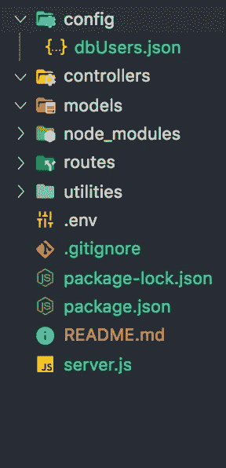

启动器应用程序

1.  在桌面上创建一个名为 authentication 的目录，并导航到该目录
2.  我们用`git`初始化项目
3.  我们用默认设置的`package.json`文件初始化项目
4.  我们安装我们的依赖项
5.  我们创建空的服务器文件和所需的目录
6.  创建了一个`Users.json`文件，其中包含我们的模拟用户数据库
7.  创建了一个名为`.ignore`的文件，并写下要忽略的文件/文件夹的名称
8.  通过使用`process.env`创建一个名为`.env`的文件，该文件将保存在整个项目中使用的`environment vairables`。

让我们从终端运行`npm run nodemon`来启动`server.js`文件。

让我们给我们的 express 应用程序添加一些代码。我不会详细解释每一行代码是做什么的，但是，用一点 google foo 就可以很快找到这些问题的答案！继续前进…

```
// In server.jsconst { config } = require('dotenv');
const express = require('express');
const app = express();
const logger = require('morgan');
const cookieParser = require('cookie-parser');
const userRoutes = require('./routes/user');
// LOADS ENVIRONMENT VARIABLES
config({ debug: process.env.DEBUG });
// LOGS HTTP METHODS
app.use(logger('dev'));
// PARSES JSON
app.use(express.urlencoded({ extended: true }));
app.use(express.json());
// PARSES COOKIES
app.use(cookieParser(process.env.SECRET));
// ROUTES
app.use('/users', userRoutes); 
// LISTENS ON PORT
app.listen(process.env.PORT, () =>
  console.log(`App running on http://localhost:${process.env.PORT}`)
);
```

## 恭喜你！我们出现了第一个错误！🎉

我们很快就会谈到这一点。但在此之前，有几件事需要注意。在我们的代码中，我们使用 d *重构:*

```
es5
require('dotenv').config({ debug: process.env.DEBUG });es6const {config} = require('dotenv');
config({ debug: process.env.DEBUG });
```

## **现在，对于错误……🧐**

起初，这可能令人不知所措，但如果我们仔细观察…

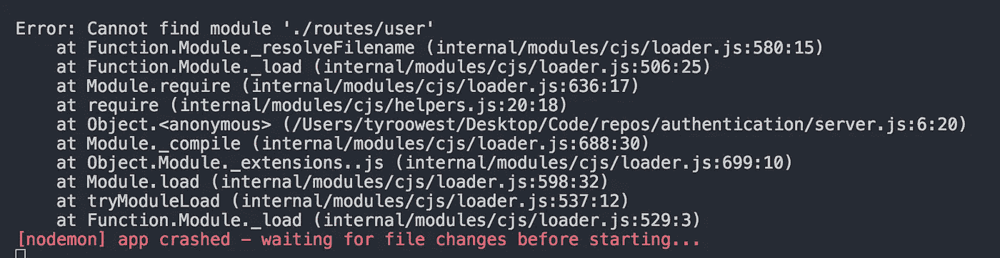

`*Error: Cannot find module './routes/user'*`

1.  我们的错误说明了什么？`*Error: Cannot find module './routes/user'*`
2.  这个错误是什么意思？`*Cannot find our module userRoutes*`
3.  为什么我们会得到这个错误？`*ur we are requiring a variable that references a file which does not exist yet*`
4.  我们如何修复这个错误？`*Create a file called user.js inside of the routes directory*`

**边注**:*`*app.use('/users', userRoutes)*`*是做什么的？**

*`*app.use('/users', userRoutes)*` 用`*/users*` *给 routes/user.js 里面我们所有的路由加前缀。**

```
*// In routes/user.jsconst router = require('express').Router();
const {login, logout, signup, cookieCheck, getUsers} = require('../controllers/user');router.get('/all', getUsers);
router.get('/authorized', cookieCheck);
router.post('/login', login);
router.get('/logout', logout);
router.post('/signup', signup);module.exports = router;*
```

*我们在这里做的是`requiring & exporting`这个，并使用我们的`controller functions`到`handle our routes`。这些功能`getUser, cookieCheck, login, logout, signup`用于在这些特定的路线上做一些事情。我们一会儿将回顾这些。但是首先…*

## *我们现在又有了一个错误！🤭*

*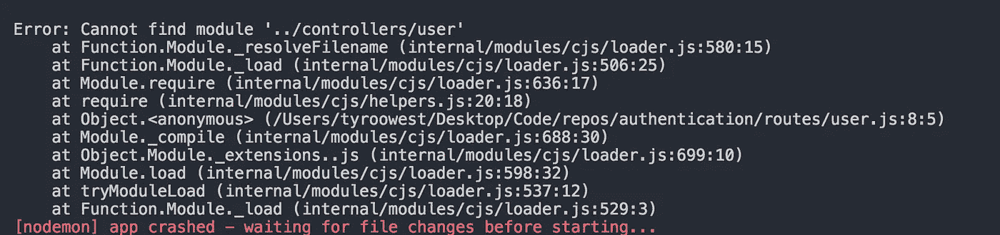*

*错误:找不到模块'../控制器/用户'*

***花点时间想想如何回答以下问题:***

1.  *我们的错误说明了什么？*
2.  *这个错误是什么意思？*
3.  *为什么会出现这种错误？*
4.  *我们如何修复这个错误？*

***回答:**我们的控制器功能没有定义。*

*为了解决这个错误，让我们在`controllers`目录中创建一个名为`user.js`的文件，并插入以下代码:*

```
*// In controllers/user.jsconst Users = require('../config/dbUsers.json');const getUsers = async (req, res) => {
  res.json(Users);
};
const login = async (req, res) => {
  res.send('you hit the login route');
};
const logout = async (req, res) => {
  res.send('you hit the logout in route');
};
const signup = async (req, res) => {
  res.send('you hit the signup in route');
};
const cookieCheck = async (req, res) => {
  res.send('you hit the authorized route, we will need to check your cookies');
};module.exports = { login, signup, logout, cookieCheck, getUsers };*
```

## *哦，看，又一个错误，耶！🤓 🎉我保证这是最后一次🤥*

*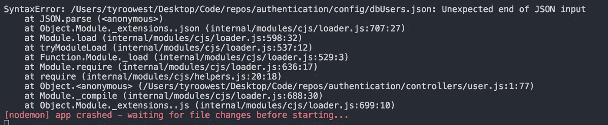*

*`*SyntaxError: dbUsers.jsonUnexpected end of JSON input*`*

*我们如何解决这个问题？没有线索？*

*让我们谷歌一下吧！🧐……等等，我要谷歌什么？*

****答案:*** *语法错误:JSON 输入意外结束**

*…如果您没有找到答案，下面是我们得到错误的原因:*

*我们的`**dbUsers.json file**`中没有任何数据*

***怎么修？***

*打开我们的`config/dbUsers.json`文件并复制🍝我们的模拟数据。*

*确保使用双引号`" "`将数据正确格式化为`JSON`*

```
*// In config/dbUsers.json {
    "username": "tyroo",
    "hashedPassword": "$2b$10$lprsK4kY7fWm1jv/a97jLO17n5NIm1qLmEoN/lO6Ip2curY.jSnSm",
    "plainTextPassword": "tyrooTheKangaroo"
  },
  {
    "username": "hanna",
    "hashedPassword": "$2b$10$CsQBUeevFRweWyIh7uYorutAmBFiy6d1/brgTWUP85U0zh3r3nxr6",
    "plainTextPassword": "hannaBanna"
  },
  {
    "username": "zane",
    "hashedPassword": "$2b$10$q1akMvEKFrDF34F6Xd.kHe1.IN27b3zUYBHn8TsnY3oZ9Su.2hkoG",
    "plainTextPassword": "zaneTheMane"
  }
]*
```

*出于演示的目的，我们硬编码了`plainTextPasswords`和`hashedPasswords`来测试我们的模拟用户。但是，我们将创建新用户并散列他们的密码。*

***恭喜你！***

*你已经走到这一步了。在这一点上，开始测试我们的路线并确保一切正常工作是一个好主意。如果你还没有这样做，继续下载[邮差](https://www.getpostman.com/downloads/)。*

# *🚨在你开始测试路线之前！！*

*每次保存 JavaScript 文件时`nodemon`都会重启应用程序。因此，每次保存时，我们新创建的用户都会被删除。*

*🛣这是我们的路线，相应的方法和回应:*

```
*| METHOD | ROUTE             | RESPONSE                        |
| ------ | ----------------- | ------------------------------- |
| GET    | /users/logout     | you hit the logout route        |
| GET    | /users/all        | displays our mock database      |
| GET    | /users/authorized | you hit the authorized route... |
| POST   | /users/login      | you hit the login route         |
| POST   | /users/signup     | you hit the signup route        |*
```

## *📂您的应用程序结构应该如下所示:*

> **测试教程时，可以忽略图像中包含的* `*images*` *目录和* `*README.md*` *。**

*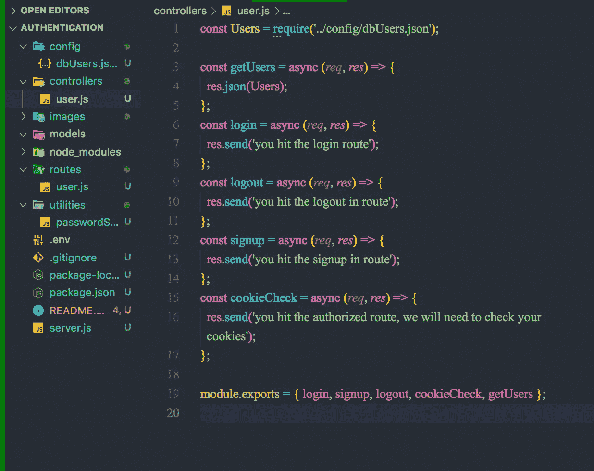*

*应用结构+用户路线*

*现在，我们所有的路由都已定义，让我们编写散列密码的逻辑，并开始使用 POSTMAN 进行测试。*

# ***🧐📝在 POSTMAN 中测试我们的路线***

*让我们打开 POSTMAN，提出我们的第一个请求。*

***待办事项:***

1.  *将我们的 HTTP 方法设置为`GET`*
2.  *将我们的路线名称设置为`[http://localhost:PORT/users/all](http://localhost:PORT/users/all)`*
3.  *确保`PORT`是正确的数字。`Check your .env`*
4.  *最后，单击发送*

*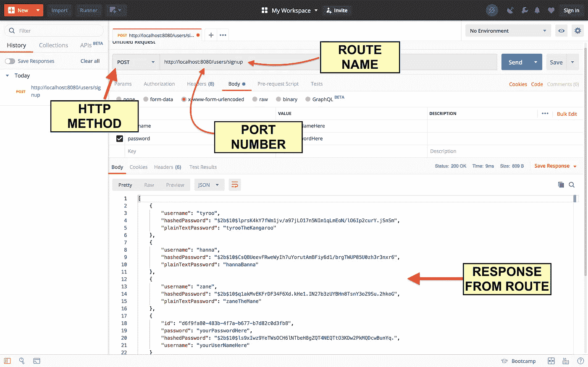*

*邮递员仪表板*

*请注意，在我们的`GET /users/all`路线上，我们的密码以明文形式存储。我们需要做的是使用 bcrypt 将`plainTextPasswords`存储为`hashedPasswords`。*

*让我们在实用程序目录中创建一个名为`passwordService.js`的文件，并插入以下代码:*

```
*// In utilities/passwordService.jsconst bcrypt = require('bcrypt');
const { SALTROUNDS } = process.env;module.exports = {
  hashPassword: async myPlaintTextPassword => {
    try {
      let hash = await bcrypt.hash(myPlaintTextPassword, parseInt(SALTROUNDS));
      return hash;
    } catch (err) {
      if (err) throw err;
    }
  },
  checkPassword: async (myPlaintTextPassword, hash) => {
    try {
      let isMatched = await bcrypt.compare(myPlaintTextPassword, hash);
      return isMatched;
    } catch (err) {
      if (err) throw err;
    }
  }
};*
```

1.  *我们在这里做的是需要 bcrypt 包并使用我们的`.env`文件中的`environment variable SALTROUNDS`。*
2.  *导出两个函数，`hashPassword`和`checkPassword`，它们将在我们的`login and register`路线中使用。这通常会在您的用户模型上完成，但因为我们没有使用官方数据库，所以我们将在我们的路线上直接使用它们。*

*   *`**hashPassword**`:是一个以`plain text password`为`argument`的`async function`，使用带`plain text as its first argument`的 `bcrypt.hash method`以及`salt rounds as its second argument`和`returns the hashed password`的编号。*
*   *`**checkPassword**`:是带一个`plain text password as its first argument`和一个`hashed password as its second argument`的`async function`，使用带一个`plain text as its first argument`的`bcrypt.compare method`和`hash as its second argument`和`returns the hashed password`。*

> *尽管我们的环境变量 `SALTROUNDS`是一个数字，我们仍然需要将我们的值解析为一个整数。*

# *salt rounds…嗯，那是什么？🤯*

***SALTROUNDS** :“成本因素”*

*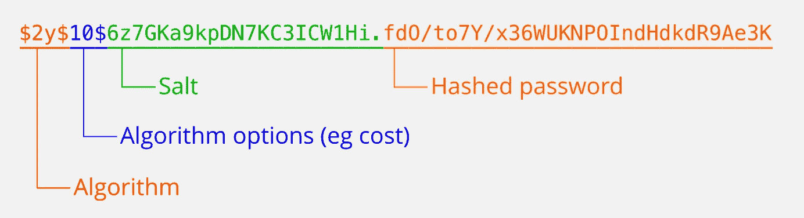*

*Bcrypt 哈希示例*

*`cost factor`控制计算一个 BCrypt 散列所需的时间。成本系数越高，`hashing rounds`做得越多。成本系数增加一倍，所需时间增加一倍。成本系数越高，散列就越难受到[强力攻击](https://en.wikipedia.org/wiki/Brute-force_attack)。*

1.  *salt 是一个随机值，每次计算都应该不同。即使密码相同，结果也不应该完全相同。*
2.  *salt 通常以可读的形式包含在结果散列串中。所以在存储散列串的同时，你也存储了盐。*
3.  *成本系数为 10 意味着计算要进行 2 次⁰，也就是大约 1000 次。获得最终哈希需要的计算轮次越多，需要的 CPU/GPU 时间就越多。这对于计算登录的单个散列来说没有问题，但是当您强行使用数百万个密码组合时，这就成了一个大问题。*

## *我们有我们的功能，我们如何使用它？*

*在本练习中，我们将分别修改每条路线，因此请务必复制并粘贴位于每个代码片段顶部的新`constant variables`。*

*为`signup`路线插入以下代码:*

```
*// In controllers/user.jsconst uuid = require('uuid/v4');
const Users = require('../config/dbUsers.json');
const { hashPassword } = require('../utilities/passwordService');const signup = async (req, res) => {
  try {
    let newUser = {
      id: uuid(),
      password: req.body.password,
      hashedPassword: await hashPassword(req.body.password),
      username: req.body.username
    };
    Users.push(newUser);
    res.status(200).redirect('/users/all');
  } catch (err) {
    if (err) throw err;
  }
};*
```

*我们在这里做的是需要一个包`uuid`，它为我们的 newUser 对象创建一个唯一的 id。然后，我们使用我们的`hashPassword`中间件功能，并从我们的`req.body`中的 post 传递我们的密码。然后，我们将我们的`newUser`推送到我们的`dbUsers.json`文件，向我们的客户端发送一个状态代码，并重定向到我们的`/users/all`路由。*

## *使用 POSTMAN 测试您的`/users/signup route`*

*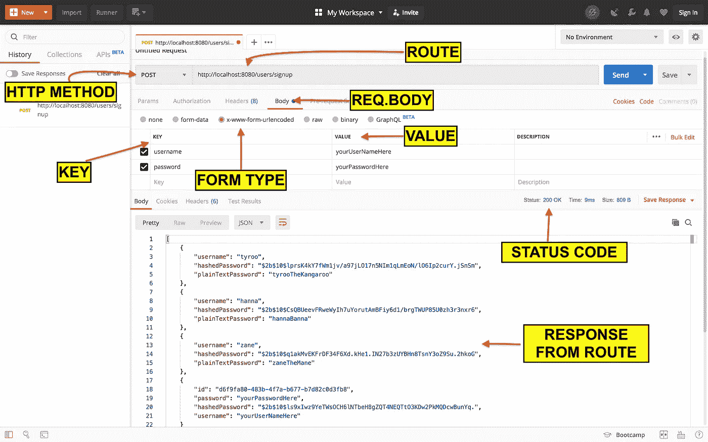*

*邮寄方法邮递员*

*   *HTTP 方法:`POST`，*
*   *路线:`[http://localhost:yourPortNumber/users/signup](http://localhost:yourPortNumber/users/signup,)`*
*   *点击`body`*
*   *选择`x-www-form-urlencoded`*
*   *最后，添加一个键值对`username, password`*

*提交`POST`后，在`response`中应该会有一个新用户*

*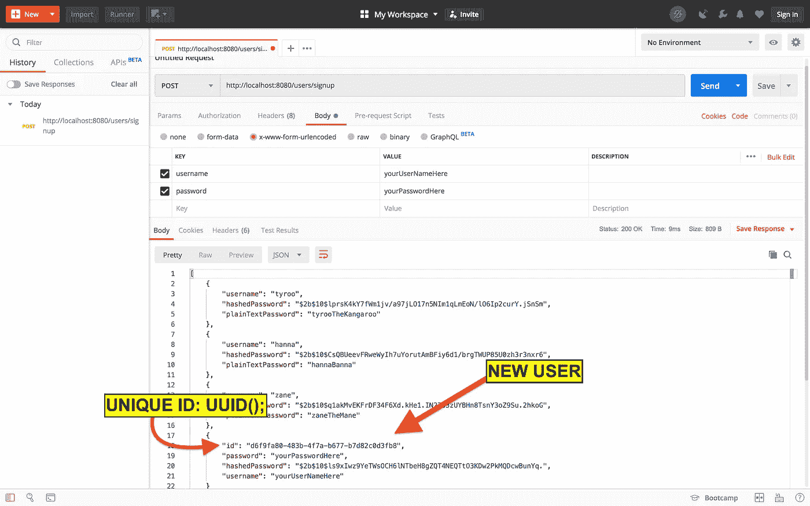*

*具有 id、用户名、密码和散列密码的新用户*

*瓦拉！现在，您应该能够创建一个新用户，该用户应该有一个 id、用户名、密码和一个`hashedPassword`字段。*

*接下来，我们将使用来自`utilities/passwordService.js`的`checkPassword middleware function`向`login route`添加功能。*

*将以下代码添加到我们的`login`路线中:*

```
*// in controllers/user.jsconst uuid = require('uuid/v4');
const Users = require('../config/dbUsers.json');
const { hashPassword, checkPassword } = require('../utilities/passwordService');const login = async (req, res) => {
  try {
    let user = Users.find(user => user.username === req.body.username);
    let isMatch = await checkPassword(req.body.password, user.hashedPassword);
    if (user) {
      if (isMatch) {
        res.status(200).redirect('/users/authorized');
      } else {
        res.send('sorry password did not match');
      }
    } else {
      res.send('sorry username does not match');
    }
  } catch (err) {
    if (err) throw err;
  }
};*
```

## *使用邮递员测试你的`login route`*

```
*- request type is POST
- route is [http://localhost:yourPortNumber/users/login](http://localhost:yourPortNumber/users/login,)
- click on body
- select www-form-urlencoded
- add key-value pair of username & password
- try using incorrect credentials
- try using correct credentials*
```

*我们在`login`路径中所做的是返回我们的“数据库”中的第一个用户，即`matches`和`req.body.username.`，然后我们使用`checkPassword`函数，即`returns a Boolean value`。检查密码功能检查`req.body.password`是否与我们的`user`中的`hashedPassword`匹配。*

*现在，我们有条件地检查用户是否存在。如果用户存在，我们将检查密码是否匹配。如果一切顺利，我们发送一个`202 status code`和`redirect`到我们的`authorized`路线。否则，我们`send errors`向`client`解释哪里出了问题。在真实的应用程序中，您的消息看起来更像这样:“对不起，您输入的凭证不正确，请重试”。*

## ***我们现在需要实现** `**json-webtokens**` **和🍪美国***

*让我们创建并打开一个文件`utilities/tokenService.js`。在这个文件中，我们需要`jsonwebtoken`包和我们的`SECRET`环境变量。然后我们将创建两个函数，`createToken`和`isValidToken`。*

```
*// In utilities/tokenService.jsrequire('dotenv').config();
const jwt = require('jsonwebtoken');
const { SECRET } = process.env;module.exports = {
  createToken: async user => {
    try {
      let token = await jwt.sign(
        { user, exp: Math.floor(Date.now() / 1000) + (60 * 60) },
        SECRET
      );
      return token;
    } catch (err) {
      if (err) throw err;
    }
  }, isValidToken: async token => {
    try {
      let decoded = await jwt.verify(token, SECRET);
      return decoded;
    } catch (err) {
      if (err) throw err;
    }
  }
};*
```

*我们期望上面的代码通过使用 jwt 对令牌进行签名来完成`create a token`。传入一个对象，带有我们期望的用户、到期时间和我们的`SECRET`环境变量。然后我们归还令牌。此外，我们使用`jwt.verify`和`SECRET`环境变量`verify our token`，其中`jwt.verify`将一个预期的令牌字符串作为其第一个参数。*

*现在，在我们的`controllers/user.js`文件中，让我们重构我们的代码和每个路由，以使用我们的令牌服务和 cookies。*

# *一个接一个地更新我们的路线处理程序*

***🚨👀🧐MAKE 肯定要试探每一条路线！！***

```
*// In controllers/user.jsconst uuid = require('uuid/v4');
const Users = require('../config/dbUsers.json');
const { hashPassword, checkPassword } = require('../utilities/passwordService');
const { createToken, isValidToken } = require('../utilities/tokenService');
const cookieOptions = {
  expires: new Date(Date.now() + 900000),
  httpOnly: true,
  // secure: true, on deployment for https
  signed: true
};*
```

*在上面的片段中:*

*   *需要 UUID 自动为我们的用户生成唯一的 ID。*
*   *要求我们的用户模拟数据库。*
*   *需要我们的密码服务和令牌服务的实用程序。*
*   *创建一个名为 cookie options 的对象，这将在下面解释。*

*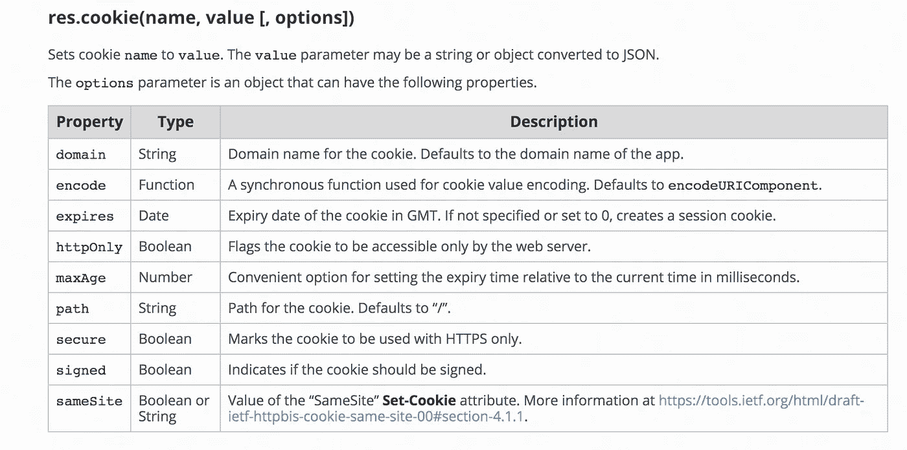*

```
*// In controllers/user.jsconst getUsers = async (req, res) => {
  try {
    res.json(Users);
  } catch (err) {
    if (err) throw err;
  }
};*
```

*在上面的片段中:*

*   *我们创建一个 getUsers 处理程序，将我们的用户数组发送给客户机。*

```
*// In controllers/user.jsconst login = async (req, res) => {
  try {
    let user = Users.find(user => user.username === req.body.username);
    let isMatch = await checkPassword(req.body.password, user.hashedPassword);
    if (user) {
      if (isMatch) {
        let token = await createToken(user);
        console.log('token', token);
        res.cookie('token', token, cookieOptions).redirect('/users/authorized');
      } else {
        res.send('sorry password did not match');
      }
    } else {
      res.send('sorry username does not match');
    }
  } catch (err) {
    if (err) throw err;
  }
};*
```

*在上面的代码片段中，我们创建了一个登录处理程序，它:*

1.  *通过用户名查找用户*
2.  *检查提交给我们的用户哈希密码的密码*
3.  *然后我们检查用户是否存在，如果是真的…*
4.  *然后我们检查密码是否匹配，如果匹配…*
5.  *使用用户对象创建令牌。*
6.  *创建一个名为 token 的 cookie，传入我们的 token 和 cookieOptions，并重定向到授权路由。*

*注意，我们`console.log("token", token);`。复制🍝这个令牌来自终端[和拜访 JWT](https://jwt.io/) 。向下滚动到调试器，经过编码区域中的标记。*

*我们的令牌在解码时包含一个头、有效载荷和签名。其中头部包含算法和令牌类型，有效负载包含数据，签名验证我们的签名是否与我们的`SECRET`环境变量匹配。*

# *JWT*

*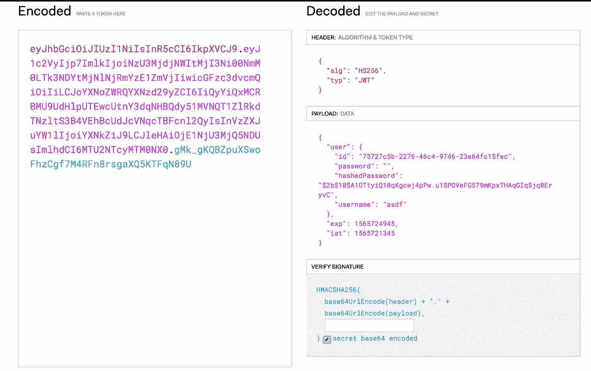*

# *编码*

*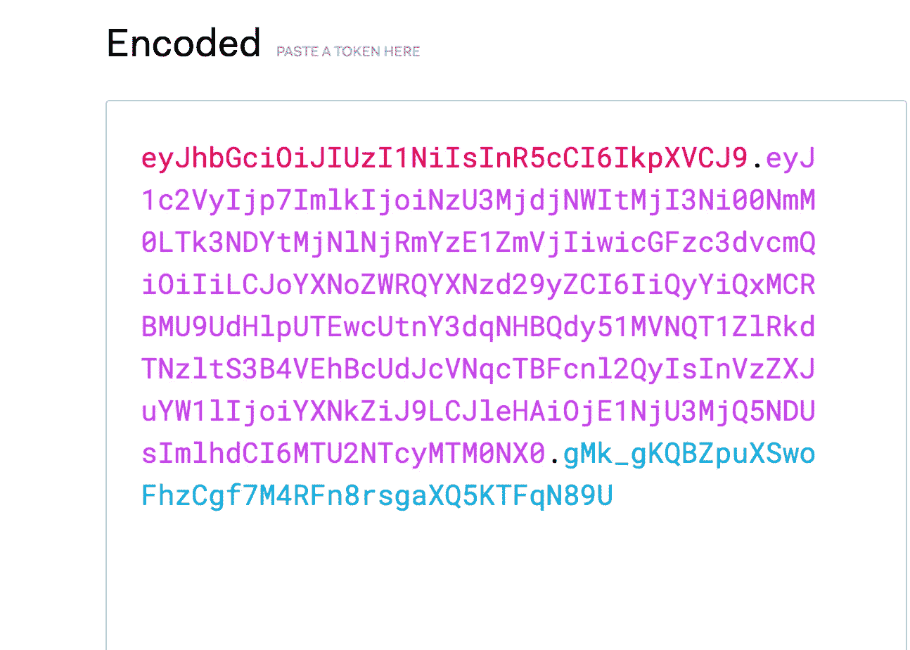*

# *译解*

*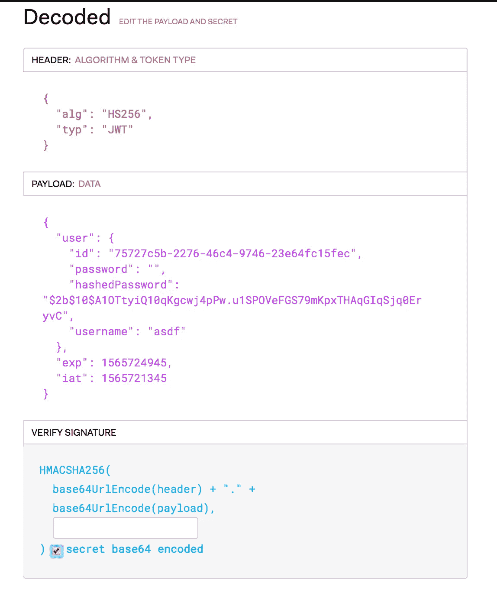*

*不要将这与加密混淆。我们所做的是将我们的凭证存储在一个对象(json web token)中，这是一个额外的安全层。*

```
*// In controllers/user.jsconst logout = async (req, res) => {
  try {
    res.clearCookie('token').redirect('/users/all');
  } catch (err) {
    if (err) throw err;
  }
};*
```

*在上面的代码片段中，我们简单地从客户端删除了 cookie，并重定向到我们的`/users/all`路由。因此，如果没有 cookie，我们的用户将被注销并且没有被授权。*

```
*// In controllers/user.jsconst signup = async (req, res) => {
  try {
    let newUser = {
      id: uuid(),
      password: req.body.password,
      hashedPassword: await hashPassword(req.body.password),
      username: req.body.username
    };
    Users.push(newUser);
    let token = await createToken(newUser);
    console.log(token);
    res
      .cookie('token', token, cookieOptions)
      .status(200)
      .redirect('/users/authorized');
  } catch (err) {
    if (err) throw err;
  }
};*
```

*在上面，我们的注册处理程序:*

1.  *创建一个新的用户对象并将新用户推送到我们的用户模拟数据库。*
2.  *用我们的 newUser 对象创建一个令牌和 cookie，就像我们的登录路由一样。*

***我知道我说的最后一个错误…🤥但是嘿，我们都是👨‍💻我们并不完美。***

*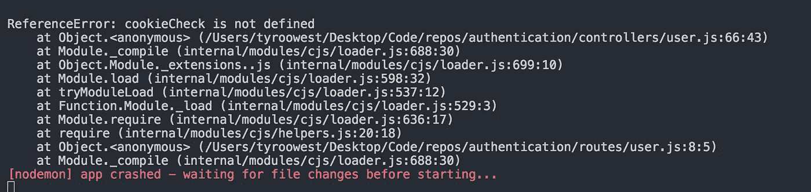*

```
*// In controllers/user.jsconst cookieCheck = async (req, res) => {
  try {
    res.send(
      'you hit the authorized route, we will need to check your cookies'
    );
  } catch (err) {
    if (err) throw err;
  }
};*
```

*目前，我们的`cookieCheck handler`只是向客户端发送一条消息。我们希望我们的 cookieCheck 处理程序做的是`get`来自`signed cookie`的`token`,如果它存在，验证令牌并提取用户的凭证。*

*接下来，`find a user`在我们的模拟数据库中使用来自`token`的凭证，并将它们发送给客户端。当然，处理我们所有的错误。我们将为这个练习记录特定的错误，但是在实际的应用程序中，由于显而易见的原因，这些消息不应该出现在这里。*

*添加以下代码，然后我们将测试我们所有的路线，并确保我们是正确的用户。*

```
*// In controllers/users.jsconst cookieCheck = async (req, res) => {
  const { token } = req.signedCookies;
  if (token) {
    try {
      let {
        user: { username, hashedPassword }
      } = await isValidToken(token);
      let user = Users.find(user => user.username === username);
      res.send({ username: user.username, password: hashedPassword });
    } catch (err) {
      if (err) throw err;
    }
  } else {
    res.send({ message: 'Sorry your token has expired.' });
  }
};*
```

*使用 POSTMAN，我们将测试以下路线:*

```
*| METHOD | ROUTE             | RESPONSE                        |
| ------ | ----------------- | ------------------------------- |
| GET    | /users/logout     | clears cookies and redirects    |
| GET    | /users/all        | displays all users              |
| GET    | /users/authorized | validates token client          |
| POST   | /users/login      | verifies username/password      |     
| POST   | /users/signup     | creates new user inside cookie  |*
```

# *概述:*

1.  *学会了什么是[饼干](https://developer.mozilla.org/en-US/docs/Web/HTTP/Cookies)*
2.  *了解如何使用 [JSON Web 令牌](https://jwt.io/introduction/)*
3.  *学会了如何阅读、研究和处理错误*

***如果你喜欢这篇文章，就把它扔掉👏🏼让我知道！感谢您的阅读，并希望为您的屏幕带来更多精彩的内容！***