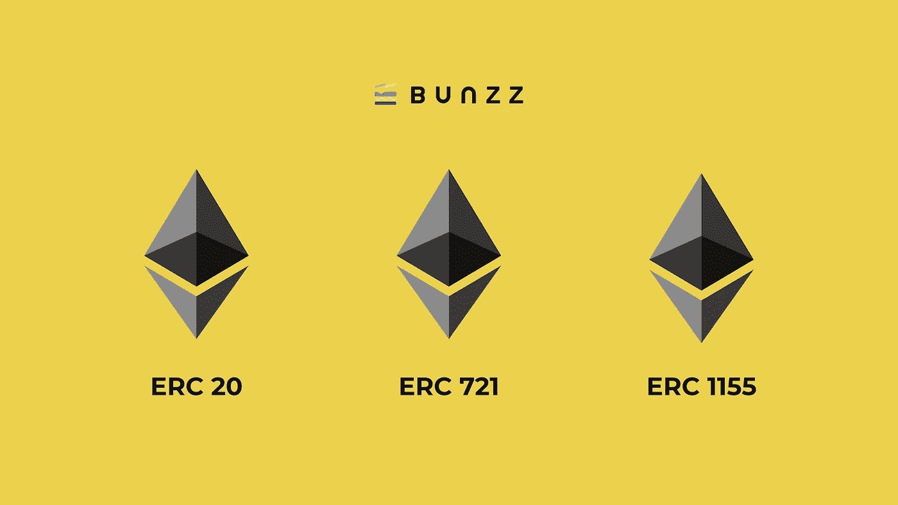

# 象征性标准:ERC-20 对 ERC-721 对 ERC-1155

> 原文：<https://medium.com/codex/token-standards-erc-20-vs-erc-721-vs-erc-1155-2e4a09dc0f8a?source=collection_archive---------13----------------------->

由 [iamtjah](https://twitter.com/iamtjah) 设计的文章横幅

ERC 代表 ***以太坊请求评论*** ，解决这个话题将帮助我们更好地理解许多区块链用例的范围。

在某种程度上，ERC 标准定义了编写智能合同的标准，该合同管理以太坊上的令牌活动。

其中，以太坊区块链网络已经批准了三个重要的协议或令牌标准在生态系统中运行: ***ERC-20、ERC-721 和 ERC-1155*** 。这些是目前最常用的令牌标准，因为以太坊是市场上最知名和最主要的区块链。

这些令牌标准在定义它们的特定方式上互不相同。在深入细节之前，让我们先给你一个大概的概念。

这三种代币类型取决于 NFT 的发展和可替代性水平。区块链以太坊发行的第一枚代币是 ERC-20。它被用来铸造可替换的代币，现在仍然如此。然后，该系统引入了一个新的不可替代的令牌标准，ERC-721，用于创建令牌。ERC-1155 在 2019 年开始活跃。这个令牌是另外两个令牌的交叉。

ERC-1155 的 USP 实际上是在单个智能合约中创建不可替代、可替代和半可替代令牌的能力。

让我们仔细看看他们每一个人。

# 以太坊令牌标准的演进

## ERC-20(可替换的代币)

ERC-20 于 2015 年提出，最终在 2017 年与区块链以太坊整合。

在以太坊区块链上，使用 ERC20 令牌标准发布和创建智能合约。分散式生态系统将脚本令牌标准广泛用于各种用途。由于 ERC-20 是用于控制某些区块链操作的规则集合，因此其用户主要是组织和管理机构。

如你所知，ERC-20 是一个可替换的令牌，可以用于相同的实体。正因为如此，它可以用于建立 stablecoins、ICOs(初始硬币发行)、众筹和相关活动。

以下数字资产理论上可以用 ERC-20 令牌来表示:

-在线竞赛的门票。
-真实世界的金融资产，如公司股票、股份股息等。
-通过在线游戏赢取的积分。
-其他可兑换积分。2017 年的加密牛市可能在 ERC 20 代币的发展中起到了至关重要的作用。基于 20 令牌构建的加密货币的几个突出例子是 Tether、Chainlink、和 DAI。尽管它是被广泛接受的令牌标准，但它不能成为万金油，因此后来推出了新的以太坊令牌标准。

## ERC-721(不可替代的代币)

与 ERC-20 不同，ERC-721 专注于不可替换的令牌。换句话说，根据这个令牌的规则，创建了单一的、不能被任何东西替代的数字实体。

简而言之，ERC-721 对于不总是以数字货币形式出现的数字资产至关重要，正如 ERC-20 对于向市场推出新的加密货币至关重要。

新令牌最初由 CryptoKitties 的创始人兼首席技术官 Dieter Shirley 在 2017 年作为以太坊改进提案(EIP)提出，最终在 2018 年被区块链的监管机构接受。

ERC-20 对发现新的加密货币很重要。同样，ERC-721 对于开发新颖有趣的 NFT 作为不可变所有权证明也是必要的。

让我们了解一下 ERC-721 能代表什么:

-独一无二的数字内容。
——房地产地产。
-社交媒体内容推文、视频和图片。
-博彩资产和收藏品。
-游戏角色。

你现在正在经历 NFT 最近的高峰，这可以归因于 ERC-721 的引入。新的协议使得创作者、游戏玩家和其他任何有特殊商品出售的人的市场发展成为可能。

如果没有这个象征性的标准，艺术家毕普就不可能卖出一件价值 6900 万美元的数字艺术品。

## ERC-1155(多代币)

ERC-1155 于 2018 年在区块链以太坊打开了一扇新的大门，由金恩首席技术官威泰克·拉多姆斯基打造。在单个智能合约中，用户可以创建可替换和不可替换的令牌。本质上，它有助于填补市场空白。ERC-1155 是一个游戏规则的改变者，因为它现在允许你在一个地方找到你需要的 NFT 的所有解决方案。

ERC-1155 令牌可以表示以下内容:

代币。
- NFTs。
-可兑现的购物券等。

此外，用户友好的设计对新手来说是一个更有效的环境。用他们自己的话说，ERC-1155 背后的基本思想是，一个智能合约可以控制几乎无限数量的令牌。艺术家和游戏玩家的另一个好处是，新硬币将汽油价格降低了 80%至 90%。

根据 Radomsk 的说法，“Horizon Games 的创造者 Phillippe Castonguay 通过使用一种称为平衡打包(在一个 ID 中保留 16 个低分辨率令牌)的技术，与标准传输相比，能够节省 80-90%的气体。”

# 结束语

这三个令牌标准只是一个非常有效和开放的数字生态系统的开始。在未来几年，由于令牌标准发展的速度相当快，在区块链看到重大突破并不令人震惊。

如果您想在不到 10 分钟的时间内构建和部署所有 ERC 令牌，只需很少的代码或不需要代码，请尝试使用 [Bunzz DApp 构建器](https://www.bunzz.dev/)并查看此[视频指南](https://www.youtube.com/watch?v=2zNymFqYXOY)来部署 ERC-721 令牌(NFTs)。

在[Discord](https://discord.gg/ZsqvmdBA4e)|[Twitter](https://twitter.com/BunzzDev)|[LinkedIn](https://www.linkedin.com/company/bunzz)上关注并加入 Bunzz

在 [Twitter](https://twitter.com/iamtjah) 上与我联系。