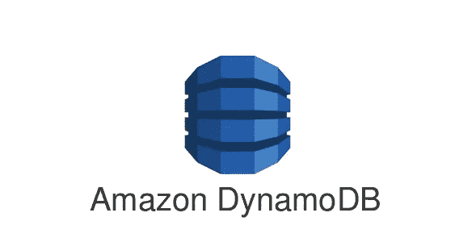

# 好得难以置信:为什么 NewSQL 失败了

> 原文：<https://medium.com/codex/too-good-to-be-true-why-newsql-failed-63ccbda3842b?source=collection_archive---------6----------------------->

2000 年代后期，出现了一种新型数据库，以解决与存储大量数据相关的数量迅速增加的机会和问题。

这些非关系数据库被归入术语*下，并提供灵活的模式、更好的伸缩性和快速查询，但不支持 [*ACID*](https://en.wikipedia.org/wiki/ACID) 事务。*

*没过多久，就有人提出了一个解决方案，2011 年，一位名叫马修·阿斯莱特(Matthew Aslett)的 451 Group 分析师创造了“新 SQL”一词。一种新型的关系数据库诞生了，它提供了 NoSQL 的可伸缩性，同时保持了传统的 ACID 保证。*

*10 年过去了，关于“现在是时候了”的文章数不胜数，我们不禁要问为什么 NewSQL 从未真正流行起来。本文将讨论技术细节，为什么 NewSQL 在理论上很有意义，以及我们可以从它的实际失败中学到什么。*

# *NoSQL 的崛起*

*为了深入研究 NewSQL 是什么——以及应该是什么——我们必须首先简要回顾一下 NoSQL 的历史，反过来，它最好被理解为关系数据库的替代品。*

*Edgar F. Codd 于 1970 年在其开创性论文[“大型共享数据库的数据关系模型](https://www.seas.upenn.edu/~zives/03f/cis550/codd.pdf)中首次引入了元组关系演算，基于此，关系数据库将数据排列到不同的行和列中，并为每一行关联一个特定的键。*

*几乎所有的关系数据库系统都使用[结构化查询语言](https://searchsqlserver.techtarget.com/definition/SQL) (SQL)，这是在 Donald Chamberlin 和 Raymond Boyce 发表“[SEQUEL:A Structured English Query Language](https://dl.acm.org/doi/10.1145/800296.811515)时首次引入的从那以后，关系数据库的繁荣就没有停止过，直到今天，它仍然占据着主导地位。关于 SQL 50 年统治的更详细的历史，请查看我以前的一篇博客文章。*

*SQL 数据库倾向于更加严格和受控的系统，并且只提供有限的能力来翻译复杂的数据，例如非结构化文档。这意味着——随着互联网在 20 世纪 90 年代中期迅速获得极大的普及——关系数据库根本跟不上用户所需的信息流，也跟不上所需的更多种类的数据类型。*

*开发 NoSQL 就是为了满足这种快速处理大量非结构化数据的新需求。Carlo Strozzi 在 1998 年首次使用这个缩写来表示他的开源“关系”数据库，Eric Evans 和 Johan Oskarsson 再次使用它来表示他们的非关系数据库。对该术语最常见的解释是“不仅是 SQL”，以强调一些系统可能仍然支持类似 SQL 的查询语言。*

*NoSQL 系统不仅可以处理结构化和非结构化数据，还可以快速处理非结构化[大数据](http://www.dataversity.net/brief-history-big-data/)，这得益于[的分布式特性](http://markets.businessinsider.com/news/stocks/nuodb-insights-provides-critical-visibility-into-distributed-database-performancenew-graphical-dashboard-introduced-as-part-of-nuodb-3-1-empowers-users-to-optimize-cloud-and-container-resources-1020950098)。非关系型系统速度更快，使用专门的方法来组织数据，并处理大量不同的数据。这些能力导致 Twitter、脸书、LinkedIn 和 Google 等组织将 NoSQL 作为其技术堆栈的一部分。*

# *NoSQL 的多种风味*

*NoSQL 是一个灵活的术语，用于描述许多本身也趋于灵活的专用数据存储设计。这些数据存储通常针对特定目的进行了优化，但可以分为几个主要类型。*

# *NoSQL 键值数据库*

**

*[键值存储](https://www.infoworld.com/article/3223728/nosql/nosql-standouts-the-best-key-value-databases-compared.html)，也称为键值数据库，是一种使用简单的键值方法存储数据的数据存储系统。这些数据库包含一个始终唯一的简单字符串(键)和一个任意大的数据字段(值)。它们易于设计，是为存储、检索和管理“关联数组”而设计的*

# *使用 NoSQL 的文档数据库*

**

*[文档存储库](http://basho.com/resources/document-databases/)是一个非关系数据库，用于存储、检索和管理“面向文档的信息”，也称为半结构化数据。文档数据库将给定项目的所有信息保存为数据库中的单个实例，从而可以很容易地将项目映射到数据库中。文档可以是 PDF、文档、XML 或 JSON 文件。*

# *时间序列 NoSQL 数据库*

**

*时间序列数据库是一种数据库系统，用于存储和检索带有时间戳的数据。它“针对运营监控、[物联网](https://en.wikipedia.org/wiki/Internet_of_Things)传感器数据和实时分析等领域的[时间序列](https://en.wikipedia.org/wiki/Time_series)数据的快速、高可用性存储和检索进行了优化。”*

# *NoSQL 图形数据库*

**

*[图形数据库](https://www.computerweekly.com/blog/Data-Matters/2018-is-a-graph-shaped-year)以节点的形式存储数据，使用灵活的图形表示来管理数据。每个节点都与另一个节点相连，这种连接称为“边”，代表两个节点之间的关系。这些数据库被优化以存储数据对象之间的关系(例如 Twitter 上的关注者或巴拿马的普通律师)。*

# *实现 NoSQL 的宽列数据库*

**

*宽列存储使用典型的表、列和行，但与标准的关系数据库不同，同一表中不同行的格式和名称会有所不同。他们使用持久、稀疏的矩阵、多维映射来实现巨大的可伸缩性。*

# *搜索引擎 NoSQL 数据库*

**

*搜索引擎数据库是非关系数据库，专用于通过索引来搜索数据内容，以便对数据中的相似特征进行分类并促进搜索能力。它们中的许多都是开源的，通常与其他非关系数据库放在一起。*

# *人工智能数据库*

**

*人工智能数据库是一种快速兴起的数据库方法，致力于创建更好的机器学习和深度学习模型，然后更快更有效地训练它们。他们有时使用图形处理单元来部署分布式、内存优先的数据库管理系统。*

# *什么是酸碱一致性模型？*

*关系模型和非关系模型都有优点和缺点。关系模型提供了一种内置的、万无一失的方法，通过主键和外键来保证记录之间的关系。这使得它们在连接方面非常有效，并有助于确保数据库层的业务逻辑和可信度。数据存储在多个表中，这提供了冗余和安全性，但限制了灵活性。*

*试图为 NoSQL 数据库提供一个完整的利弊列表不仅极其复杂，而且毫无意义，因为每种 NoSQL 数据库都有其特定的用例。与其试图为所有可能的变化列出一个不完整或混乱的列表，不如关注非关系模型最重要的败笔:ACID 保证更有意义。*

*这也是 NewSQL 试图在其数据库模型中解决的问题。为了理解它为什么如此重要，让我们来看一点理论。*

# *CAP 定理*

*[CAP 定理](https://dzone.com/articles/understanding-the-cap-theorem)陈述了分布式数据存储“不能”同时提供多于“三分之二”的已建立的保证。Eric Brewer 在 1999 年发表了 CAP 原理，随后麻省理工学院的 Nancy Lynch 和 Seth Gilbert 在 2002 年发表了他的概念的正式证明。*

*CAP 首字母缩写代表不能同时满足的三个保证:*

*   *一致性:数据总是一致的(即使在操作已经执行之后。*
*   *可用性:系统始终可用(无停机时间)*
*   *分区容错:即使服务器之间的通信不再可靠，系统仍将继续运行。*

**

# *一致性的两个模型*

*鉴于上限原则所带来的限制，开发了两个流行的一致性模型，它们也是首字母缩略词。*

*[酸碱](http://www.dataversity.net/choose-right-nosql-database-application/)。*

*酸代表原子性、一致性、隔离性和持久性，而碱代表基本可用。*

*ACID 保证了处理数据的安全环境。这意味着数据是一致和稳定的，并且可以使用多个存储位置。*

*BASE 是该模型的替代方案，它侧重于可用性，以便进行扩展。它提供的保证不如 ACID，但适合 NoSQL 数据库的使用案例。*

*这让我们想到了 NewSQL 试图解决的关键问题。*

# *NewSQL 的创始原则:“为什么不两者兼得？”*

**

*10 年前，Matthew Aslett 询问在不放弃 ACID 保证的情况下，可以做些什么来提供 NoSQL 的可伸缩性，并决定将这类解决方案称为 NewSQL。*

*他后来承认，这种新的数据库类别的创建是“一种意外”，“如果我们知道这个术语会流行起来，我们会提前更多地考虑它到底是什么。”目标是描述一组试图用关系 SQL 数据库模型做一些新事情的产品，因此，在当时肯定是合适的。*

*虽然这种说法现在似乎过时了(没有一个 NewSQL 数据库是新的了)，但它们有一组多年来保持不变的共同特征。利用内存存储、分区、共享和并发控制几乎都被他们所使用，尽管不同厂商的实现有所不同。连接这些应用程序的东西是“取关系数据库的精华并将其应用于分布式体系结构”的中心思想*

*因此，NewSQL 系统倾向于专注于提供高水平的可伸缩性，同时保持 ACID 兼容，而不依赖于大规模计算架构(如云技术)。*

*虽然在准确描述哪些供应商是 NewSQL 生态圈的“正式”成员方面有一些余地，但最常见的例子包括以下供应商:*

*   *[亚马逊极光](https://aws.amazon.com/rds/aurora/?aurora-whats-new.sort-by=item.additionalFields.postDateTime&aurora-whats-new.sort-order=desc)*
*   *[高地基地](https://www.altibase.com/en/index.php?ckattempt=1)*
*   *[阿帕奇交通](https://trafodion.apache.org/)*
*   *[谷歌云扳手](https://cloud.google.com/spanner)*
*   *[Clustrix](https://mariadb.com/products/clustrixdb/)*
*   *[NuoDB](https://www.nuodb.com/)*
*   *[HarperDB](https://harperdb.io/)*
*   *[VoltDB](https://www.voltdb.com/)*
*   *[内存 SQL](https://www.memsql.com/)*
*   *[cocroach db](https://www.cockroachlabs.com/product/)*

*这些应用程序各有其优点和优势，但总的来说，很难发现 NewSQL 的本质有什么问题。当然有可能在保持 ACID 保证的同时提供 NoSQL 式的扩展，这就提出了一个大问题。*

# *NewSQL 为什么会失败？*

*在这个术语第一次被创造出来的十年后，很明显，NewSQL 工具可能不会是数据库技术的未来。你可能觉得这种说法有点过于苛刻，但我实际上认为这是相当公平的，甚至是保守的。*

*虽然肯定有个别 NewSQL 供应商已经在市场上建立了一个利基市场，并吹嘘适度的成功，但该类别正在迅速失去它所拥有的少量市场份额。当观察市场上最流行的数据库时，这一点变得很明显。*

**

*即使您认为我在宣布 NewSQL 类别失败时有点过于耸人听闻，您仍然需要解释为什么这些数据库中没有一个实现了大规模采用。毕竟，提供关系和非关系数据库系统的最佳解决方案难道不应该对开发人员有某种吸引力吗？是什么阻碍了他们使用理论上更好的产品呢？*

*一种假设可能是这些数据库仍然太新。这似乎不太可能，因为它们几乎和大多数 NoSQL 数据库一样古老。另一个原因可能是 NewSQL 数据库实际上并没有提供它们所承诺的东西。考虑到至少一些供应商(如 VoltDB)似乎取得了有限的成功，我觉得 NewSQL 的主要目标肯定是可以实现的。*

*那么是什么阻碍了他们呢？云计算的兴起和专业化的缺乏似乎是最有可能的罪魁祸首。*

# *云的采用:NewSQL 黑仔？*

*NewSQL 刚好竞争拯救了和云技术一样的问题。随着互联网的兴起，许多处理高规格数据的企业系统(例如，财务和订单处理系统)对于传统的关系数据库来说变得太大了。其中一些被转换为非关系型系统，但其他的仍然必须满足[事务性](https://en.wikipedia.org/wiki/Database_transaction)和一致性需求，这对于 NoSQL 技术和基本一致性来说是不可能的。*

*为了解决这个问题，组织被迫要么购买更强大的计算机，要么开发昂贵的[中间件](https://en.wikipedia.org/wiki/Middleware)，通过传统的[数据库管理系统](https://en.wikipedia.org/wiki/DBMS)分发请求。这正是 NewSQL 应该大放异彩并席卷市场的地方。碰巧的是，第四种选择越来越受欢迎。云计算允许组织扩展标准关系模型，而不必购买额外的计算机或构建定制的解决方案。*

# *NewSQL 的理想用例？几乎没有。*

*有一个很好的理由来解释为什么有这么多不同种类的数据库。如果单个类别倾向于进一步细分为针对特定用例的定制解决方案。这是因为数据种类繁多，为不同类型的数据部署不同类型的技术通常是值得的。*

*最好的 NewSQL 数据库知道这一点，并设法填充非常具体的用例。不太成功的技术仍然是令人印象深刻的技术，但并不比更专业的 SQL 或 NoSQL 数据库更好地解决任何单一问题。*

# *NewSQL 的故事:闪光的不都是金子*

*数万亿字节的非结构化数据以光速在万维网上流动，引发了许多问题。NoSQL 数据库承诺解决许多这样的问题，但只能通过牺牲一致性来实现。*

*NewSQL 试图介入并提供一个可以两全其美的解决方案。我已经分享了我对是什么限制了它的采用的想法；云的采用和专业解决方案的缺乏。*