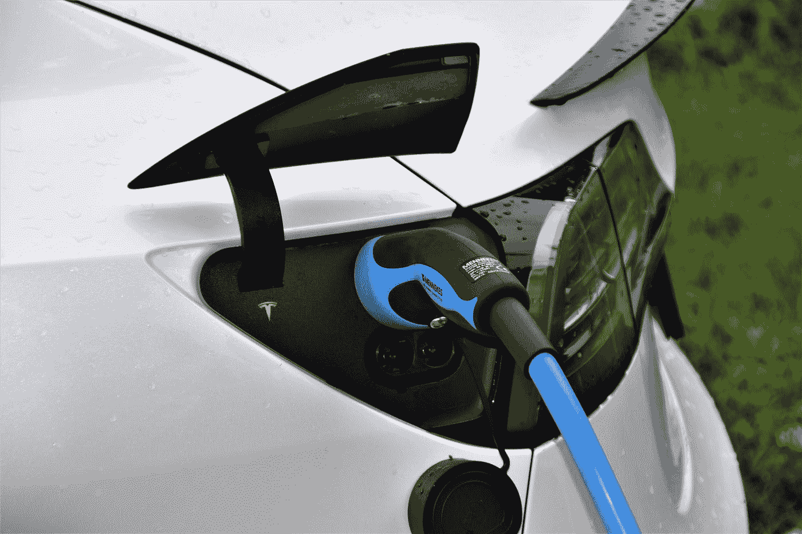

# 过多的电动汽车在夜间充电可能会使电网过载

> 原文：<https://medium.com/codex/too-many-electric-cars-charging-at-night-may-overload-electrical-grid-5c5701d25f2e?source=collection_archive---------2----------------------->

电气系统不是为处理住宅电动汽车夜间充电而设计的。为了适应住宅需求的增长，电力基础设施必须升级，功率更大。这个过程需要时间，而且会增加家庭电费。因此，夜间充电可能会导致过度充电。

在 [Unsplash](https://unsplash.com?utm_source=medium&utm_medium=referral) 上由 [Waldemar Brandt](https://unsplash.com/@waldemarbrandt67w?utm_source=medium&utm_medium=referral) 拍照