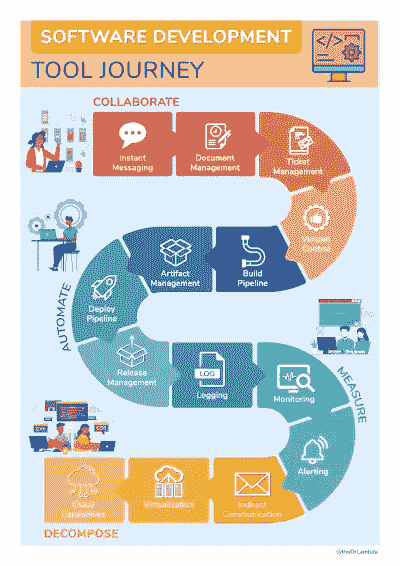

# 支持软件增长的工具

> 原文：<https://medium.com/codex/tools-supporting-software-growth-56d223bef8e1?source=collection_archive---------8----------------------->

## [抄本](http://medium.com/codex)，海报

## 我们在 DevOps 中使用的工具概述。

在软件开发中，当构建任何重要的东西时，我们都依赖工具。我们可以将我们的工具分为两类:影响代码的工具和影响过程的工具。诸如我们使用哪个 IDE 或数据库之类的工具通常会影响代码，而不是我们如何工作。另一方面，像构建管道这样的工具极大地改变了我们的工作方式，但对代码的影响很小。在本帖中，我们只关注后者。

这篇文章描述了一个从一无所有到微服务的旅程，以及我们如何采用哪些工具。这个旅程有 12 个步骤，分为四个阶段。这篇文章没有详细介绍具体的工具；关于每一步都有整本书。相反，我提供了整个生命周期的概述，讨论了一两个要点或缺陷，并在每个步骤给出了工具建议。这并不是要展示 T2 应该如何发展，而是 T4 应该如何发展，并希望引发一些问题。在这次旅行中，你的工具链在哪里？你跳过了什么步骤吗？

# 合作

软件开发最基本的就是协作。我们直接或间接地与许多其他人一起工作；用户、涉众、团队成员和其他开发团队。因此，我们使用一系列工具来最小化所有这些通信的开销。

## 即时消息

热门选择:Slack，微软团队，不和谐。

即时消息是内部电子邮件的现代替代品。我们经常看到收件人列表随着电子邮件不断增长，一旦我们被添加，就很难取消关注。这意味着我们会收到很多不必要的电子邮件，这导致了上下文切换并产生挫折感。

使用带有公共渠道的工具，人们可以选择跟踪哪些线程以及何时退出，这使得减少这种开销变得容易得多。尽管如果误用，这些工具很容易增加更多的开销和挫折。

使用公共渠道也增加了透明度，这是非常有益的。一个好处是，当我看到一个我不感兴趣的帖子，但我知道有人可能感兴趣时，我可以通知他们，他们可以很容易地加入进来。

## 资料管理

热门选择:合流、Sharepoint、栈溢出、Google Drive。

虽然即时消息对于快速信息来说很棒，但是我们也需要更多的静态信息。这包括合同、内部文档和开发人员文档。其中一些文档是法律文档或演示文稿，形式很重要，而另一些则更类似于指南或教程。

由于这些文档的风格不同，我不认为一个工具可以涵盖所有的内容。像 Sharepoint 这样的东西对非开发人员来说很好。但是对于开发人员来说，我建议将 markdown 文件放在包含代码的文件夹中，我们可以将所有与代码相关的信息放在那里。我也建议把更多的一般信息放在一个中心位置。这可能是堆栈溢出的私有部分。将文档放在离开发人员很近的地方会大大增加它的可见性。

## 票务管理

热门选择:吉拉，蓝色德沃普斯，特雷罗。

一旦我们与利益相关者签订了合同，就该开始计划了。为此，我们使用票务系统。这里的票证代表要完成的任务。任务需要区分优先级，我们的票证系统应该提供可追溯性和概览。

我们从看板中了解到，正确使用看板有助于暴露瓶颈，增强团队合作。我们的票证系统的另一个重要功能是显示我们的交付周期，即从票证进入系统到它在生产中正确运行的时间。我们甚至应该能够跟踪我们的票证需要返工或修复错误的频率。

## 版本控制

热门选择:Git、SVN、Mercurial、Pijul。

计划完成后，我们可以开始编写代码了。为了共享代码，我们需要版本控制。在当前的“meta”中，这是 Git 的同义词。我遇到过需要一个集中系统来锁定文件的情况，但这种情况很少见。

更有趣的我觉得是向前看。我将 Mercurial 和 Pijul 放在列表中，因为它们看起来可能是分布式版本控制系统的下一步。

# 使自动化

在协作阶段之后，到了自动化的时候了，这很重要，因为它支持持续集成(CI)、持续交付和最终的持续部署，这被认为会导致更少的错误并提高开发速度。

## 构建管道

热门选择:GitLab，Azure DevOps，Jenkins。

自动化的第一步是开始集中构建我们的软件。这有助于消除太熟悉的方式“它建立在我的机器上。”在一个中立的服务器上构建还可以发现一些常见的问题，比如忘记将一个文件添加到版本控制中，或者在本地构建之前进行推送。

一旦它启动并运行，我们可以通过添加静态代码分析或运行自动化测试来增加它的信心。唯一的缺陷是到达主分支的构建管道越长，人们倾向于推迟推进它的时间就越长，这不利于持续集成。我的经验是 CI 构建应该在五分钟内运行。

## 工件管理

热门选择:Artifactory、Nexus。

试图让我们的构建管道在不到五分钟的时间内运行，如果我们的代码库很大，我们就会遇到问题。解决这个问题的最好办法是把它分割成可单独建造的部分。这不是一个简单的任务，但是通过构建更小的工件，我们可以使用我们编程语言的包管理器，避免重新构建我们代码中未更改的部分。

这是加快构建和测试时间的最重要的方法之一，因为更小的组件意味着构建更少的代码和运行更少的测试。它还可以给我们更稳定的构建，因为相同的工件被重用，而不是每次都重建，可能使用不同的工具版本。

## 部署管道

热门选择:GitLab，Azure DevOps，Jenkins。

有了生产的工件，我们可以构建一个脚本来将它们部署到生产中。有了这样的脚本，我们可以做连续交货。像大多数自动化一样，这减少了时间浪费。更重要的是，它提高了质量，因为脚本每次都做同样的事情；因此，我们更有可能更快地发现错误，并永远修复它们。

不过，在我看来，完全自动化部署还有一个更重要的效果。许多开发人员害怕不得不进行手动部署；如果我做错了怎么办？部署包有 bug 怎么办？如果后来有东西坏了，部署人员通常要负责，即使问题不是他们造成的。自动化部署将这一责任转移到整个团队，减少了恐惧。

## 发布管理

流行的选择:黑暗发射，优化，自己制作。

自动化阶段的最后一步是分离发布和部署。我们希望在产品中有一个没有发布的特性，也就是对用户可见的特性。我们可以通过功能切换来实现这一点。简而言之，特性切换意味着在我们所做的任何改变周围放置一个`if`，在`else`中保持现有的行为。如果我们可以动态地翻转`if`的哪个分支正在运行，我们就可以精确地控制释放什么。

部署是一项技术决策。向用户发布特性是一项商业决策。然而，如果没有特性切换，两者是相同的，这意味着两个组都不满意。开发团队不能随意部署，这意味着他们被迫构建更大的部署包，增加了部署期间出错的风险。如果没有与开发团队协调，企业就不能发布或推出新的特性。

分离发布和部署允许我们进行持续的部署。也就是说，我们可以在每个到达主分支的提交上进行部署，因为它在一个`if (false)`之后，所以不会有新的代码运行。

这是“工具之旅”的唯一一步，我建议在使用全功能的第三方工具之前，先从内部版本开始。重要的是练习基本原理，习惯引入旗帜和安全摆脱旗帜的循环。一旦这种循环成为第二天性，你就可以随意连接到一个更大的系统，开始做高级的 A/B 测试和实验。

# 措施

随着我们的代码无缝地、持续地流入生产，接下来最紧迫的事情是了解我们需要测量的生产状态。不断地。我们需要知道*什么*在运行，以及*如何*运行。这个阶段的最后阶段是我们可以在用户之前发现错误的时候。让我们讨论一下工具如何帮助我们实现这一点。

## 记录

热门选择:麋鹿栈。

日志记录是找出正在运行的代码的一种简单而强大的方法。通过简单地在重要方法的开头放置一个日志语句，我们可以很容易地了解每个方法被调用了多少。这意味着我们可以识别一些方法是否没有或者很少有用。删除这些是对代码库的即时改进。我在我的书《五行代码》第 9 章，“[喜欢删除代码](https://livebook.manning.com/book/five-lines-of-code/chapter-9/v-5/)”中详细讨论了这个问题

虽然简单地将这些日志打印到文件中可以工作，但是将它们编入索引并可查询可以节省大量时间。我通常更喜欢 ELK stack，它由一些工具组成，协作索引、查询和呈现日志数据。它易于上手，甚至可以扩展到最大的应用程序。

## 监视

热门选择:蜂巢，普罗米修斯。

一旦我们知道了什么在运行，我们就把注意力转向它是如何运行的。当前的负载是多少，我们的错误率是多少，我们的吞吐量是多少，我们当前支付了多少？尽管日志记录关注的是代码库内部发生的事情，但所有这些问题都是关于代码环境的。这就是监控的用武之地。

我们通常可以将代码包装在 Prometheus 或 Honeycomb 等工具中，这些工具会监控所有请求和响应，甚至观察运行它的(虚拟)机器。只需很少的努力，我们就可以获得很多洞察力，当问题出现时，我们可以用这些洞察力来诊断问题。

## 发信号

热门选择:普罗米修斯。

当我们有大量关于生产系统应该如何运行的数据时，我们可以开始寻找异常值。任何参与维护软件的人都努力保持一致性。无论什么时候事情不寻常，通常意味着事情不对劲。如果我们能发现这一点并做出反应，我们就能让用户免受挫折。

我们可以通过几种方式向团队提供这些信息。我们可以设置简单的阈值警报，在错误率超过特定值时发出警报。这在某些情况下很有效，但是不太灵活。我们可以建立自适应警报系统，以了解数据应该是什么样的，如果偏离了一定的百分比，就会触发警报。这确实可以很好地工作，但是很难设置。如果这两种方法中的任何一种出错，我们就有发出过多警报的风险，这会让值班人员感到沮丧。我们还会诱发警报疲劳，人们不再关注警报，因为它们太常见了。

我首选的开始方法是简单地将重要的度量放在团队所在的大屏幕上。人类擅长识别模式和发现异常值。通过让数据可见，他们自动开始学习数据，并在数据不可见时做出反应。

# 分解

有了协作、自动化和度量，我们通常会获得许多相互依赖。这些可以在代码中，在组织中，在过程中，在交流中，无处不在。因此，最后阶段的重点是管理这些。提高团队的独立性可以减少认知负荷，加快实验和学习的速度。在这篇文章中，从工具的角度来看，它是关于支持服务的独立构建、运行时和部署。

## 间接交流

热门选择:RabbitMQ、Kafka、AWS SNS & SQS。

团队变得独立的第一步是独立于其他团队构建他们的组件。根据我的经验，最有效的方法是对所有服务间的通信使用一个中央消息队列。这将组件上的紧密依赖关系重定向到队列，这是一种更容易管理的依赖关系。它也更加动态，意味着我们可以逐渐改变沟通流程。

我在之前的一篇博客文章中详细介绍了如何建立这样一个架构。我非常喜欢使用 RabbitMQ，因为它的*交换*功能可以节省大量的工作。不过 RabbitMQ 确实比 Kafka 之类的工具吞吐量低，所以当 RabbitMQ 成为瓶颈的时候，我就迁移了。

## 虚拟化

热门选择:Docker，VMware。

独立构建我们团队的组件，我们也想单独运行它们。我们通过外部队列进行的通信实际上使这变得非常简单。通过向我们的组件添加一个“main 方法”来建立与队列的通信，我们现在有了一个可独立运行的服务。

我们可以将其打包到 docker 映像中，或者在单独的虚拟机上运行。重要的是它的运行时独立于其他服务。这样，如果一个服务出现故障，对其他服务的影响应该很小。单独运行服务还使我们的监控粒度更细，允许我们快速隔离故障服务。

## 云功能

热门选择:Heroku，AWS，Azure，Kubernetes。

我们旅程的最后一步是能够独立扩展和部署我们的服务。这是“云”的两个最大优势，不管它是否被管理。在使用 Heroku、AWS 或 Azure 等托管云时，它们通常很容易获得，但也可以通过运行 Kubernetes 集群获得。

请注意，虽然这非常强大，但它也是这个旅程中最昂贵的步骤之一，无论是通过云费用还是运营 Kubernetes 的巨大成本。你应该仔细检查你的规模是否合理，否则很可能会超出你的预算。

# 摘要

从工具的角度来看，我们已经经历了软件开发的整个生命周期和成长。从**协作**开始，讨论有效沟通软件所需的工具。增加**自动化**减少浪费，提高质量。使用**测量值**在内部和外部操作代码。最后，通过**分解**来降低依赖性。

我不相信每个软件产品都需要这个列表上的所有东西，但我认为这是值得讨论的，我相信在考虑如何发展我们的软件时，我的模型是有用的。事实上，当我讨论 DevOps 转换时，我经常使用这个模型。这是因为工具是具体的，因此容易理解。而且我的模型接近我偏爱的 DevOps 的定义；平静:

*   文化
*   自动化
*   倾斜
*   尺寸
*   共享——我经常把它解释为“扩展”,因为这是它的主要部分。

在这段 2 分钟的 YouTube 视频中，我杰出的同事[约翰](https://twitter.com/randomsort)详细解释了摄像机:[https://www.youtube.com/watch?v=jiDwhKNS9A0](https://www.youtube.com/watch?v=jiDwhKNS9A0)。

因为我的模型在我的交流中非常有用，所以我把它变成了一张海报，你可以在这里为自己或你的团队拿起它:

否则，如果你想了解更多，我会在这篇文章中讨论很多观点，并在我的书中从开发人员的角度进行更多讨论:

