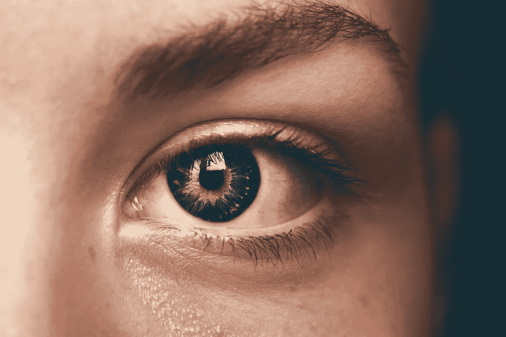

# 你应该关注的 10 大人工智能影响者

> 原文：<https://medium.com/codex/top-10-artificial-intelligence-influencers-you-should-follow-ca91e94c797b?source=collection_archive---------1----------------------->

## [法典](http://medium.com/codex)

## 随时关注人工智能领域的最新进展。

来源:照片由[阿曼达·达尔比约恩](https://unsplash.com/@amandadalbjorn?utm_source=unsplash&utm_medium=referral&utm_content=creditCopyText)在 [Unsplash](https://unsplash.com/s/photos/intelligence?utm_source=unsplash&utm_medium=referral&utm_content=creditCopyText) 上拍摄

作为一名数据科学家和人工智能爱好者，我总是在我们的领域寻找任何新的和创新的东西。因此，跟上…的最新消息是至关重要的