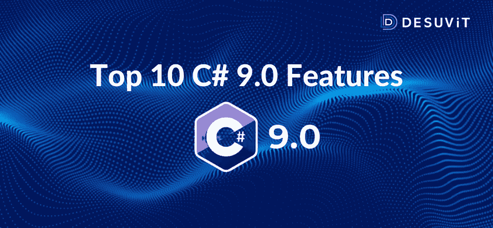

# 让你的代码更简单的 10 大 C# 9.0

> 原文：<https://medium.com/codex/top-10-c-9-0-to-make-your-codes-simpler-c68a64ec8f85?source=collection_archive---------25----------------------->

随着 C# 9.0 的发展，微软令人印象深刻地蒸蒸日上，c# 9.0 是该公司的类型安全和面向对象语言的一个进步，它现在包含了像记录、基于值的等式等新功能。C# 9.0 融入了几个新特性，并强调了几个主题。C# 9.0 是。NET 5，走向单身之旅。网络生态系统。
新功能突出…