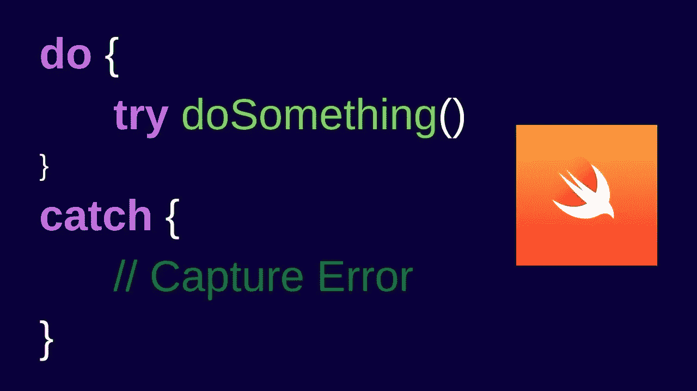
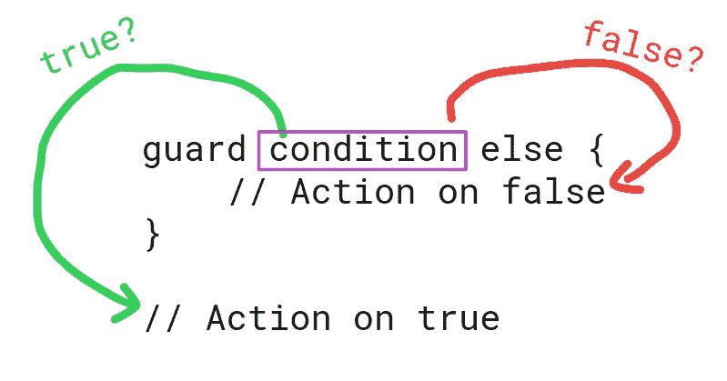
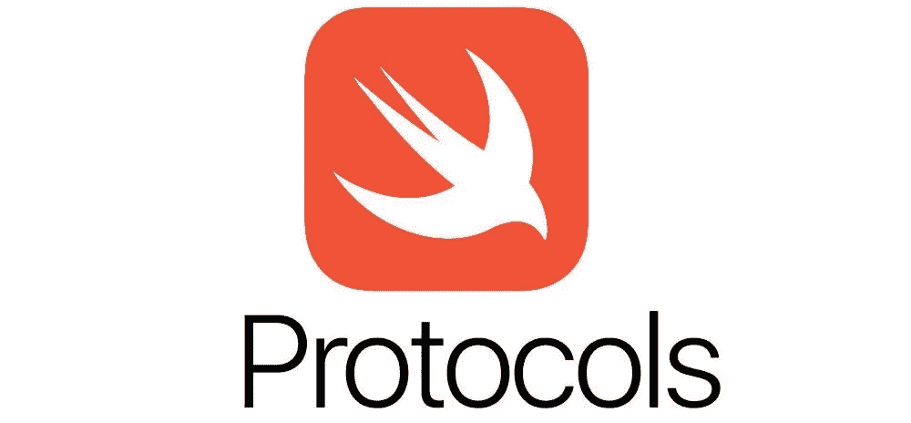
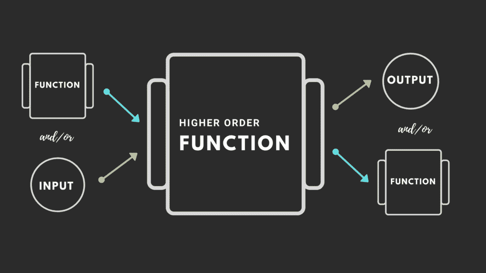
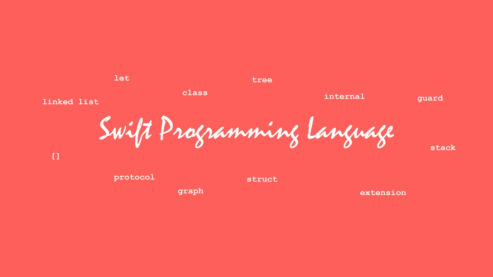

# swift 开发人员犯的 10 大错误

> 原文：<https://medium.com/codex/top-10-mistakes-swift-developers-do-1c20e81f93c5?source=collection_archive---------0----------------------->

在今天的博客中，我们将讨论我们作为 iOS 开发人员所犯的 10 大错误，如果你刚刚开始 iOS 开发，那么请记住这些要点，这样你将编写出更灵活、可维护、更简洁、更不容易出错的代码。

> **错误 1:** 没有正确处理期权。Optionals 是 Swift 中的一个强大工具，但如果处理不当，可能会导致运行时崩溃。在展开选项之前，确保总是检查零值。

可选择的

> **错误二:**没有妥善处理错误。Swift 使用`do-try-catch`语法来处理函数抛出的错误。忽略捕捉和处理错误会导致意外行为或崩溃。

> **错误 3** :没有使用 guard 语句。Guard 语句有助于确保在执行代码块之前满足某些条件。不使用 guard 语句会使代码更难阅读和调试。

> **错误 4:** 没有使用类型推理。Swift 具有强大的类型推断功能，允许编译器根据变量的值来推断变量的类型。忽略使用类型推断会使您的代码更加冗长，可读性更差。
> 
> **错误 5:** 没有使用选项集。选项集是一个强大的工具，它以简洁和富有表现力的方式表示选项组。不使用选项集会导致代码更加冗长，可读性更差。
> 
> **错误 6:** 没有有效地使用枚举。枚举是一个强大的工具，它以简洁和富有表现力的方式表示有限的一组值。忽视枚举的有效使用会导致代码更加冗长，可读性更差。

> **错误 7:** 没有有效地使用协议。协议是在 Swift 中定义合同的强大工具。未能有效地使用协议会导致代码灵活性降低，维护更加困难。
> 
> **错误 8:** 没有在协议中使用关联类型。关联类型是协议的一个强大功能，允许您定义协议定义中使用的占位符类型。不使用关联类型会导致代码灵活性降低，维护难度增加。

> **错误 9:** 没有使用高阶函数。高阶函数是将其他函数作为参数或作为结果返回的函数。不使用高阶函数可能会导致代码不够简洁和有表现力。

> **错误 10:** 没有使用正确的数据结构。Swift 提供了多种数据结构，如数组、集合和字典，每种结构都有特定的优势和用例。未能选择正确的数据结构会导致代码效率更低或表达能力更差。

以上是我们作为初级开发人员和高级开发人员都会犯的错误。如果你认为他们需要被增加，请随意增加更多的点。

***如果您喜欢这个，点击💚尽你所能在下面为这篇文章鼓掌，这样其他人会在媒体上看到。也请在 Linkedin 和 Twitter 上与你的朋友和同事分享。如有任何疑问或建议，欢迎随时评论或打我***[***Twitter***](https://twitter.com/b_banzara)***，或***[***Linkedin***](https://www.linkedin.com/in/rranjanchchn/)***。***