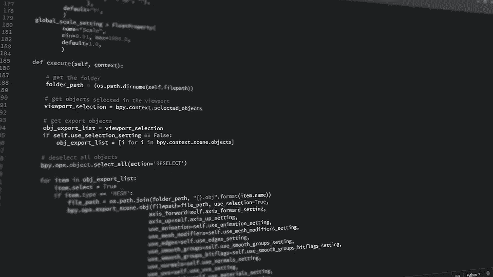

# 十大最常见的 Python 面试问题及答案第 3 部分

> 原文：<https://medium.com/codex/top-10-most-asked-python-interview-questions-with-answers-part-03-by-muhammad-umair-dc3cf5f366a1?source=collection_archive---------33----------------------->

## 穆罕默德·乌马尔



十大最常见的 Python 面试问题及答案第 3 部分

## 问题 21:如果在语法上需要一个语句，但程序不需要任何操作，Python 中可以使用什么语句？

关键字不做任何事，但它满足语法要求。

```
try x[10]:   
print(x)
except:    
pass
```

在那边使用`pass`关键字，比如:

```
if a > 0:    
print("Hello")
else:    
pass
```

## 问题 22:Python 对正则表达式的支持强吗？

是的，Python 很好地支持正则表达式。`re`是一个内置的图书馆。还有很多其他语言对 RegEx- Perl、Awk、Sed、Java 等有很好的支持。

正则表达式(称为 REs，或 regexe，或 regex 模式)本质上是一种嵌入在 Python 中的微小的、高度专门化的编程语言，并通过 re 模块提供。使用这种小语言，您可以为想要匹配的可能字符串集指定规则；这个集合可能包含英语句子，或者电子邮件地址，或者 TeX 命令，或者任何你喜欢的东西。然后，您可以提出诸如“这个字符串与模式匹配吗？”，或者“在这个字符串中有匹配的模式吗？”。您还可以使用 REs 来修改一个字符串，或者以各种方式拆分它。

正则表达式模式被编译成一系列字节码，然后由用 c 编写的匹配引擎执行。对于高级应用，可能有必要仔细注意引擎将如何执行给定的 re，并以某种方式编写 re，以便产生运行更快的字节码。本文不涉及优化，因为它要求您对匹配引擎的内部有很好的理解。

## 问题 23:如何在 Python 中执行模式匹配？解释一下。

正则表达式/REs/regexe 使我们能够指定能够匹配给定字符串的特定“部分”的表达式。例如，我们可以定义一个正则表达式来匹配单个字符或数字、电话号码或电子邮件地址等。Python“re”模块提供了正则表达式模式，是从 Python 2.5 的后续版本中引入的。“re”模块提供了搜索文本字符串的方法，或者根据定义的模式用拆分文本字符串的方法替换文本字符串。

## 问题 24:编写一个接受电子邮件 id 的正则表达式。使用`re`模块。

Ans。

```
import ree = re.search(r'[0-9a-zA-Z.]+@[a-zA-Z]+.(com|co.in)$' 'JaiRameshwar@gmail.com')e.group()
```

' Ramayanwashere@gmail.com '

要复习正则表达式，请查看 Python 中的正则表达式。

## *垃圾收集器&内存管理器*

## 问题 25:什么是垃圾收集？

从内存位置移除未使用或未引用的对象的概念称为垃圾收集。在执行程序时，如果进行了垃圾收集，那么就有更多的内存空间可供程序使用，程序的其余部分的执行会变得更快。

垃圾收集器是一个预定义的程序，它从内存位置移除未使用或未引用的对象。

任何对象引用计数变为零，那么我们称该对象为未使用或未引用的对象，那么指向该对象的引用变量的数量称为该对象的引用计数。

在执行 python 程序时，如果任何对象引用计数变为零，那么 python 解释器在内部调用垃圾收集器，垃圾收集器将从内存位置移除该对象。

## 问题 26:Python 中如何管理内存？

Python 内存由 Python 私有堆空间管理。所有 Python 对象和数据结构都位于私有堆中。程序员无权访问这个私有堆和解释器。像其他编程语言一样，python 也有垃圾收集器，负责 python 中的内存管理。Python 还有一个内置的垃圾收集器，它回收所有未使用的内存，释放内存，使其可用于堆空间。Python 内存管理器为 Python 对象分配 Python 堆空间。核心 API 为程序员提供了一些编程工具。

Python 有一个私有堆空间来保存所有对象和数据结构。作为程序员，我们不能访问它；管理它的是解释器。但是有了核心 API，我们可以访问一些工具。Python 内存管理器控制分配。

## 问题 27:为什么 Python 退出时没有释放所有内存？

当 Python 退出时，从 Python 模块的全局名称空间引用的对象并不总是被释放。如果存在循环引用，可能会发生这种情况。也有一些特定的记忆…

## 问题 28:当你退出 Python 时，所有的内存都被释放了吗？陈述为什么会这样。

答案是否定的。循环引用其他对象或从全局名称空间引用的对象的模块在现有 Python 中并不总是被释放。另外，也不可能释放 C 库保留的部分内存。

每当 Python 退出时，特别是那些循环引用其他对象或从全局名称空间引用的对象的 Python 模块，并不总是被释放或释放。不可能取消分配那些由 C 库保留的内存部分。退出时，因为有自己高效的清理机制，Python 会尝试释放/销毁所有其他对象。

## 问题 29:可以给列表中的值分配多个变量吗？

多重赋值技巧是一种快捷方式，允许您在一行代码中用列表中的值给多个变量赋值。所以与其这样做:

```
cat = ['fat', 'orange', 'loud']
size = cat[0]
color = cat[1]disposition = cat[2]
```

执行以下操作:

```
cat = ['fat', 'orange', 'loud']
size, color, disposition = cat
```

## 问题 30`__slots__`是什么，什么时候有用？

在 Python 中，每个类都可以有实例属性。默认情况下，Python 使用一个`dict`来存储对象的实例属性。这非常有用，因为它允许在运行时设置任意的新属性。

然而，对于属性已知的小类，这可能是一个瓶颈。`dict`浪费了大量内存。Python 不能只在对象创建时分配静态的内存来存储所有属性。因此，如果你创建了大量的对象，它会消耗大量的内存。使用`__slots__`告诉 Python 不要使用`dict`，只为一组固定的属性分配空间。

*例如:*

**1。没有插槽的对象**

```
class MyClass(object):      
def __init__(self, *args, **kwargs):                
self.a = 1                
self.b = 2if __name__ == "__main__":     
instance = MyClass()     
print(instance.__dict__)
```

**2。有槽的物体**

```
class MyClass(object):      __slots__=['a', 'b']      
def __init__(self, *args, **kwargs):                
self.a = 1                
self.b = 2if __name__ == "__main__":     
instance = MyClass()     
print(instance.__slots__)
```