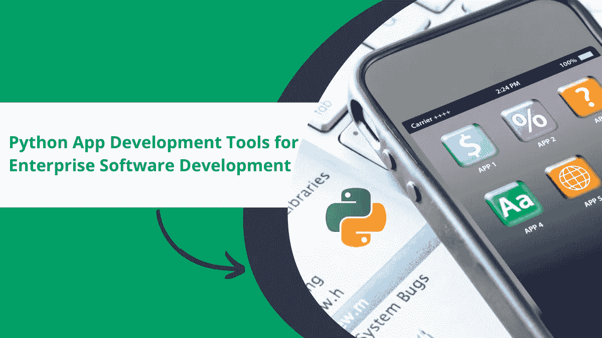

# 用于企业软件开发的 10 大 Python 应用开发工具

> 原文：<https://medium.com/codex/top-10-python-app-development-tools-for-enterprise-software-development-4a0b59e53a22?source=collection_archive---------13----------------------->

[38.87%的招聘者在招聘开发者时，要求具备 Python 编程技能](https://www.statista.com/statistics/1296727/programming-languages-demanded-by-recruiters/)。在全球开发者中，Python 是 2021 年第四大最常用的编程语言，市场份额为 48.07%。全球企业正在寻找高级应用和解决方案的 [Python 开发服务](https://www.botreetechnologies.com/python-development)专家。

开发者正在用 [Python 开发](https://www.botreetechnologies.com/blog/the-top-python-development-skills-for-developers-in-2022/)构建基于人工智能的应用、互动游戏、数据科学解决方案、桌面应用、GUI 解决方案等等。它是一种通用的编程语言，提供了最好的一切。

为什么开发者和公司更喜欢 Python 做 app 开发？虽然 Python 有不同的用例，但它提供了额外的好处。首先，它的语法简单，与英语非常相似。Python 是可伸缩的、通用的，并且对于多种应用是有用的。

人工智能和物联网是让 Python 应用程序开发大受欢迎的两个最新趋势。他们致力于 Python 的强大功能。编程语言有框架、库和工具来创建这样的解决方案。这就是我们在这篇文章中要探讨的内容。

> 阅读更多: [8 家使用 Python 编程的公司的最佳范例](https://www.botreetechnologies.com/blog/best-examples-of-companies-using-python-programming/)

# Python 应用程序开发的 10 大工具

[企业软件开发](https://www.botreetechnologies.com/blog/types-of-enterprise-software-for-companies/)很复杂。它需要几个元素和 API 来实现一个全功能的界面。Python 拥有简化企业应用程序开发的工具。让我们详细看看这些工具。

1.  **PyCharm**

*   PyCharm 是一个强大的 IDE，是 Python 开发者需要的一切。它包括一个智能代码编辑器、导航、直观的界面、调试器、基于 GUI 的测试运行器和许多其他东西。
*   PyCharm 可以很好地与 Visual Studio 集成。它兼容 JavaScript、HTML、CSS 和其他现代技术。PyCharm 还有一些用于调试和分析的内置数据库。IDE 支持 Python 2 以及从 Python 3.6 到 3.11 的版本。

**2。姜戈**

*   Django 是任何软件开发公司的每个 Python 开发人员最喜欢的框架之一，它是 Python 的全部。它是大多数 Python 开发人员的默认 web 开发框架。
*   这是一个包含电池的框架，有一个方便和愉快的 ORM。该框架提供了安全功能，如 XSS 预防、CRSF 预防等。Django 在数值计算和统计分析方面非常有用，这使得它成为数据科学应用程序的热门选择。

**3。Scikit-Learn**

*   说到数据科学，Python 有很多工具和库。Scikit-Learn 是一个用于数据挖掘和分析的开源工具。它可以在玩具数据集上以比其他任何东西都快得多的速度执行不同的基准测试。
*   Scikit-Learning 是用于分类、聚类、回归、降维、模型选择和数据预处理的流行工具。世界各地的开发人员和工程师使用该工具来解决数据科学问题。它有友好的 API，支持机器学习应用程序的完整开发。

**4。Keras**

*   谈 Python 就不能不谈 Keras。机器学习的最佳 Python 应用程序开发过程以某种方式包含 Keras。它是深度神经网络开发和数值计算的有力工具。
*   Keras 在其他神经网络框架之上运行流畅。这包括 TensorFlow、CNTK、Theano 等等。它通过提供简单的错误消息简化了代码故障排除过程。它的开源特性使得它可以被贡献者用来扩展神经网络。

**5。Plyer**

*   用于 Python 移动开发的工具有很多，Plyer 就是其中之一。它是一个独立于平台的 API，支持开发人员使用 Python 创建移动应用。Plyer 帮助访问本机功能，如相机、闪光灯等。
*   Plyer 是一个外部库，它根据特定的执行平台而变化。它提供了一种创建移动应用程序的好方法，并简化了开发过程。Plyer 利用 Python 的能力创建交互式动态移动应用。

**6。基维**

*   另一个用于移动 Python 应用程序开发的有用框架是 Kivy。它使开发人员能够构建能够在 Android、iOS、Linux 和 Windows 上流畅运行的交互式跨平台应用。
*   Kivy 提供了一个自然的用户界面(NUI ),使应用程序开发速度更快。它是一个开源框架，带有各种各样的小部件，可以使用 Python 创建移动应用程序。Kivy 有强大的文档，提供关于 API 分发的逐步说明。

**7。硒**

*   最流行的 [web 应用程序框架](https://www.botreetechnologies.com/blog/top-11-python-frameworks-for-web-development-in-2021/)之一 Selenium 在 Python 和应用程序开发中的敏捷测试方面令人惊叹。Selenium 有助于为 Java、C#和 PHP 等语言编写测试脚本。
*   开发人员可以在 Windows、macOS 和 Linux 等多种操作系统上运行测试。它为 [Python web 开发](https://www.botreetechnologies.com/blog/why-choose-python-for-website-development/)解决方案提供手动、自动甚至跨浏览器测试。该框架是开源的，使贡献者能够在构建 Python 应用程序时提高效率。

**8。美汤**

*   需要从 HTML 和 XML 文件中提取数据？美味的汤是为你准备的。这是一个了不起的 Python 库，它集成了任何用于导航、搜索和修改解析树的解析器。它可以毫不费力地将收到的文档转换成 Unicode 格式。
*   美丽的汤是一个伟大的工具，可以节省大量的工作。当涉及到发送输入和输出时，Web 抓取是必不可少的。因此，通过使用 Beautiful Soup， [Python 开发人员](https://www.botreetechnologies.com/blog/guide-to-hiring-python-developers/)可以很容易地从这类文档中提取数据。

**9。SciPy**

*   科学和技术计算变得更容易与 SciPy。这是一个流行的数学、科学和工程开源库。NumPy、IPython 和 Pandas 是 SciPy 用于数据科学解决方案的其他包。
*   SciPy 提供了惊人的处理数字的能力。它还提供了任务的可视化结果。SciPy 完全是数据科学，因为它在数值计算、科学分析、统计以及远超开发人员想象的方面令人惊叹。

**10。QPython**

*   每个开发人员都听说过 QPython——它是构建应用程序的一站式解决方案。任何 Python 应用程序开发公司都会担保 QPython 的有用性。它是一个设备上的脚本引擎，具有解释器、控制台、编辑器和 SL4A 库，用于简化应用程序开发。
*   QPython 可以运行大量的应用程序，如 web 应用程序、后端应用程序、GUI 和其他一些应用程序。它支持像 Kivy、NumPy、OpenCV、Tornado 等库。

> 阅读更多:[Python 中的敏捷软件开发:2022 年要知道什么](https://www.botreetechnologies.com/blog/agile-software-development-in-python/)

# 结论

Python 是应用程序开发的首选——无论是企业还是开发者。它有无数的工具可以简化应用程序的创建——无论是为企业还是为消费者。考虑使用 Python 的公司可以尽情享受 Python 为创建交互式应用程序和解决方案而提供的惊人工具和功能。

如果你正在寻找一家 [Python 开发公司](https://www.botreetechnologies.com/python-development)，那么 BoTree Technologies 可以提供帮助。我们拥有多年经验的 Python 工程师，他们构建动态 Python 解决方案。

[**联系我们**](https://www.botreetechnologies.com/contact) **今天免费咨询。**

*原载于 2022 年 7 月 14 日 https://www.botreetechnologies.com**的* [*。*](https://www.botreetechnologies.com/blog/top-10-python-app-development-tools-for-enterprise-software-development%ef%bf%bc/)