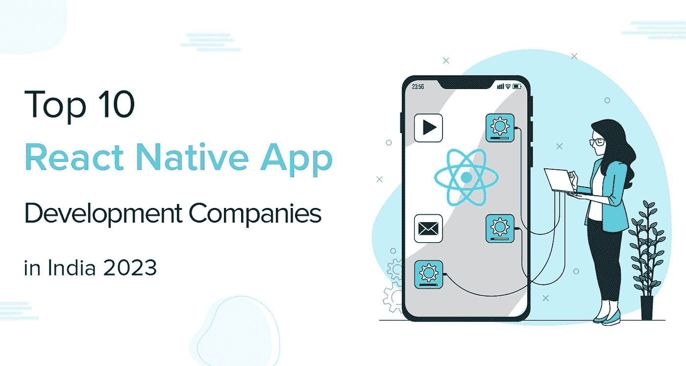
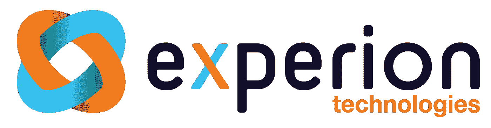
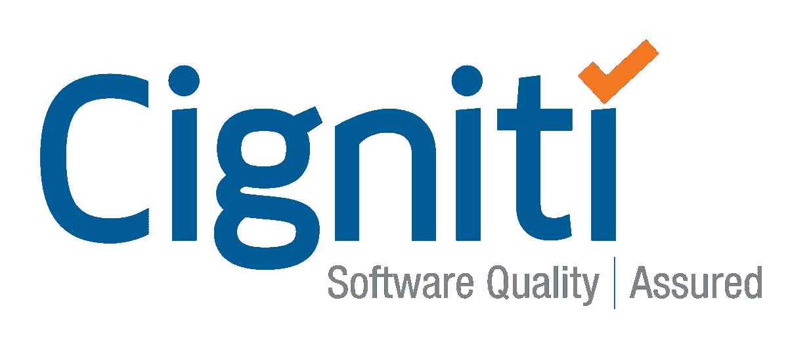
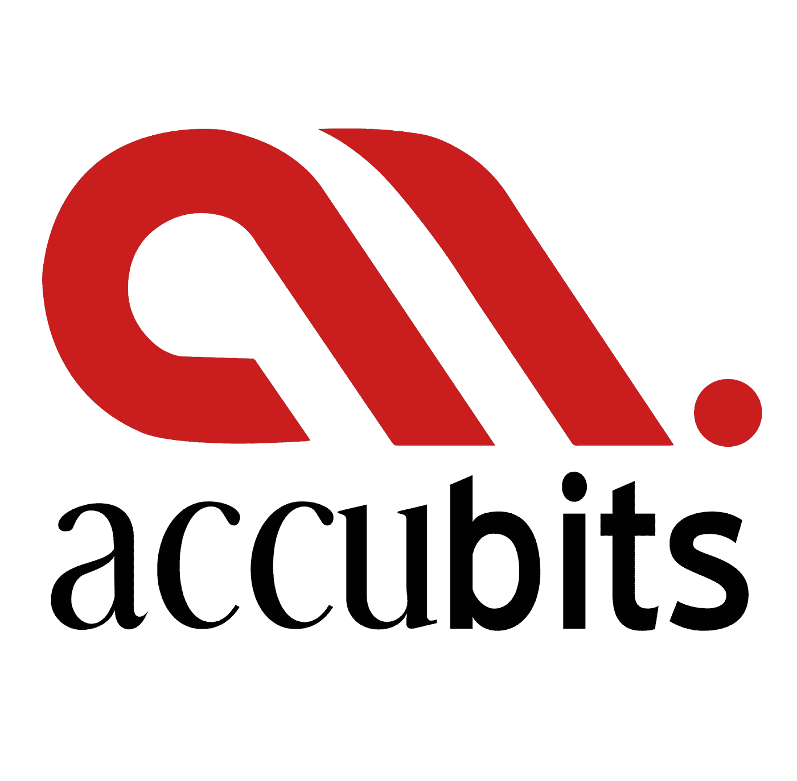

# 2023 年印度十大 React 本地应用开发公司

> 原文：<https://medium.com/codex/top-10-react-native-app-development-companies-in-india-2023-13273a3d66c6?source=collection_archive---------16----------------------->

React 原生应用开发公司

跨平台的应用程序比单空间的应用程序更有效，这意味着更快的开发时间、更低的成本和更高质量的工作。幸运的是，对于希望创建跨平台应用的初创公司和企业来说，有几个选择。

React Native 在其他跨平台框架中仍然处于领先地位，因为每天都有更新或修正，这只会增加它的受欢迎程度和效率。

为了帮助您找到满足您需求的最佳 React 原生应用程序开发公司，我们整理了一份公司列表，这些公司能够以合理的价格提供优质服务和成果。

所以我们来看看吧！

# 印度顶级 React 本地应用开发公司

以下是顶尖的 react 原生应用程序开发公司，它们是根据经验、关键评级、奖项和荣誉、投资组合等因素入围的。

## **#01- Quytech**

[**曲艺科技**](https://www.quytech.com/)

[**曲艺科技**](https://www.quytech.com/mobile-application-development/react-native-app-development.php) 是领先的 React 原生 app 开发公司之一。他们为企业的成功提供移动、网络和软件设计和开发服务。拥有 500 多名专业开发人员、质量分析师、UI/UX 设计师和图形设计师，他们在市场上得到广泛认可。

他们与全球一些最大的公司合作，迄今为止已经完成了 1000 多个成功的项目，提供了在其他地方找不到的高质量服务。

## **#02- Experion 科技**

Experion Technologies 是最好的 React 本地应用程序开发公司之一，以其在移动应用程序开发方面的专业知识和经验而闻名。React 本地开发人员的专家团队加强了他们的实力，他们通过为各种业务垂直领域开发大量项目，成为了本地应用开发领域的专家。

Experion Technologies 在网页和移动设计方面拥有超过 10 年的经验和知识，还开发了超过 4，500 个应用程序、2，200 多个网站等。

## **#03-凯尔顿科技**

顶级科技公司 Kellton Tech 为世界各地的客户提供卓越的 web 开发服务。他们引以为豪的是，所有过去的客户都给了他们 4.8 分(5 颗星)的出色服务评级，涵盖了公司、电子商务企业，

Kellton Tech 提供完全集成的数字服务，如咨询、设计策略、UX/UI 服务、应用程序开发和维护，以及增强现实(AR)、虚拟现实(VR)、区块链技术(BT)和聊天机器人等新兴技术的专业知识。

## **#04-机器人软件技术**

众所周知，Robosoft Technologies 为正在当今市场上寻找竞争优势的初创公司、中型企业和跨国企业提供最佳 react js web 开发服务。

Robosoft Technologies 将定制软件应用程序方面的专业知识与尖端技术相结合，提供满足客户特定需求的定制解决方案。

## **#05- QBurst**

QBurst 为在 web 和移动平台上寻找高质量解决方案的企业提供一些最先进和创新的 IT 服务。

凭借多年的 react 原生应用开发经验和对新兴技术趋势的关注，他们可以通过创建令人惊叹的 react 原生应用来帮助您利用新的机会。

## **#06-科捷科技**

Cigniti Technologies 提供数据驱动的解决方案，使企业能够进行分析，并使用强大的分析实现其目标。Cigniti Technologies 为其国际客户提供广泛的服务，包括物联网分析和开发、数据科学、大数据、AI/ML 等。

## **#07- Accubits**

Accubits 一直为全球企业提供尖端的移动解决方案，并在高质量、准时交付和客户满意度方面建立了良好的声誉。

他们是一个充满激情的专业团队，在技术、设计、营销、分析、项目管理和工程领域拥有超过 10 年的经验和专业知识。

此外，他们努力为我们的客户提供卓越和成功。如果您正在寻找一家一流的 react 原生应用程序开发公司，该公司了解您的业务目标和目的，提供可衡量的结果并提供完全的透明度，Accubits 可能是您的最佳选择。

## **#08- Bitdeal**

Bitdeal 是初创企业和企业 IT 解决方案的领先提供商。Bitdeal 服务包括电子商务和移动应用程序开发、数字营销活动、网站设计和开发、社交媒体管理等。

在我们的专家团队的帮助下，该公司为我们的客户提供端到端的定制解决方案。凭借创新的理念和职业道德，他们能够在迄今为止所从事的每个项目中取得成功。Bitdeal 是最好的 React 原生应用开发公司之一。

## **#09-中左**

Middeft 是印度和美国领先的、最值得信赖和可靠的 ReactJS 开发公司。该公司为 ReactJS 在美国、英国和全世界的网络和应用程序开发服务提供了一个无与伦比的平台。

致力于开发高质量应用程序的各种技能资源使用成熟的技术来开发项目。他们的专业软件工程师在电子商务、零售、酒店、教育、医疗保健、游戏和健身等多个行业拥有多年的工作经验。

## **#10-** TAFF 公司

TAFF Icn 为小型到大型企业提供认知解决方案和定制软件开发服务。TAFF Icn 是许多企业的端到端解决方案提供商和 R&D 合作伙伴。

TAFF Icn 为其客户提供数字产品工程服务。凭借在众多行业的多年经验，他们利用网络、数据科学、分析、机器学习(ML)、人工智能(AI)、云技术和移动应用提供创新的解决方案。

# 总结一下！

这些是与全球领先品牌合作过的前 10 家 react 原生应用开发公司。您可以根据自己的选择和偏好从列表中选择任何公司。

联系任何一流的 react 原生应用程序开发公司都将帮助您根据您的业务需求开发定制的应用程序。