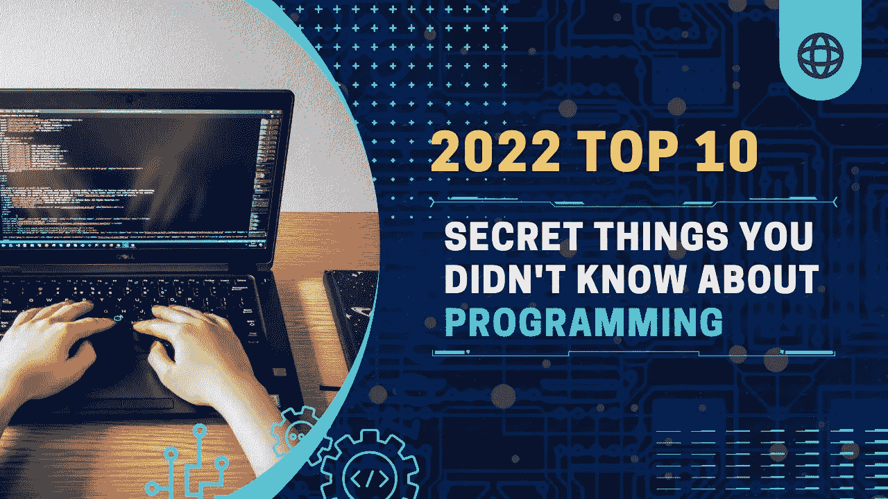

# 关于编程你不知道的十大秘密

> 原文：<https://medium.com/codex/top-10-secret-things-you-didnt-know-about-programming-ed106701a851?source=collection_archive---------8----------------------->

编程是一个需要高度自律和奉献精神的职业。这也是一件非常孤独的事情，尤其是当你是项目中唯一一个人的时候。尽管如此，仍有大多数人不知道的十大编程秘密:

# 每个职业程序员都暗暗讨厌自己的工作。

每个职业程序员都暗暗讨厌自己的工作。

这不是因为他们是坏人，而是因为编程是一项艰苦的工作，很少有人能做好。如果你认为这是一个神话，考虑以下几点:

*   程序员和其他人一样是有感情的人。他们也会感到沮丧！
*   编程不是一种爱好(尽管有些人似乎认为它是)。这是一份需要奉献和努力的工作，但也提供了成长的机会和金钱、声望以及来自同事/同事/老板等的认可。，这比没有工作好多了！

# 大多数程序员其实写不出一句“你好，世界！”从头开始编程。

下一次你写程序的时候，花一秒钟想想有多少工作要做。你知道吗，大多数程序员不会写“你好，世界！”从零开始？是真的！他们必须学习许多步骤，然后在编写程序时一遍又一遍地重复这些步骤。

大多数程序员从学习编程的基础开始——在算法中使用的命令，如循环和条件——但最终他们对这些基本概念非常熟悉，以至于他们可以在不需要任何其他人(可能除了我)的帮助或指导的情况下使用它们。然后就是我所说的“编程疲劳”当人们能够熟练地自己编写程序时(这需要花费数年时间)，就会出现这样一种情况:让另一个人看你的代码比它本身更麻烦；毕竟，如果以后在另一台机器或另一个操作系统版本上测试您的解决方案时出现问题，那么没有人会知道确切的原因，直到一切都被修复之后再说，所以何必呢？

# 程序员的秘密愿望是，我们可以扔掉那些过时的语言，重新开始。

你知道那种感觉。那一刻，当你站在电脑前，意识到它有太多的问题，就像一台来自未来的时间机器回来告诉我们，如果我们做出不同的选择，我们会是什么样子。

我们都有过这种经历，但程序员对这种绝望和失望的感觉在他们心中有着特殊的位置，因为他们知道使用 PHP 或 ASP.NET(现已被 ASP.NET 核心取代)等过时的语言有多难。这些语言漏洞百出，缓慢而复杂——这就是为什么程序员希望他们可以扔掉它们！

# 程序员暗地里想成为艺术家。

编程是一种艺术形式。这不仅仅是一份工作，更是创造力和表达的一个出口。

在编程世界中，有一些程序员想成为艺术家，创造自己的艺术作品(如视频游戏或音乐)，但大多数人永远不会这样做，因为他们没有时间或所需的技能。

# 大多数专业程序员希望他们学习人文学科。

编程的很大一部分是理解手头的问题，这就是人文学科发挥作用的地方。如果你想成为一名职业程序员，你需要学会如何与其他人进行有效的交流。这不仅仅是逻辑问题，而是能够以其他人能够理解和欣赏的方式表达自己的想法。

这听起来可能是显而易见的:毕竟，我们从出生起就被告知阅读是重要的！但这是真的！不能光靠自己看书；相反，你必须练习把它们写下来，这样它们在书面语和口语方面都变得流利，这样对于那些不熟悉之前到底写下了什么的听众(或读者)来说就容易了。"

# 所有的编程语言都很糟糕。但是有些没有其他的可怕。

事实是所有的编程语言都很糟糕。它们被设计成易于我们理解，而不是相反。

但是有些没有其他的可怕！例如:

*   如果你想让你的程序在 iPhone 或 iPad(或任何装有 iOS 的设备)上运行，C 语言是一个很好的语言。如果你想让你的程序在 Mac 上运行，这是非常糟糕的——但是如果你只是想让它在运行时安装了正确的操作系统的任何计算机上运行(比如 Windows ),那么这可能足够满足你的需求了。
*   JavaScript 早在 1995 年就出现了，但直到最近才在对其他语言一无所知的 web 开发人员中流行起来；然而，就像他之前的 PHP 一样，他也饱受冗长和缺乏任何类型检查之苦，所以一旦在开发过程中意外发生一个错误，那么一切都变得疯狂，直到有人稍后再次修复一切，这涉及到比最初预期更多的工作，因为现在每个人都需要访问任何地方，而没有访问任何其他地方的权限，因为再也没有其他地方了…

# 调试是一种艺术形式

调试是一种艺术形式。调试的艺术是找到能使程序工作的最小可能的变化。换句话说，它是关于发现当你改变你程序中的一个小东西时会发生什么，并且看它如何影响其他的东西。这需要练习和耐心！

现在让我们来讨论一下为什么这很重要:如果你不知道如何调试你的代码，那么代码中就会有一些错误，没有人知道，直到他们自己遇到它们(或者更糟)。乍一看，这似乎没什么大不了的，但是想象一下，有成百上千行代码被破坏了，而其他看到它们的人却没有办法找出问题所在！

# 程序员(通常)喜欢询问如何让他们的软件更好的用户！

成为更好的程序员的第一步是寻求帮助。如果你曾经参加过工作组，你就会知道学习某样东西的最好方法是当别人能够向你解释或者展示它是如何工作的时候。这就是为什么程序员(通常)喜欢询问如何让他们的软件更好的用户！程序员就像任何其他类型的人一样:他们想要关于他们工作的反馈，并且会做任何必要的事情，以便他们自己和他们周围的人理解是什么让代码很好地一起工作，这样每个人都是赢家——即使这些好处乍一看并不明显。

# 文档很重要，但并不总是有趣的。

文档很重要，但并不总是有趣的。

当你在一个项目中工作时，你的文档将是防止其他人迷失在你和你的代码中的东西。但是请记住:这不仅仅是要确保每个人都知道这些东西是做什么的——这也是要确保他们知道如何使用它们。对于不知道所用语言或框架的人来说，文档需要足够清晰；它们还应该足够有趣，以便人们在第一次阅读(或多次阅读)中学到一些新东西后还想再读一遍。

早在编程语言发明之前，文档就已经存在了；然而，直到最近，程序员自己(作为个人)还很少有办法为项目创建他们自己的文档资料，而不是完全依赖外部专家的帮助，如专门研究该领域的技术作家或语言学教授？

# 要弄清楚某人在错误报告中想说什么并不总是容易的。尤其是如果英语不是他们的母语！

如果你正在写一份 bug 报告，试着理解这个人想说什么。如果他们说的是英语，那么他们很容易告诉你他们为什么要报告这个问题，他们的目标是什么。但是，如果有人用非母语(或他们说得不太好的语言)报告问题，他们可能很难清楚地解释自己！

# 行业的秘密

编程不是一门艺术，它是一种贸易。

编程不是一门科学，而是一门手艺。

编程不是一种智能，而是一种实践，需要技能和知识来有效地执行，有时甚至是安全地执行！

程序员没有自己特殊类型的头脑；他们只是拥有非凡的思维方式，允许他们批判性地思考手头的问题，并在必要时提出新的解决方案(或者旧的可以重用)。

# 结论

我希望你喜欢阅读关于编程的 10 大秘密。如果你看到了，请在脸书和推特上与你的朋友分享这篇文章！