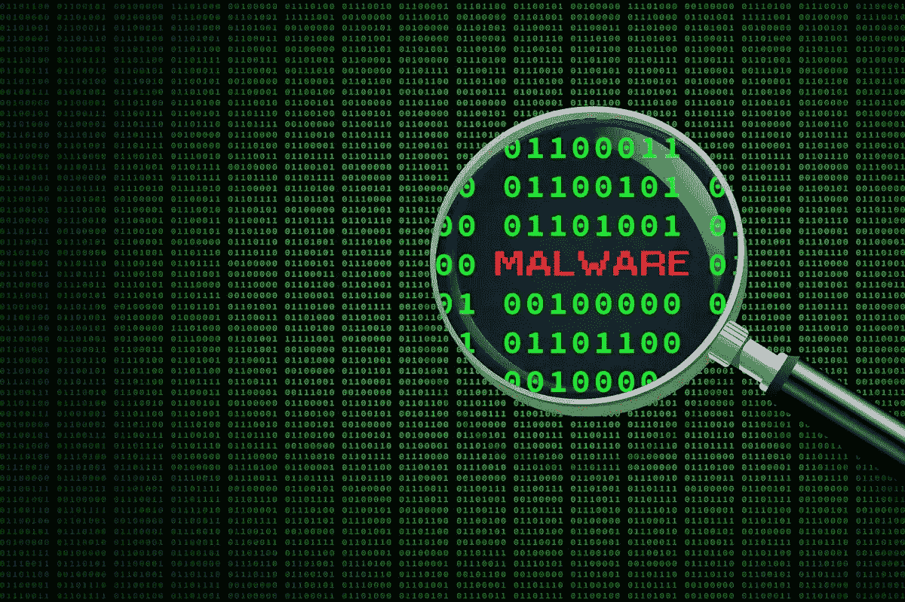

# 关于恶意软件防护的十大被低估的资源

> 原文：<https://medium.com/codex/top-10-underrated-resources-about-malware-protection-4d07579ff8c?source=collection_archive---------7----------------------->

恶意软件对企业和个人都是一个严重的威胁，因此有一个坚实的防御措施是非常必要的。虽然有许多众所周知的资源可用于恶意软件防护，但也有许多被低估的选项可能同样有效。以下是 10 种被低估的恶意软件防护资源:

关于恶意软件防护的十大被低估的资源