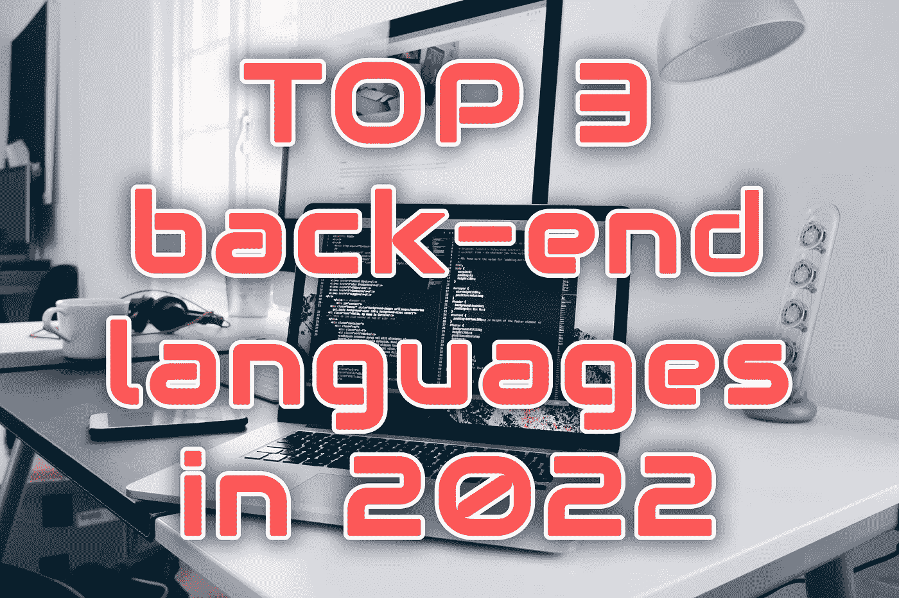

# 2022 年 Web 开发人员的三大后端编程语言

> 原文：<https://medium.com/codex/top-3-back-end-programming-languages-for-web-developers-in-2022-60554c334781?source=collection_archive---------0----------------------->

## 其余的你可以忽略(至少现在)

克里斯托夫·高尔在 [Unsplash](https://unsplash.com/s/photos/code?utm_source=unsplash&utm_medium=referral&utm_content=creditCopyText) 上拍摄的照片

前端开发技术很容易。归结为三种语言，HTML，CSS，JavaScript。

对于希望进入后端开发的 web 开发人员来说，有时会遇到的问题是选择什么样的后端编程语言？