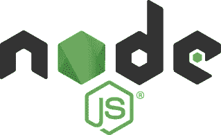
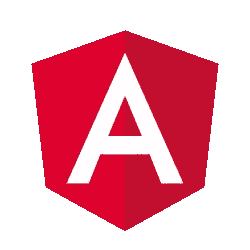

# 2021 年要学习的 4 大 JavaScript 框架

> 原文：<https://medium.com/codex/top-4-javascript-frameworks-to-learn-in-2021-5ed1b3b29856?source=collection_archive---------4----------------------->

框架是预先写好的、可重用的代码，它的存在是为了帮助开发人员不用从头开始就能得到想要的结果。框架让用户更关注最终产品，而不是从零开始，由一组预构建的库组成，从而使我们的工作变得简单高效。虽然有超过 70 个 JavaScript 框架，但是让我们来谈谈前 4 个 JavaScript 框架，以及它们为什么会在最上面。

# 节点 JS

虽然在技术上，NodeJS 被认为是一个平台，但 Node JS 的实际使用模糊了它们之间的界限。Node JS 于 2010 年推出，由 Ryan Dahl 开发。无论是小规模的，还是整个开发都由这个平台支持。兼容各种类型的应用程序。这项技术正在被 PayPal、LinkedIn、Medium、Yahoo 等使用。

## 特征

*   轻量级、事件驱动和非阻塞 I/O 模型。
*   极致的数据流能力。
*   动态节点包管理器。
*   利用可靠性和快速性。

# 角度 JS

Angular JS 是一个开源的前端 web 框架，是单页面应用程序(SPAs)的首选。它通过提供页面内加载来增强用户体验，优于被广泛采用的重定向到新页面的浏览器，该浏览器由谷歌开发并于 2010 年推出，被一些顶级跨国公司采用，如 Upwork、Freelancer、网飞、英特尔等。

## 特征

*   轻量级、可伸缩、响应迅速的应用程序。
*   易于测试和调试

# 反应 JS

现在，React 被认为是一个库，而库和框架都可以是相同的，都是为获得所需结果而编写的可重用代码，但有一个重要的区别必须明确，那就是谁控制着应用程序的流程。使用库时，应用程序的流程在您的控制之下，您可以随时随地调用代码。在框架的情况下，你被要求提供代码，但是框架负责何时调用它。

由脸书开发，于 2013 年推出，由 WhatsApp Web、Instagram、Dropbox 等服务使用。它也是单页应用程序或移动应用程序的首选。

## 特征

*   动态和高性能应用的理想选择。
*   速度超快，重量轻。

# Vue JS

Vue.js 是一个开源的 model–view–ViewModel 前端 JavaScript 框架，用于构建用户界面和单页面应用程序。由尤雨溪开发，于 2014 年推出，通常用于 Pagekit，Laravel Sparks，Vice 采用的单页应用程序。

## 特征

*   容易上手。
*   与其他 JS 库的简单集成
*   高性能、快速的单页应用程序
*   通过灵活的 API 提供高效的 MVVM 数据绑定。

**又**:[2021 年要学的顶级编程语言](https://freemiumstuffings.blogspot.com/2021/08/top-programming-languages-to-learn-in-2021.html)

最初发表于[freemiumstuffings.blogspot.com](https://freemiumstuffings.blogspot.com/2021/09/top-javascript-framework-to-learn-in-2021.html)…

如果你想通过把你的媒体故事变成播客来增加你的听众:

 [## 作家！！！你会喜欢这个的…

### 哦！还有播客听众！

medium.com](/writers-blokke/writers-youre-gonna-love-this-8f1fa2f1fddf) 

如果您对 Pegasus 间谍软件的工作原理感兴趣:

 [## 飞马间谍软件是如何工作的？

### 是的，它现在可能使用了一套完全不同的利用方式…

medium.com](/writers-blokke/how-did-does-pegasus-spyware-work-3f0867f5ef34) 

一直想进入编程领域？：

 [## 2021 年最值得学习的 6 种编程语言

### 对于初学者或改变职业的人来说，我们经常发现学习者问这个问题“什么编程…

medium.com](/writers-blokke/top-6-programming-languages-to-learn-in-2021-b06f4628f008) 

我想你会发现这很有趣:

 [## 你现在应该改变的 7 个 iPhone 设置

### 它们并不总是显而易见的…

medium.com](/macoclock/7-iphone-settings-you-should-change-right-now-b107c8664b34)