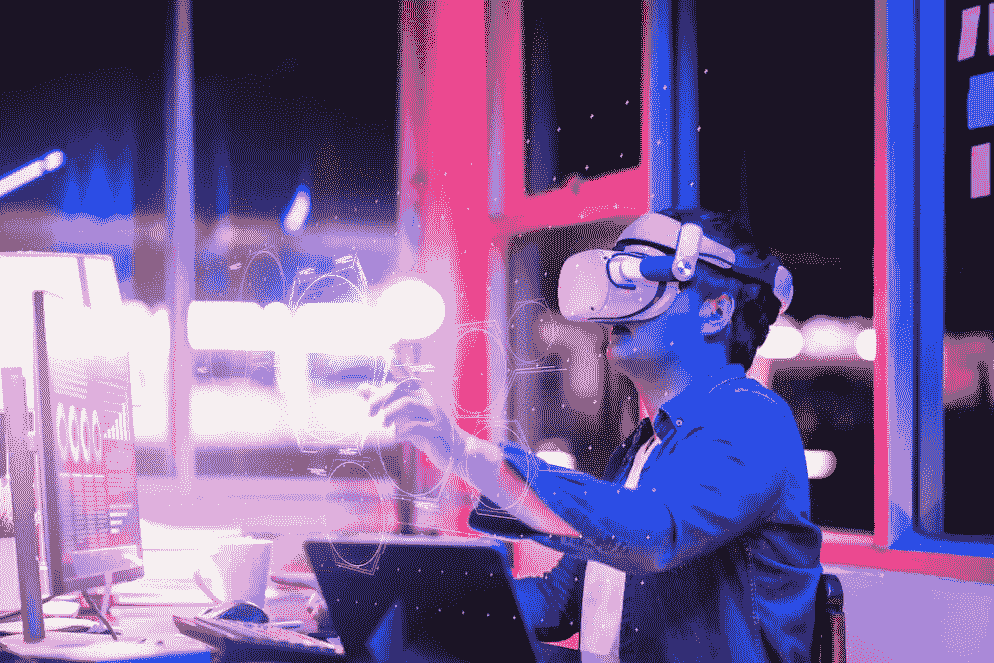
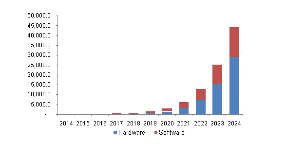
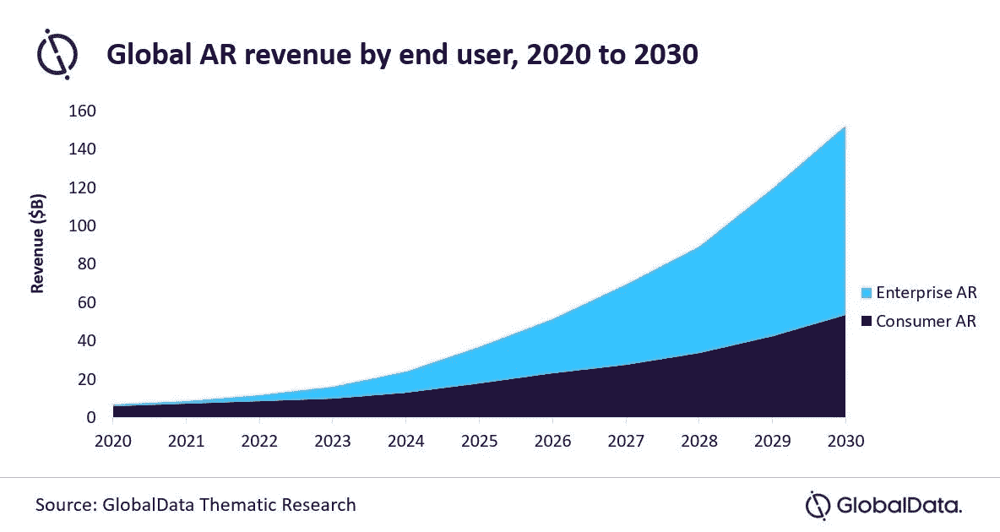
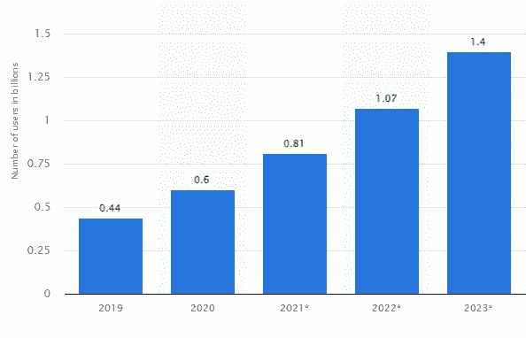
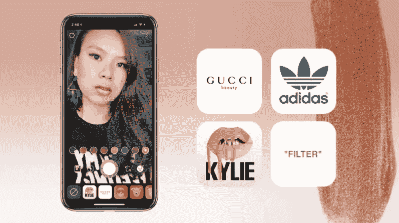
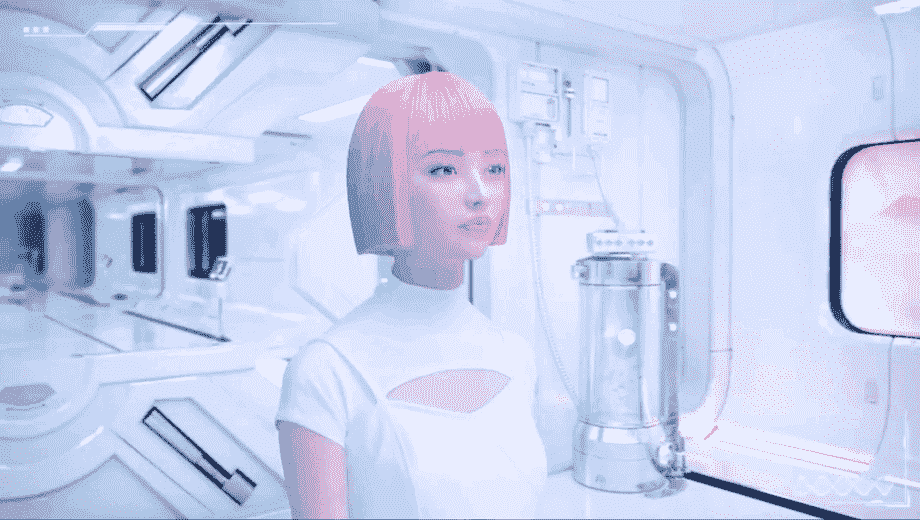
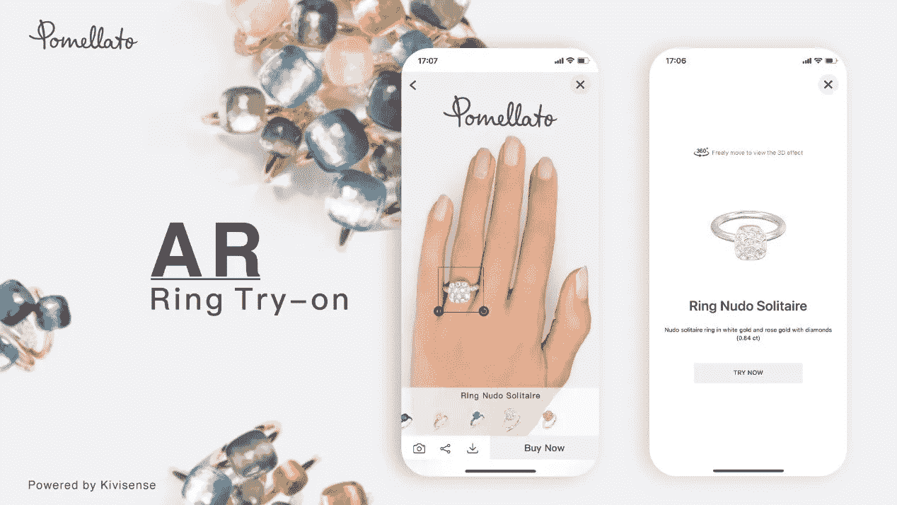
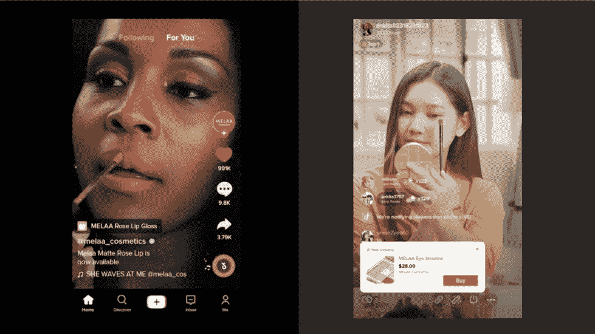
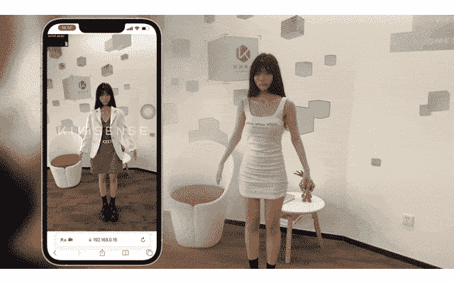
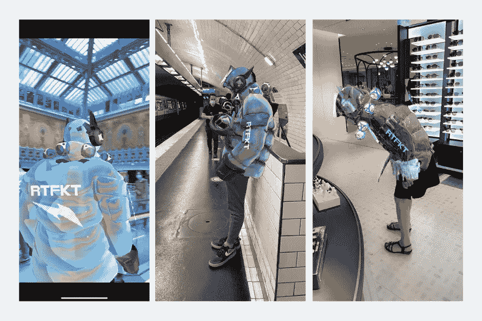

# 2023 年 5 大增强现实趋势:600 亿美元和 14 亿用户的愿景

> 原文：<https://medium.com/codex/top-5-augmented-reality-trends-of-2023-a-vision-of-60-billion-1-4-billion-users-d77c4e5941c?source=collection_archive---------13----------------------->

增强现实显然越来越受欢迎。到 2023 年，全球虚拟和增强现实(VR 和 AR)技术市场预计将达到**1424 亿美元**，高于 2018 年的 134 亿美元。然而，这还不是全部。需求预计将受到新兴趋势的推动，如可穿戴设备和增强现实(AR)之间的日益融合。根据 Statista 的数据，预计到 2023 年**将有 14 亿人**在手机上使用增强现实技术。**以下是 2023 年值得关注的五大增强现实趋势:**

*   [**AR 到 2023 年价值 600 亿美元**](https://tryon.kivisense.com/blog/ar-trends-of-2023#1)
*   [**全球 14 亿移动 AR 用户**](https://tryon.kivisense.com/blog/ar-trends-of-2023#2)
*   [**零售商和营销人员利用 AR 获得新客户**](https://tryon.kivisense.com/blog/ar-trends-of-2023#3)
*   [**AR 直播流媒体购物将腾飞**](https://tryon.kivisense.com/blog/ar-trends-of-2023#4)
*   [**NFTs 将不限于图稿和面部滤镜**](https://tryon.kivisense.com/blog/ar-trends-of-2023#5)

这种增长在很大程度上是出于必要:由于疫情效应和全球转向网上购物，数千家商店已经关门。对于度过这一艰难时期的品牌来说，痛苦地发现，保持相关性需要不断创新。因此，越来越多的组织开始投资增强现实技术，毫无疑问，这是受积极推动这项技术的科技巨头的影响，这种格局越是演变，就有越多的增强现实趋势需要跟踪。

**资料来源:Medium，Gaurav Shah**

# 增强现实趋势 2023:增强现实价值 600 亿美元

据报道称，随着人和增强现实设备之间相互作用的进步，增强现实市场将在 2023 年跃升至 600 亿美元。预计全球增强现实(AR)市场规模**到 2024 年将达到 1000 亿美元，到 2028 年将达到 3326 亿美元**，这与今天借助 Emergen Research 进行的评估一致。

**来源:GlobalData 创建者:Rupantar Guha**

扩展功能，利用智能手机和应用程序的集成，具有 AR 的网站是推动市场销售增长的关键因素。增强事实是现实世界的一个更强大的模型，它是在虚拟可视元素、声音或不同感官刺激的帮助下完成的，这些刺激可能是通过使用技术带来的。增强现实是商业企业和计算应用中的一种流行趋势。

# 增强现实趋势 2023:全球 14 亿移动 AR 用户

根据 Statista 于 2022 年 6 月发表的一项研究，**到 2023 年**，全球将有约 14 亿移动增强现实(AR)用户，比 2019 年观察到的 44 万增加了 10 亿。到 2024 年，全球预计将有 17.3 亿移动 AR 用户。到 2023 年，AR 耳机的全球出货量预计将达到 3000 万台以上，是 2020 年预期出货量的 12 倍以上。

**资料来源:2022 年统计数据**

这些数字表明增强现实受到公众的欢迎。在 AR 中，关于周围真实世界的信息被提供给用户，用于通过使用设备进行信息检索和/或交互。在过去的几年里，我们一直致力于提高对这项技术的认识和关注，以实现其全部潜力和影响。因此，我们不得不发明解决方案，让用户能够通过增强现实与周围环境互动，帮助推动销售和提高投资回报率。

# AR 趋势 2023:零售商和营销人员使用 AR 来获得新客户

新冠肺炎疫情对所有行业都产生了严重影响，但很明显，对与客户直接接触的领域，如零售和购物，影响要大得多。零售商和营销人员在增强现实方面有很大的潜力，2023 年无疑将是营销人员和用户开始认真关注增强现实及其提供的机会的一年。跟上不断变化的环境和当前趋势，比以往任何时候都有更多的组织投资于 AR，更多的人开始意识到 AR 不仅仅是简单的过滤器。

来源:电子设备匹配

## 流行的数字人增加销售

随着越来越多的数字影响者成为一种趋势，各行各业都渴望利用他们的商业潜力。增加现实中的虚拟人有助于品牌**发展与客户的情感联系**。伊马是 Aww Inc .在日本的第一个虚拟人和模特，她被选为屈臣氏新碳酸饮料“X 苏打”的形象大使。当你扫描苏打水时，能量出现了，一个虚拟的 imma 出现在现代城市中，通过数字人类解决方案显著增加了销售。在全球范围内，AR 领域的虚拟影响者比 Imma 多得多，如 Noonoouri 和 Ayayi，Emergen **研究认为，到 2030 年**，数字人类产业的价值将达到 5275.8 亿美元，比前几年增长 46.4%(CAGR)。

*   相关文章:[AR 中的数字人类——用数字讲故事推动销售](https://tryon.kivisense.com/blog/digital-human-in-ar-more-sales/)

## “先试后买”解决方案

基于 AR 的营销材料不仅可以提高与受众的互动，还可以增加购买的可能性。零售商已经在他们的在线商店中实现了增强现实，这样潜在的客户就可以足不出户地尝试东西。**超过 60%的购物者更喜欢使用增强现实购物，46%的店主对转向 AR 解决方案持乐观态度。**最受欢迎的例子有 WebAR、Mini 程序、试穿鞋子、配饰、衣服等的 AR APP 等。

这是一个很好的例子，展示了我们如何在时尚界使用增强现实。考虑你寻找一条新项链。看着别人戴上它和图片不会告诉你那条项链是否适合你。然而，AR 允许你仅使用智能手机摄像头来试戴珠宝。

**Pomellato 在这方面做了一个很大的决定。为了鼓励更多用户探索其知名系列并了解更多关于其背后的故事，它打破常规，通过全渠道营销和沉浸式 AR 技术在其网站上为客户提供无缝购买体验，他们可以立即试穿。顾客还可以使用该应用的“虚拟试戴”选项，在外出购物时试戴新的彩色宝石。在真实的商店购买珠宝时，客户可以走近智能镜子，使用其全高清 AR 显示和触摸屏功能，获得难忘的购物体验。**

*   相关文章: [Pomellato AR 珠宝试戴带动全渠道收入增长](https://tryon.kivisense.com/blog/pomellato-ar-jewelry-try-on-drives-omnichannel-revenue/)

通过多次试穿，顾客可以尝试虚拟的鞋子、配饰、衣服，这样他们在购买之前就可以对产品有一个更加个性化、可视化的体验。这也有利于企业，因为他们可以在这个平台上展示他们的产品。因此，公司可以获得更高的满意度和品牌忠诚度，并提高参与度。

# AR 趋势 2023: AR 直播流购物将腾飞

在中国已经很受欢迎的直播购物现在正在席卷西方世界。要了解实时商务趋势，首先要看中国— **,预计到 2023 年，中国市场将增长到 7707 亿美元**。品牌越来越多地使用电子商务应用和社交媒体平台，如 Tiktok 直播和 Instagram 直播，来推广和销售产品。展示和描述产品的影响者通常引领这些可购买的直播流。观众可以实时向他们提问，并与他们互动(例如，通过征求对方的意见)。托管可购物直播流对营销人员来说有多种优势，包括可能加快销售过程。

**图片来源:**抖音购物来源:Techcrunch

然而，一个明显的缺点是，与去实体店不同，在网上看别人展示产品不允许顾客试穿。**这可能会随着增强现实直播购物**而改变。AR 技术消除了互联网购买的负面影响，如产品退货，通过为客户提供近距离商店体验，无论他们在哪里。**将这种 AR 功能扩展到直播流是合乎逻辑的下一步，我们肯定会在 2023 年看到这一步**。

我们的增强现实试穿服务允许直播平台购物者通过提供实时 AR 试用解决方案来试穿服装、包包和配饰等，从而做出更明智的购物选择。

# AR 趋势 2023: NFTs 将不仅限于艺术品和面部滤镜

元宇宙被视为互联网的下一代，因为它是现实世界和数字世界融合的地方。元宇宙是一种社交技术，它允许人们以数字形式在各种环境中相互联系。无论是在工作中，在办公室，参加音乐会或体育赛事，甚至穿上衣服，元宇宙为无限的，互联的虚拟社区提供了一个平台。

图片来源:世界经济论坛

Gartner 估计，到 2026 年，25%的世界人口将每天在元宇宙度过至少一个小时。不可替代代币(或 NFT)在元宇宙将很重要，不仅是我们如何到达那里，或许更重要的是，我们可以在那里拥有什么。常见的数字活动包括购物、协作、游戏、教育和社交网络。他们中的每一个都可能利用 AR NFTs。

NFT 作为独一无二的数字资产，代表着独一无二的商品的所有权，这些商品可以是数字艺术品和限量版运动鞋，也可以是文章或游戏中的物品。一些 NFT 包括增强现实功能，为用户提供完全沉浸式的体验。例如，允许人们感知他们周围或身体上的数字对象。

许多品牌也在尝试非功能性食物。美国运动服装公司 Original Penguin 拍卖了 8 个 NFT 企鹅头像，用户可以在购买前在 ar 中看到这些头像。**此外，Dolce & Gabbana 创造了“Collezione Genesi”，这是一个 AR 可穿戴设备 NFT 系列，为公司带来了约 600 万美元的收入……**如果这些领域的活动具有任何迹象，我们可以预计越来越多的品牌将在 2023 年推出 NFTs，因为元宇宙越来越接近现实。元宇宙和不可替代令牌(NFT)将在增强现实的发展中发挥关键作用。

杜嘉班纳的“基因系列”——图片:UNXD 来源:Currency.cn

*   相关文章:【2022 年 NFT 顶级流行趋势——用可穿戴 NFT 为你的品牌提供动力

# 如何将 AR 整合到我的在线业务中？

无论是现在还是未来，AR 包含的承诺远不止五个趋势。营销和客户服务活动可以在网上购物和电子商务中提供竞争优势。通过让顾客在购买前参与有趣的沉浸式体验，他们可以了解哪种产品最适合自己。

您可以通过联系我们在**<sales@kivisense.com>**的知识渊博的员工或扫描下面的二维码了解更多信息以及我们提供的所有产品和服务的完整演示，来了解我们为您公司提供的 AR 解决方案。 [**现在请求试玩！**](https://tryon.kivisense.com/?utm_source=blog_gucci_jewelry#contact-us)

