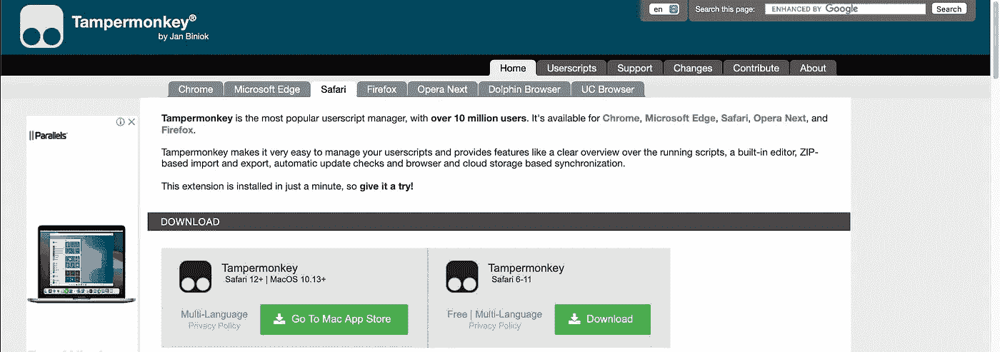
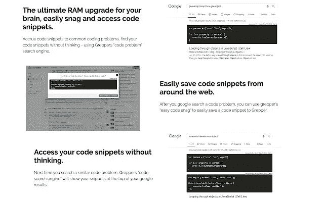

# 每个开发者现在必须拥有的 5 大 Chrome 扩展！

> 原文：<https://medium.com/codex/top-5-chrome-extensions-every-developer-must-have-now-f4d80d66a221?source=collection_archive---------2----------------------->

## 以下是开发者必须拥有的 5 大 chrome 扩展！

[图片](https://media.istockphoto.com/photos/you-could-cut-the-tension-with-a-knife-picture-id502089751?s=612x612)来自 [iStock](https://www.istockphoto.com/es)

嘿大家好。希望你今天过得愉快。在这个故事中，我将分享我的 5 大 chrome 扩展，每个开发者都必须拥有。

# 1.)坦帕蒙基

Tampermonkey 是一个 chrome 扩展，可以让你在页面中注入定制的 javascript。它使管理用户脚本变得非常容易，并提供了一些功能，如运行脚本的清晰概述、内置编辑器、基于 ZIP 的导入和导出、自动更新检查以及基于浏览器和云存储的同步。

图片来自[网站](https://www.tampermonkey.net/index.php?ext=dhdg)

下载链接—[https://www.tampermonkey.net](https://www.tampermonkey.net)

# 2.)格雷珀

Grepper 是软件开发人员大脑的终极 RAM 升级。轻松地从网上抓取代码示例，然后无需思考即可访问您的代码示例。它把代码答案放在你的谷歌搜索的最上面，这样你就不用去寻找答案了。

[图片](https://chrome.google.com/webstore/detail/grepper/amaaokahonnfjjemodnpmeenfpnnbkco?hl=en)来自 Chrome 网上商店

下载链接—[https://www.codegrepper.com](https://www.codegrepper.com)

# 3.)uBlock

uBlock 不仅仅是一个“广告拦截器”，还是一个以 CPU 和内存效率为主要特征的广谱内容拦截器。

[图片](https://lh3.googleusercontent.com/67lmvCqkZrIqiHXFGuIZxXC9UDXDPxhpCF34KrK9S4MwewyEgVcVPlP0KiJJH6x8Bt83UdYPTZ4-XMEq2E6fijV67e4=w640-h400-e365-rj-sc0x00ffffff)来自 Chrome 网上商店

下载链接—[https://chrome . Google . com/web store/detail/u block-origin/cjpalhdlnbpafiamejdnhcphjbkeiagm？hl=en](https://chrome.google.com/webstore/detail/ublock-origin/cjpalhdlnbpafiamejdnhcphjbkeiagm?hl=en)

# 4.)Vimium

Vimium 是一个 chrome 扩展，可以让你只用键盘通过著名的 vim 编辑器中的命令来浏览 chrome。

下载链接—[https://vimium . github . io](https://vimium.github.io)

# 5.)DuckDuckGo 隐私必备

DuckDuckGo Privacy Essentials 是一个简单的 chrome 扩展，它给你一个网站如何尊重隐私的概述，并阻止跟踪器。

来自 Chrome 网上商店的图片

下载链接—【https://duckduckgo.com 

# 最后的想法

好吧，这里是我的 5 个顶级扩展，每个开发人员都绝对需要。

我希望这篇文章对你有所帮助，并让你学到一些新东西。把这篇文章分享给你的开发者朋友或者刚入门的朋友。

# 祝你有美好的一天…

GIF 来自 [GIPHY](https://media.giphy.com/media/YorwDAH66ln3O/giphy.gif)