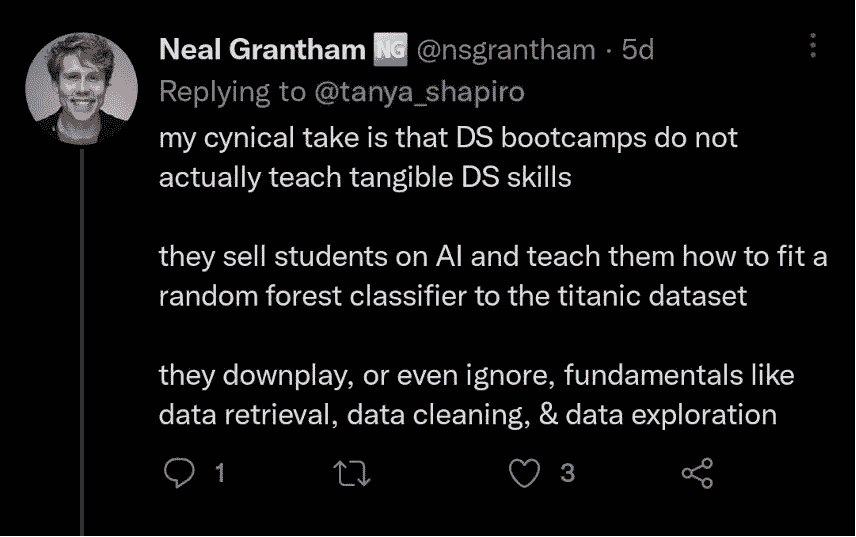
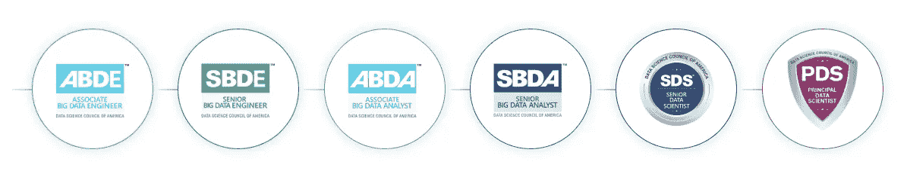
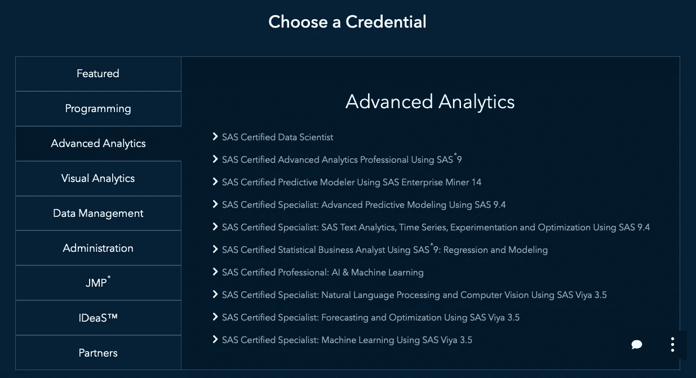

# 2023 年财富 500 强企业最需要的 5 大数据科学认证

> 原文：<https://medium.com/codex/top-5-data-science-certifications-in-demand-by-fortune-500-firms-in-2022-362ad4e26b0f?source=collection_archive---------0----------------------->

我们生活在一个大数据的世界里，预计到 2025 年全球数据量将达到 180 吉字节。然而，这种海量数据需要领域专家使用创新技术将其转化为有用的见解。因此，数据科学专业人员的工作对于协助领导团队制定目标和计划至关重要。

那么，这是否意味着成为一名才华横溢、才华横溢的数据科学专业人士很容易？

> 答案显然是否定的！

# 为什么需要数据科学专业人员？

*数据科学是一个利润丰厚的领域，对专业人员有巨大的需求，并且很容易进入这个领域*——这是初学者甚至是中级专业人员目前常见的误解。随着您发现独特的领域，您将认识到数据科学是一门需要不断学习新技能和技术来解决数据相关问题的学科。

*   根据 Payscale 的报告，具有一年或更少经验的入门级数据科学家预计可以获得 85，456 美元至 96，204 美元的高薪，与其他职业相比，这是相当高的。
*   据 Indeed 称，数据科学职位发布的数量增加了 33%以上，雇主优先考虑拥有最新数据科学技能的专业人士。

拥有相关领域的学位无疑会让你具备基本技能，但获得数据科学认证将让你磨练在这个行业很难找到的利基技能。此外，这也是一个补充专业知识的机会。通过这种方式，财富 500 强公司的招聘人员会知道如果他们雇佣你，他们会得到什么。

帮助您更好地理解数据科学认证的重要性；让我们来讨论一些雇主提出的重要面试问题。

*   长格式数据和宽格式数据有什么区别？
*   提及一些采样技术。采样的主要优势是什么？
*   你对物流回归的理解是什么？
*   什么是混淆矩阵？
*   什么是特征向量和特征值？

所有这些都不能无可争议地回答，除非你已经通过了考试，并正式持有数字证书来证明这些技能。

# 考虑一下在财富 500 强公司高层工作的专家的例子

*   Benjamin Arnulf(人工智能、数据和分析战略领导者，在美国和欧洲拥有超过 15 年的全球经验)，拥有多项数据科学认证(Python for data science、Oracle Cloud Customer Connect 等)
*   Carla Gentry(分析解决方案公司的高级数据科学家，重视学习新技能的证书，并持有一份证书)。

这代表了一个连贯的条件，即使顶级数据专家也考虑获得**数据科学认证**，你不应该在这方面落后。

正如推文中提到的，一些申请人选择了无法教授有形和无形数据科学技能的数据科学课程。大多数设计程序都是以帮助学习者完成课程的方式进行的，这些课程仅仅包括简单和基本的学习主题。

*   福布斯最近的一份报告表明，数据科学专业人员的工作需求预计将从 364000 增加到 2720000；然而，供给与行业需求不匹配。

需求缺口是有原因的。一句流行的名言很好地解释了这种情况。

> 生活中每一件有价值的事情都需要努力。一般规则是，最需要努力的东西价值最高，而不费力气的东西实际上毫无价值”。

顶级组织只会招聘那些有足够能力满足其工作要求的个人，因此，即使您认为自己了解数据科学，也需要一份可信且全球公认的数据科学认证，以证明您被正式认可拥有最新的数据科学技能。

**让我们来讨论一下 2023 年顶级公司需求的一些重要且最好的数据科学认证:**

1.IBM 数据科学认证

2.高级数据科学家(DASCA)

3.Azure 数据科学助理(微软)

4.数据科学专业认证(哈佛大学)

5.SAS 认证数据科学家

6.Python 应用数据科学(密歇根大学)

7.专业数据工程师(谷歌)

8.数据科学专业(约翰·霍普斯金大学)

9.数据科学训练营(跳板)

10.数据科学家纳米学位(Udacity)

您可能很难选择要获取的适当凭据。此外，你可能对自己擅长的专业感兴趣。

**以下是根据受欢迎程度和国际需求选出的前 5 名认证的精选列表。**

# 1.IBM 数据科学认证

该数据科学证书旨在帮助新手掌握数据科学的核心理念、数据科学家的职责和义务，以及如何流畅地使用 IBM cloud、RStudio IDE 和 Jupyter Notebooks 等数据科学技术。该计划包括十门课程，向学习者传授最新的数据科学技能和方法。Python、数据库和 SQL、数据可视化、数据分析和 ML 等主题都包含在本课程中。

***优点:***

*   不需要特定的先决条件
*   以你的速度学习

***缺点:***

*   与其他**最佳数据科学认证相比，完成该计划需要更长的时间。**

## 👉 [**认证详情:**](http://ibm data science certification review)

# 2.DASCA 的高级数据科学家(SDS)

这是你可以进入顶级数据科学家联盟的最佳数据科学家认证之一，该联盟由美国数据科学委员会提供。对于希望展示其数据领导潜力和数据科学前沿知识的专业数据科学专业人员来说，这是最强大的认证。SDS 建立在独立于供应商的知识体系之上，旨在强调您对最高能力标准的承诺及其高效的学习途径，从而获得优异的资格。

***先决条件:***

在数据科学和相关学科领域拥有 4 年以上工作经验和学士/硕士学位的专业人士可以申请此证书。此外，该计划要求你熟悉统计分析，数据库管理，电子表格，SPSS，R 编程，以及一系列的定量方法。

***优点:***

*   价格实惠，全程在线；节省时间和成本。
*   该认证计划为数据科学专业人员提供高影响力的技术领导职位，并被 CIO 杂志评为全球前五大数据科学认证之一。SDS 知识工程软件由世界领先的行业专业人士开发，提供了一个影响深远的学习途径，可获得优秀的资格认证。
*   SDS 符合最重要的全球商业区域的市场需求，让您在就业市场上拥有更大、更国际化的优势。
*   该认证在五个基本知识维度和 30 个核心专业知识科目中进行验证

***缺点:***

*   与其他凭证相比，先决条件稍微多一些。

## 👉 [**认证详情:**](https://bit.ly/SDSCertification)

**DASCA 提供的其他认证:**

# 3.Azure 数据科学助理(微软)

该认证使您能够学习所有关于云技术的知识，同时获得实际的学习经验。该考试评估你创建和部署 Azure 应用程序的能力。

***前提:***

对于任何有兴趣进一步了解 Azure 或者已经在使用它的人来说，这是一个理想的选择。尽管这是一个入门级的证书，你将通过学习关键原则获得该主题的知识；尽管如此，相关部门的经验是必需的。此外，它非常适合数据科学家，因为它主要专注于学习如何使用和应用 Azures ML 服务和 NLP，并通过实践经验教授。

***优点:***

*   在没有教师的情况下自由学习
*   初级专业人员的高级学习

***缺点:***

*   有教员在场的课程收费很高。

## 👉 [**认证详情:**](https://docs.microsoft.com/en-us/learn/certifications/azure-data-scientist/)

# 4.数据科学专业认证(哈佛大学)

HarvardX 数据科学计划为您提供了面对现实世界数据分析困难所需的信息和技能。该计划教授概率、推理、回归和机器学习等概念，以及 R 编程、使用 dplyr 进行数据辩论、使用 ggplot2 进行数据可视化、使用 Unix/Linux 进行文件组织、使用 git 和 GitHub 进行版本控制以及使用 RStudio 进行可重复的文档准备。你将同时学习 R，统计思想和数据分析程序。

***前提:***

没有获得此证书的先决条件。

***优点:***

*   适合希望获得 R 编程实践经验的专业人士

***缺点:***

*   该项目表示，尽管对数学的基本理解是必要条件，但不需要任何先决条件。

## 👉 [**认证详情:**](https://pll.harvard.edu/series/professional-certificate-data-science)

 [## 数据科学家在处理数据时最常犯的 5 个错误

### 管理良好的分析计划可以为您的组织带来金牌。然而，如果你做一个典型的…

albertchristopherr.medium.com](https://albertchristopherr.medium.com/5-most-common-mistakes-data-scientists-make-when-handling-data-ed3a51f20732) 

# 5.SAS 认证数据科学家

该认证融合了许多 SAS 品牌的证书。证书包括广泛的主题，如数据科学原理、数据分析和数据操作等。

***先决条件:***

它旨在成为一种交互式数据科学家认证，适用于那些使用开源工具和机器学习模型从海量数据中提取见解，然后使用这些知识做出更好决策的人。该认证要求学员在 SAS 数据管理工具和应用程序以及第三方分析工具(如 Hive/HiveQL、Hadoop 和 PIG/PIGLATIN)方面拥有至少 2-3 个月的实践经验。

***优点:***

*   SAS 认证的专业人员是国际公认的

***缺点:***

*   口袋很重
*   需要多个先决条件。

## 👉 [**认证详情:**](https://www.sas.com/en_in/certification/credentials/advanced-analytics/data-scientist.html)

**SAS 提供的其他认证:**

# 简而言之…

抛开是否获得认证或认证有多重要的争论，审视一下你在学习过程中将会学到的知识。如果你有技术专长，可以帮助你建设一个更好的未来，就没有所谓的浪费。