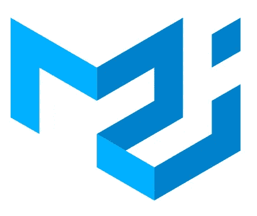
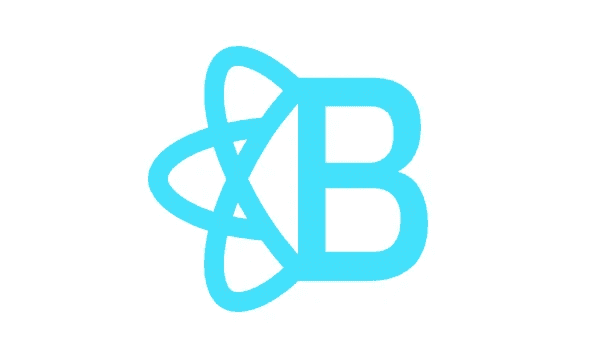
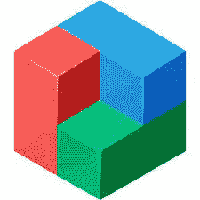
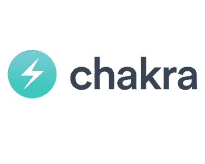
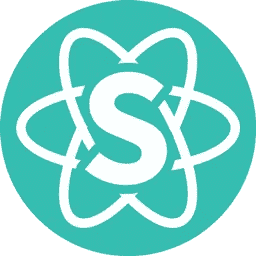

# 每个人都应该知道的 5 大 React 组件库

> 原文：<https://medium.com/codex/top-5-react-component-libraries-that-everyone-should-know-fc02832cb43d?source=collection_archive---------5----------------------->


由 facebook 开发的 React 在过去几年里变得非常流行。React 是一个强大的 JavaScript 框架，它使开发人员的前端开发工作变得更加容易。无论您是专业开发人员还是刚刚开始使用 React，如果您花了一些时间使用 React JS 编程，您都会同意使用正确的库来优化工作流是成功的关键。

**你为什么需要一个组件库？**

1.  它是一组健壮的现成 UI 组件，比如模态、输入、对话框等等。
2.  这使得开发变得容易，我们不需要从头开始重新创建一切。
3.  它极大地简化了响应网站的构建。

下面是 2022 年每个开发者都应该知道的一些最常用的组件库。

1.  **材质 UI**



材料用户界面

⭑ 78.8K 星

:- 27.2k 货叉

Material UI 是一个基于 google 的材料设计指南构建的库。GitHub 上有超过 75，000 颗星，Material UI 是最受欢迎的库之一，有很好的文档，是一个用户友好的库。

该库易于实现，并且组件非常酷。

可以使用 npm 命令安装材质 UI 库

```
npm install @mui/material @emotion/react @emotion/styled
```

此外，您可以通过 [*官网*](https://mui.com/) 阅读文档，并从 [*GitHub 资源库*](https://github.com/mui/material-ui) 了解更多信息。

**2。反应引导**



反应引导

⭑ 20.8K 星

:- 3.3k 叉子

React 引导是您最喜欢的用 React 重建的引导框架。Bootstrap 是一个开源框架，用于使用 HTML、CSS 和 JavaScript 开发应用程序。

React Bootstrap 是取代旧的引导 JavaScript。每个组件都是作为真正的 React 组件从头开始构建的，没有像 jQuery 这样不必要的依赖。引导还必须与 react-bootstrap 一起安装。

您可以使用 npm 命令轻松安装 React 引导程序

```
npm install react-bootstrap bootstrap
```

另外，您可以通过 [*官网*](https://react-bootstrap.github.io/) 阅读文档，并从 [*GitHub 资源库*](https://github.com/react-bootstrap/react-bootstrap) 了解更多信息。

**3。蓝图**



BluprintJs

⭑ 19K 明星队

:- 2k 个叉子

BlueprintJs，一个基于 React 的 web 工具包，用 Typescript 编写。它针对构建复杂的数据密集型接口进行了优化。

蓝图很容易拿起，有据可查，积极维护，随时可用！

可以使用 yarn 命令轻松安装 Blueprint

```
yarn add @blueprintjs/core react react-dom
```

查看 [*官网*](https://blueprintjs.com/) 和 [*GitHub 资源库*](https://github.com/palantir/blueprint) 了解更多信息。

**4。查克拉 UI**



Chakra UI

⭑ 26.6K 星

:- 2.3k 叉子

Chakra UI，简单、模块化且可访问的 UI 组件库，为您提供构建 React 应用程序所需的构建模块。

此外，查克拉用户界面是内置的光明和黑暗的用户界面，这是非常受欢迎的这些天，所以查克拉用户界面使其易于使用。

Chakra UI 可以使用 npm 命令安装

```
npm i @chakra-ui/react @emotion/react @emotion/styled framer-motion
```

查看 [*官网*](https://chakra-ui.com/) 和 [*GitHub 资源库*](https://github.com/chakra-ui/chakra-ui) 了解更多信息。

**5。语义 UI 反应**



语义 UI 反应

⭑ 12.8K 星

:- 3.9k 叉子

语义 UI React 是官方对 [*语义 UI*](https://semantic-ui.com/) 的 React 集成。jQuery 免费，声明式 API，速记道具，等等。

语义 UI，一个使用 jQuery 和 CSS 构建惊人界面的开源框架。它和 Bootstrap 一样，有不同的元素可以使用，让你的网站看起来很棒。

语义 UI React 可以使用 npm 命令安装

```
npm install semantic-ui-react semantic-ui-css
```

更多探索可从 [*官网*](https://react.semantic-ui.com/) 和 [*GitHub 资源库*](https://github.com/Semantic-Org/Semantic-UI-React) 获取。

**快乐学习！**