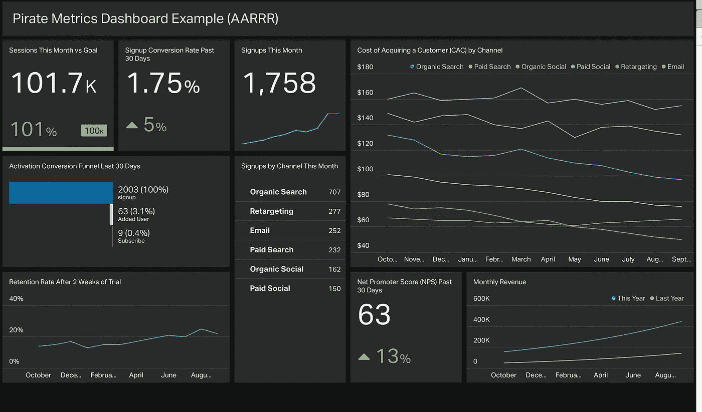

# 数据科学家应该具备仪表板创建技能的五大理由

> 原文：<https://medium.com/codex/top-5-reasons-why-a-data-scientist-should-have-dashboard-creation-skill-caedb1f572de?source=collection_archive---------4----------------------->

由[壁虎](http://support.geckoboard.com)设计的图像

John 是一家咨询公司的数据科学家，负责领导一家零售客户的分析工作。John 和他的团队为零售商创建了一个机器学习模型，该模型可以预测客户在未来 3 个月内是否会流失。该模型以 85%的召回率预测客户流失。客户对结果很满意，并希望积极使用这种模式来设计促销策略。

现在，John 如何确保客户能够独立使用该模型？

John 计划创建一个交互式仪表盘，作为客户的自助工具。一个可以上传客户相关数据的仪表板，在幕后，机器学习算法预测客户是否会流失。

> **想学习如何创建交互式仪表盘吗？**如果您在数据科学工作中使用 python，那么您可以考虑使用 plotly dash 来创建交互式仪表盘。点击这里查看我关于 dash 的介绍性博客:【https://bit.ly/3jQVWli[。你也可以在 Udemy 上以高达 70%的折扣报名参加我的课程**:**](https://bit.ly/3jQVWli)**[https://bit.ly/3iAmEhi](https://www.udemy.com/course/plotly-dash-python-dashboards/?couponCode=332E5E3BCFE9A528A457)**

**在这篇博客中，我将重点介绍数据科学家应该知道如何创建交互式仪表盘的五大理由**

# ****1。打动并赢得更多客户****

****

**克里斯·利维拉尼在 [Unsplash](https://unsplash.com?utm_source=medium&utm_medium=referral) 上拍摄的照片**

**在 PowerPoint 演示文稿中谈论您/您的团队带来的能力不足以赢得新客户。这更像是一种枯燥的理论。想象一下，如果您可以通过展示一个工作的交互式仪表板来添加一个实用的元素，该仪表板可以完美地展示您为现有客户解决的数据科学问题。演示不仅有助于潜在客户更好地了解你的能力，还会给他们留下深刻印象。**

# ****2。获得知名度，从而获得更高的薪水****

****

**在 [Unsplash](https://unsplash.com?utm_source=medium&utm_medium=referral) 上 [NeONBRAND](https://unsplash.com/@neonbrand?utm_source=medium&utm_medium=referral) 拍摄的照片**

**当您向多个潜在客户展示演示时，该工具/仪表板将在您的组织中为人所知，并且作为该工具的创建者，您将获得很高的知名度。一个伟大的工具甚至可以让组织的高层管理人员看到。这肯定会反映在你的评估中。**

# ****3。将您的 ML/AI 模型投入生产****

****

**约翰·施诺布里奇在 [Unsplash](https://unsplash.com?utm_source=medium&utm_medium=referral) 上拍摄的照片**

**如果你的客户喜欢你建立的机器学习模型，并且他/她计划在未来使用它，那么你将把你的模型投入生产。选择正确的仪表盘工具可以帮助您轻松地将 python 脚本转换为面向客户的生产级应用程序。我学习 plotly dash 是因为它不需要你学习 HTML、CSS 和 Javascript，你只需要知道 python。**

# ****4。获得更多工作机会****

****

**照片由[马丁·比约克](https://unsplash.com/@martenbjork?utm_source=medium&utm_medium=referral)在 [Unsplash](https://unsplash.com?utm_source=medium&utm_medium=referral) 上拍摄**

**仪表板创建技能正成为数据科学家角色的必备技能。大部分的招聘信息都提到了这一要求，如果你有这方面的技能，那么你的简历被选中参加面试的机会就会大大增加。**

# ****5。最小化你的依赖性****

****

**[约翰·卡梅隆](https://unsplash.com/@john_cameron?utm_source=medium&utm_medium=referral)在 [Unsplash](https://unsplash.com?utm_source=medium&utm_medium=referral) 上的照片**

**通过交互式仪表盘，您可以将涉及机器学习、深度学习模型等复杂的 python 分析置于业务决策者和运营商的手中。有了仪表板的访问权限，客户就不需要每次都来找你解决他们已经解决的业务问题了。**

**分享你的想法，你认为这项技能如何能够/已经帮助你成为一名数据科学专业人员。**

****

**卢克·切瑟在 [Unsplash](https://unsplash.com?utm_source=medium&utm_medium=referral) 上的照片**