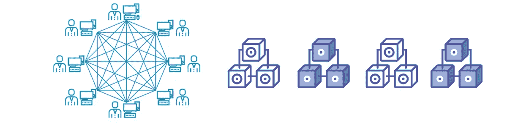

# 2022 年要掌握的 5 大技能

> 原文：<https://medium.com/codex/top-5-skills-to-get-in-2022-eeaf1a310be5?source=collection_archive---------10----------------------->

当我们开始的时候，常常会感到困惑，我们不知道该去哪里。你的职业生涯将是一个漫长的旅程，你可以走上不同的道路，但只要看看主要趋势和技术的发展方向。顺应潮流，然后决定你想把自己带到哪里。看看什么是你感兴趣的，你认为什么会给你的时间带来最大的回报，因为我们的时间都是有限的。我们都有有限的资源。在这篇文章中，我将总结我认为你应该在 2022 年获得的 5 大技能。

你不能改变昨天发生的事情。你只能改变今天发生的事情和未来发生的事情。没有人指望你一下子学会所有的东西。学习技术需要时间。每天花一些时间学习新的东西，你会惊讶于你获取信息的速度，你的技能发展的速度，以及你能迅速改变你现在所处的位置。如果你对目前的技能或工作不满意，如果可能的话，每天花时间学习一些新的东西。决定你想去哪里，然后每天花时间去实现这些目标。

因此，如果你还没有开始学习，那么在 2022 年你应该需要学习的第一项技能是…

## **1。编程— Python**

这是一种非常容易掌握的语言，如果你从事网络安全，Github 上有很多脚本和代码，如果你用 python 编程，你可以利用它们。如果你学习一门编程语言，它会改变你的行业标准。如果你愿意，你可以创造自己的财富，而不仅仅是一个应用程序的用户。您可以创建自己的代码来做您想做的事情。作为一个初学者，你可以从 Github 上的一个开发人员那里获得一段代码，从另一个开发人员那里获得一些代码，然后你可以将它们结合起来，用你的想法进行实验。因此，编码可以真正帮助你，我并不是建议你必须成为一名开发人员，如果你想进入网络安全或网络工程，但你会比其他人有优势。

还有其他一些非常好的语言也在今天的行业中获得了关注，比如 GO 和 Rust，但是如果你不确定从哪里开始，我建议你从 Python 开始。稍后，一旦你掌握了 Python，你可以切换到任何语言，但是这里的课程是开始学习编程语言。

## **2。Linux**

Linux 无处不在。如果你打算从事任何技术工作，你都会遇到这种情况。你需要学习 Linux。不管你是想进入网络安全、云计算、网络工程还是数据科学领域。虽然学习在 Windows 或 Mac 上开发和编写工作或个人使用的代码相对容易，但是学好 Linux 会有很多好处。最大的原因是它是一个**免费的**操作系统，有很多功能。

在最大的云提供商 AWS 上。所以，如果你打算进入职场，很有可能你会 ssh 到一个 Linux 服务器上做一些事情。您使用的大多数流行软件都有自由和开放源码(FOSS)替代软件。一般来说，与商业替代方案相比，它们可能缺少一些特性，但是对于大多数用例来说，这些都不是问题，或者可以通过扩展或配置获得。如果你有经验，在设置和配置这个软件，你将能够有同样的功能，除了免费的。

学习 Linux 是值得的，因为它驱动着世界上所有的技术基础设施。访问较低级别的命令行可以让您对这些系统拥有更大的权限。有一个陡峭的学习曲线，但它支付巨大的红利。每个在软件或数据方面挣六位数的人都经常使用 Linux 命令行。它让你经常使用的网络上的每一项技术和软件都能存在并正常运行。

## 3.建立工作关系网

现在，世界运行在网络上。你需要对网络有所了解。你想走哪条路并不重要。你只需要理解或欣赏网络。但是如果你不明白什么是 IP 地址呢？什么是端口号？什么是路由或交换？这会让你处于非常不利的地位。所以 get Network+或者 CCNA 至少给了自己一个良好的人脉基础。

研究现有的分支，找出你个人在这个领域最感兴趣的是什么，并继续阅读。一旦你找到了适合你的，安排一个课程或者买一本书来学习相关的证书。在那个领域查找工作，看你准备好了想申请什么。

此外，如果你认为现在进入社交网络为时已晚(由于年龄或者你已经在教育上投入了多少时间)，问问你自己你愿意花多少时间去学习。如果你有激情，你走了多远真的不重要，因为谁会阻止你？如果/当你真的迈出第一步，安排你的第一堂网络课时，请做好你的本职工作。如果你了解材料和技术，你会做得很好:在课堂上，在测试中，在野外。

如果你仍然不确定，YouTube/Google 不同的网络主题可以看到术语和一些不同的网络配置。学习网络不需要任何物理设备。你将无法经济地建立一个学习网络，这个网络将很好地转化为该领域的网络。相反，虚拟化您的网络将是迄今为止您的最佳选择: [GNS3](http://www.gns3.net/) 和 [Packet Tracer](https://www.netacad.com/web/about-us/cisco-packet-tracer) 是您最常听到的两个程序选择。许多人从 Packet Tracer 开始，这是 Cisco 的 NetAcad 实验室使用的，它会激起你的兴趣。

## 4.云— AWS(亚马逊网络服务)

云计算服务的需求曲线持续增长，是商业中的一个关键因素。就云计算服务和基础设施的总市场份额而言，亚马逊网络服务(AWS)目前处于领先地位，并将继续增长。如果你想学习 AWS，没有比现在更好的时机了。

如果你有 AWS 认证，有很多就业或创业的机会。经过 AWS 认证后，您可以获得一个亚马逊认证的标志，并使用它来炫耀和品牌化您的 AWS 技能集，您可以成为 AWS 社区的一部分。随着亚马逊扩大其云服务，它在 IT 市场上变得越来越大。越来越多的公司正在转向云，亚马逊提供高度安全和灵活的云服务。对许多技术人员的需求已经增加，并将继续增加。拥有一个认证将帮助你脱颖而出，你一定会从中获得巨大的好处。

需要开发新的技能来提高自己，并跟上最新的技术进步。AWS 认证有助于您获得这方面的专业知识。对于大多数基于实时场景的 AWS 认证，您需要实践和知识来通过考试。通过考试并获得认证肯定会显示你在该领域的专业知识，并帮助你获得更高水平的认证。

## 5.区块链

区块链。权力下放。点对点技术。Web3。所有这些都将成为我们称之为互联网的下一次变革的重要组成部分。监控经济即将面临法律和趋势的衰落，区块链可以作为认证组件和商业的一个非常方便的替代品。

自学，了解区块链如何帮助企业。我们如何使用分布式区块链来确保个人和公司都有责任？我们如何记录正在发生的事情？你不必放弃目前的职业道路来探索区块链技术的可能性。事实上，把你现有的技能和专业区块链结合起来，你就有可能晋升到高薪职位。

区块链的职业包括区块链开发商、设计师、工程师、法律顾问和项目经理。区块链继续受到欢迎，并在许多领域变得越来越有用。继比特币之后，区块链网络上出现了多种加密货币。除了在加密货币方面的应用，区块链还被证明在治理、网络安全、工业流程、金融部门、娱乐等领域非常有用。

学习这些东西需要时间，但是试着每天学习新的东西。试着每天增加你的知识。与其多花一个小时浏览社交网站，为什么不花一个小时花点时间学点东西。去看 YouTube 上教育你的视频，而不仅仅是娱乐你。观看许多公司提供的培训材料..外面有如此多的免费内容。祝你在 2022 年学习愉快，万事如意:)