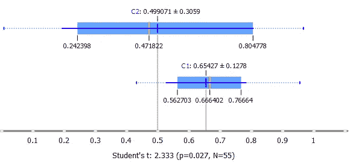

# 六大简单高效的可视化类型简述

> 原文：<https://medium.com/codex/top-6-simple-efficient-visualization-types-briefly-e9ccf7871287?source=collection_archive---------24----------------------->

## 如果你想发现或展示你的数据，你来对地方了

在 [Unsplash](https://unsplash.com/s/photos/data?utm_source=unsplash&utm_medium=referral&utm_content=creditCopyText) 上由 [Carlos Muza](https://unsplash.com/@kmuza?utm_source=unsplash&utm_medium=referral&utm_content=creditCopyText) 拍摄的照片

我们有几种理解数据的方法。当我们分析它的时候，我们最后想到的是可视化。然而，我们的思维方式决定了我们需要我们想要检验的事物的视觉形式。因此，视觉化不仅对呈现某些结论是必要的，对发现世界模式也是必要的。

即使处理一些与日常生活无关的数字信息，我们也经常需要在数据中找到一些序列和模式来进行分析。如果我们看到图片，我们可以做得更快。因此，可视化的基本目的是创建一种可视化形式，以便更好、更有效地理解隐藏在数据中的模式。

**额外收获:**可视化可以说明书面报告或文章，以便更容易地向读者提供一些想法。

然而，本文致力于简单可视化类型的顶部。因此，我很高兴分享我几乎每天都在使用的可视化选项的简短集合:

1.  **方框图**

作者图片

该工具显示基本统计数据。它对于观察单个变量是有效的。我们可以用一个分类变量把它分成多个箱线图。在这种情况下，我们可以计算 ANOVAs 或卡方，并根据变量分类的好坏对变量进行排序。

**2。曲线**

作者图片

它使分布可视化，但是应该仔细考虑，因为这个工具是一些平滑的结果。因此，它有一些隐藏的参数。有时，它们很难设定和/或解释。有时，曲线是由拟合形状的参数产生的，我们必须决定它应该是什么样子。在这种情况下，我们没有好的论据来支持特定的形状视觉。

**3。直方图**

作者图片

这个工具对于发行版也是有效的。在这里，我们也可以通过分类变量分割数据。

**注意:**这里最重要的问题是选择箱子的数量。这个特性会强烈影响可视化的最终形式。

然而，直方图本质上比曲线好，因为它们没有隐藏任何东西。如果不操纵所决定的箱或边界的数量的标准，它有效地工作。

**4。马赛克显示**

作者图片

此工具对于分类特征之间的关系非常有用，其发现方式类似于散点图对于数值变量的发现方式。它将数据按 1-4 个变量分成更小的子组。马赛克显示执行与组大小相对应的区域大小。该区域可以进一步分割，以显示目标变量在组内的分布。

**5。散点图**

作者图片

正如前面所说，散点图显示了两个数值变量之间的关系。在这里，我们可以使用大小、颜色、形状，甚至角度来显示同一个图中的其他量。在前三种颜色中，颜色是最有效的属性。在大多数情况下，很容易看到某一颜色占优势的具体区域。它还允许在没有图案的地方发现图案。

**注意:**使用颜色是显示数字量最有效的方式。要点是使用不太多颜色的离散刻度。如果色标是连续的，则很难将图例中的颜色与图上的专色进行比较。

**6。筛图**

作者图片

该工具显示了两个变量的实际频率与其预期频率的对比。它使用颜色和网格作为卡方可视化。与镶嵌显示不同，该区域沿每个轴独立分割。因此，假设变量是独立的，大小对应于预期的实例数。这种类型的图表也显示了独立性的侵犯。换句话说，它向我们展示了比预期更罕见或更常见的价值观组合。

因此，我试图尽可能简单地执行前 6 种简单有效的可视化类型。它们中的每一个都适用于不同的情况。这里的关键点是数据分析确定的需求和目的。据此，选择最合适的可视化类型。

*感谢您的阅读！如果你想和我分享你的观点或想法，你可以在评论区自由写作。如有任何建议或疑问，请随时通过* [*LinkedIn 简介*](https://www.linkedin.com/in/margarita-a-2767a5200/) *联系我。*

祝你有愉快的一天！