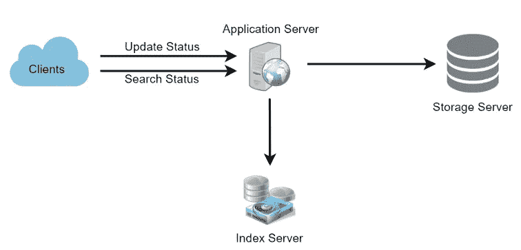
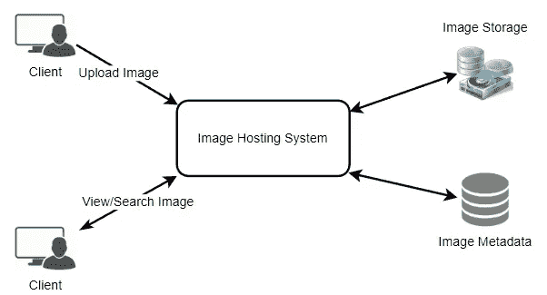
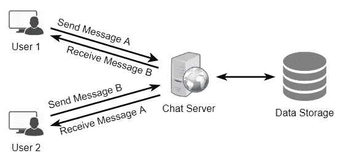
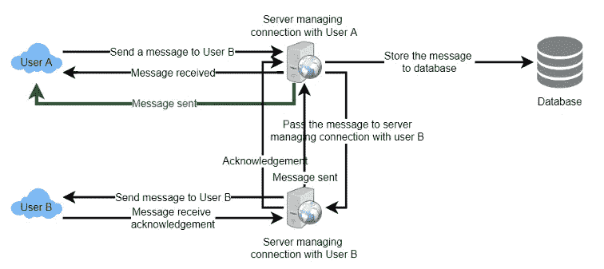
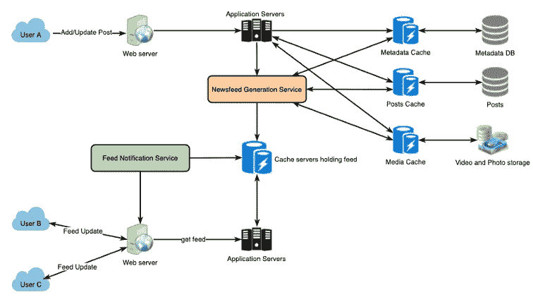
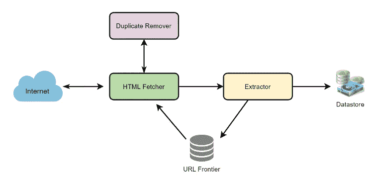
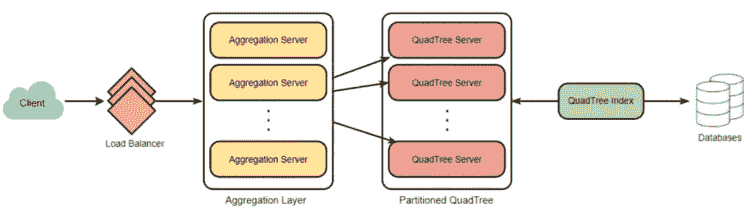
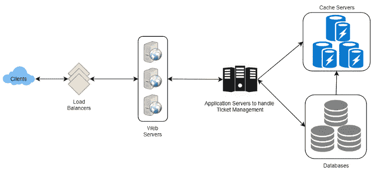

# 前 7 名脸书系统设计面试问答(2023)

> 原文：<https://medium.com/codex/top-7-facebook-system-design-interview-questions-and-answers-2022-8c2dd329038?source=collection_archive---------3----------------------->

## 在你下一次脸书面试之前练习这些问题！

脸书系统设计面试问题

系统设计面试(SDIs)在过去的几年里获得了很多关注。现在所有的软件工程面试都包括这些面试来评估候选人设计和管理复杂系统的能力。

工程师通常与 SDI 斗争，部分原因是他们在开发大规模系统方面缺乏经验，部分原因是 SDI 的非结构化性质。即使是经验丰富的工程师也觉得这些面试令人不安，主要是因为设计问题的开放性，没有标准答案。

今天我们就来讨论一下在脸书面试中问到的 **top 7** [**系统设计问题**](https://levelup.gitconnected.com/system-design-interview-survival-guide-2023-preparation-strategies-and-practical-tips-ba9314e6b9e3) 。

# 1.设计脸书状态搜索

脸书是最大的社交网络服务之一，用户可以在这里分享照片、新闻和基于文本的消息。让我们设计一个可以存储和搜索用户状态更新的服务。

**要求**

*   假设脸书有 15 亿用户，其中 8 亿是日活跃用户。
*   平均来说，脸书每天收到 4 亿条状态更新。
*   状态更新的平均大小是 300 字节。
*   让我们假设每天会有 5 亿次搜索。
*   搜索查询将由用 AND/OR 组合的多个单词组成。

在高层次上，我们需要将所有的状态更新存储在数据库中，还需要构建一个索引来跟踪哪个单词出现在哪个状态更新消息中。这个索引将帮助我们快速找到用户试图搜索的消息。

Twitter 搜索的高级设计

了解更多关于 [**设计脸书状态更新搜索**](https://designgurus.org/path-player?courseid=grokking-the-system-design-interview&unit=grokking-the-system-design-interview_1626970258715_7Unit) **。**

# 2.设计 Instagram

设计一个类似 Instagram 的照片分享服务，用户可以上传照片与其他用户分享。

**功能需求**

1.  用户应该能够上传/下载/查看照片。
2.  用户可以根据照片/视频标题进行搜索。
3.  用户可以关注其他用户。
4.  系统应该生成并显示用户的新闻提要，包括用户关注的所有人的顶级照片。

**非功能需求**

1.  我们的服务需要高度可用。
2.  对于新闻提要生成，系统的可接受延迟为 200 毫秒。
3.  如果用户有一段时间没有看到照片，一致性会受到影响(为了可用性)；应该没问题。
4.  该系统应该高度可靠；任何上传的照片或视频都不应丢失。

# 高级解决方案

在高层次上，我们需要支持两种场景，一种是上传照片，另一种是查看/搜索照片。我们的服务需要一些对象存储服务器来存储照片，需要一些数据库服务器来存储关于照片的元数据信息。

了解更多关于 [**设计 Instagram**](https://designgurus.org/path-player?courseid=grokking-the-system-design-interview&unit=grokking-the-system-design-interview_1626970106319_0Unit) **。**

# 3.设计 Facebook Messenger 或 WhatsApp

设计一个像 Facebook Messenger 一样的即时消息服务，用户可以通过网络和移动界面互相发送文本消息。

**功能需求:**

1.  Messenger 应该支持用户之间的一对一对话。
2.  Messenger 应该跟踪其用户的在线/离线状态。
3.  Messenger 应该支持聊天记录的持久存储。

**非功能性需求:**

1.  用户应该有一个实时聊天体验，最小的延迟。
2.  我们的系统应该是高度一致的；用户应该可以在他们所有的设备上看到相同的聊天记录。
3.  Messenger 的高可用性是可取的；为了一致性，我们可以容忍较低的可用性。

# 高级解决方案

在高层次上，我们将需要一个聊天服务器，它将是协调用户之间所有通信的核心部分。例如，当一个用户想要给另一个用户发送消息时，他们将连接到聊天服务器，并将消息发送到服务器；然后，服务器将该消息传递给其他用户，并将其存储在数据库中。

详细的工作流程如下所示:

1.  用户 A 通过聊天服务器向用户 B 发送消息。
2.  服务器接收消息并向用户 a 发送确认。
3.  服务器将消息存储在其数据库中，并将消息发送给用户 b。
4.  用户 B 收到消息，并向服务器发送确认。
5.  服务器通知用户 A，消息已经成功传递给用户 b。

发送消息的请求流

了解更多关于 [**设计 Facebook Messenger**](https://designgurus.org/path-player?courseid=grokking-the-system-design-interview&unit=grokking-the-system-design-interview_1626970153011_2Unit)**的信息。**

# 4.设计脸书的新闻源

设计脸书的新闻源，其中包含用户关注的所有人和页面的帖子、照片、视频和状态更新。

**功能需求:**

1.  新闻订阅源将基于用户关注的人、页面和组的帖子生成。
2.  用户可能有许多朋友并关注大量页面/群组。
3.  提要可能包含图像、视频或文本。
4.  我们的服务应该支持为所有活跃用户在新帖子到达新闻提要时添加新帖子。

**非功能性需求:**

1.  我们的系统应该能够实时生成任何用户的新闻订阅——最终用户看到的最大延迟是 2s。
2.  假设有新的新闻订阅请求，一篇文章不应该花超过 5 秒的时间到达用户的订阅源。

# 高级解决方案

概括地说，我们的新闻订阅服务需要以下组件:

1.  **网络服务器:**维持与用户的连接。此连接将用于在用户和服务器之间传输数据。
2.  **应用服务器:**执行在数据库服务器中存储新帖子的工作流程。我们还需要一些应用服务器来检索新闻提要并将其推送给最终用户。
3.  **元数据数据库和缓存:**存储关于用户、页面和组的元数据。
4.  **帖子数据库和缓存:**存储关于帖子及其内容的元数据。
5.  **视频和照片存储，以及缓存:** Blob 存储，用于存储帖子中包含的所有媒体。
6.  **新闻订阅源生成服务:**为用户收集和排列所有相关的帖子，以生成新闻订阅源并存储在缓存中。该服务还将接收实时更新，并将这些较新的提要条目添加到任何用户的时间表中。
7.  **提要通知服务:**通知用户他们的新闻提要有更新的条目。

下面是我们系统的高层架构图。用户 B 和 C 跟随用户 a。

脸书新闻订阅架构

了解更多关于 [**设计脸书新闻订阅**](https://designgurus.org/path-player?courseid=grokking-the-system-design-interview&unit=grokking-the-system-design-interview_1626970300115_9Unit) **的信息。**

# 5.设计一个网络爬虫

设计一个网络爬虫，系统地浏览和下载万维网。网络爬虫也被称为网络蜘蛛、机器人、蠕虫、步行者和机器人。

**要求**

让我们假设我们需要抓取所有的网页。

可伸缩性:我们的服务需要是可伸缩的，这样它就可以抓取整个网络，并且可以用来获取数以亿计的网络文档。

可扩展性:我们的服务应该以模块化的方式设计，并期望有新的功能加入其中。将来可能会有更新的文档类型需要下载和处理。

# 高级解决方案

一个最小的爬虫至少需要这些组件:

**1。URL frontier:** 存储要下载的 URL 列表，并区分哪些 URL 应该首先被抓取。
2**。HTML 获取器:**从服务器获取网页。
**3。提取器:**从 HTML 文档中提取链接。
**4。重复消除器:**确保相同的内容不会被无意中提取两次。
**5。数据存储:**存储检索到的页面、URL 和其他元数据。

了解更多关于设计网络爬虫的信息。

# 6.设计 Yelp 或附近的朋友或优步

设计一个类似 Yelp 的服务，用户可以搜索附近的地方，如餐馆、剧院或购物中心等。，还可以添加/查看地方评论。

**功能需求:**

1.  用户应该能够添加/删除/更新的地方。
2.  给定他们的位置(经度/纬度)，用户应该能够找到给定半径内所有附近的地方。
3.  用户应该能够添加关于一个地方的反馈/评论。反馈可以包含图片、文本和评分。

**非功能需求:**

1.  用户应该有一个实时的搜索体验，最小的延迟。
2.  我们的服务应该支持繁重的搜索负载。相比增加一个新的地方，会有很多搜索请求。

# 高级解决方案

在高层次上，我们需要存储和索引上述每个数据集(位置、评论等)。).为了让用户查询这个庞大的数据库，索引应该是高效的，因为在搜索附近的地方时，用户希望实时看到结果。

鉴于一个地方的位置不会经常改变，我们不需要担心数据的频繁更新。相比之下，如果我们打算构建一个服务，其中的对象经常改变它们的位置，例如人或出租车，那么我们可能会提出一个非常不同的设计。

了解更多关于 [**设计 Yelp 或者附近的朋友**](https://designgurus.org/path-player?courseid=grokking-the-system-design-interview&unit=grokking-the-system-design-interview_1626970328123_10Unit) **。**

# 7.设计票主

设计一个在线售票系统，像 Ticketmaster 或 BookMyShow 一样出售电影票

**功能需求:**

1.  我们的订票服务应该能够列出其附属影院所在的不同城市。
2.  一旦用户选择了城市，该服务应该显示在该特定城市发行的电影。
3.  一旦用户选择了一部电影，该服务将显示播放该电影的电影院及其可用的放映时间。
4.  用户应该能够选择一个特定的电影院放映，并预订他们的门票。
5.  该服务应该能够向用户显示电影院大厅的座位安排。用户应该能够根据自己的喜好选择多个座位。
6.  用户应该能够区分已预订的座位和可预订的座位。
7.  用户应该能够在付款完成预订之前保留座位五分钟。
8.  如果座位有机会变得可用，例如当其他用户的保留到期时，用户应该能够等待。
9.  应该以公平、先到先得的方式为等候的顾客服务。

**非功能性需求:**

1.  该系统需要高度并发。在任何特定的时间点，对于同一个座位都会有多个预订请求。服务应该优雅而公平地处理这个问题。
2.  服务的核心是订票，也就是金融交易。这意味着系统应该是安全的，数据库应该是 ACID 兼容的。

# 高级解决方案

在高层次上，我们的 web 服务器将管理用户的会话，应用服务器将处理所有的门票管理，将数据存储在数据库中，并与缓存服务器一起处理预订。

了解更多关于 [**设计 Ticketmaster**](https://designgurus.org/path-player?courseid=grokking-the-system-design-interview&unit=grokking-the-system-design-interview_1626970362841_12Unit) **。**

# 从这里去哪里？

➡练习这些问题是为了让自己与众不同！

➡在“ [**钻研系统设计面试**](https://designgurus.org/course/grokking-the-system-design-interview)**”****[**钻研高级系统设计面试**](https://designgurus.org/course/grokking-the-advanced-system-design-interview) ”中了解到更多这些问题**

**➡在 Linkedin 上关注我，了解系统设计和编码面试的技巧。**

# **感谢阅读**

*   **👏请为这个故事鼓掌，然后跟我来👉**
*   **📰查看更多关于[编码和系统设计访谈](https://arslan-ahmad.medium.com/)的内容**
*   **🔔关注我:[LinkedIn](https://www.linkedin.com/in/arslanahmad/)|[Twitter](https://twitter.com/arslan_ah)|[时事通讯](https://designgurus.org/interview-noodle-page)**