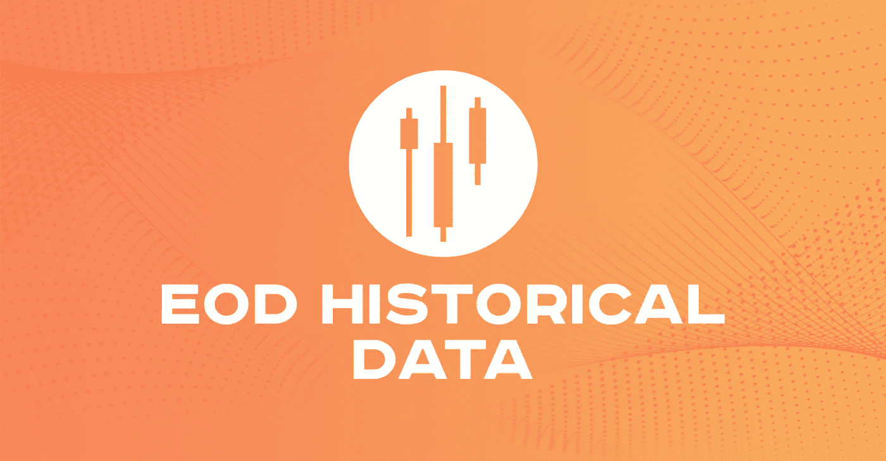
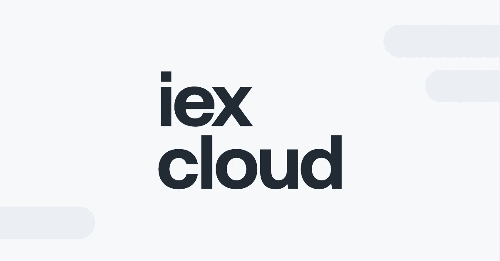
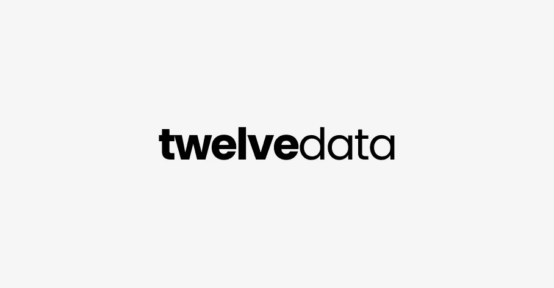
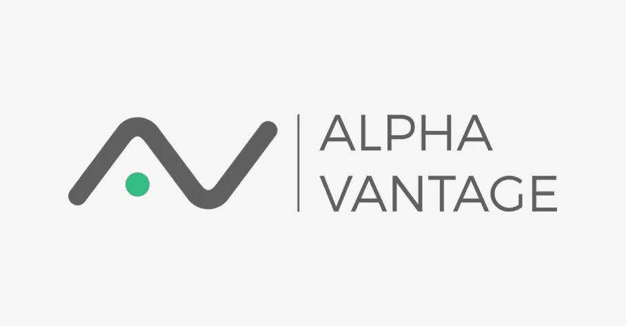
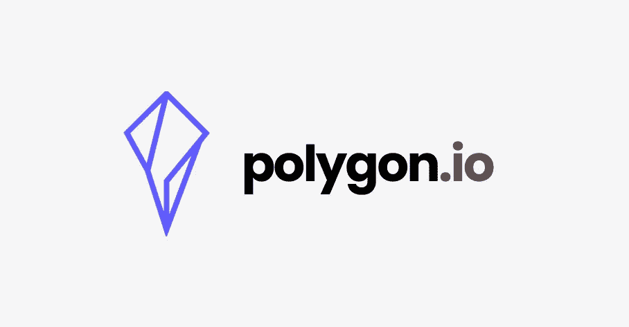
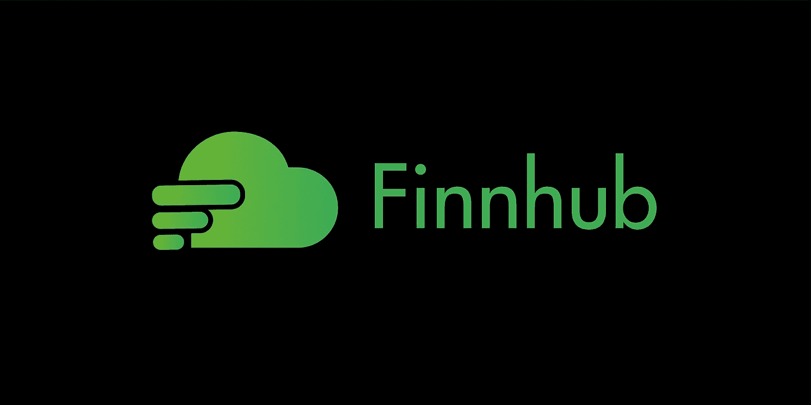

# 将于 2023 年试用的 7 大财务 API

> 原文：<https://medium.com/codex/top-7-financial-apis-to-try-out-in-2022-4f7b38c1fb8?source=collection_archive---------1----------------------->

## 不要错过这些！

# 介绍

数据是金融领域的新黄金，尤其是如果你专注于算法交易领域。谁知道如何充分利用数据，谁就拥有强大的市场优势。但由于出现了过多的金融数据提供商，寻找高质量和可靠的数据变得有点棘手。

不要担心，因为今天我创建了一个最好的 API 列表，你可以出于各种目的查看，例如 algo 交易、研究、项目、应用程序和许多其他很酷的事情。该列表基于三个核心标准:易用性、文档和所提供的特性。我亲自测试了所有的 API，以下是 2022 年要试用的 7 大财务 API(排名):

1.  [EOD 历史数据(EODhd)](https://eodhistoricaldata.com/?utm_source=medium&utm_medium=post&utm_campaign=top_7_financial_apis_to_try_out_in_2022)
2.  [IEX 云](https://iexcloud.io/)
3.  [十二数据](https://twelvedata.com/)
4.  [Intrinio](https://intrinio.com/)
5.  [阿尔法优势](https://www.alphavantage.co/)
6.  [Polygon.io](https://polygon.io/)
7.  [芬兰枢纽](https://finnhub.io/)

# 1.EOD 史料

[eodhistorical.com](https://eodhistoricaldata.com/?utm_source=medium&utm_medium=post&utm_campaign=top_7_financial_apis_to_try_out_in_2022)

[EOD 历史数据](https://eodhistoricaldata.com/?utm_source=medium&utm_medium=post&utm_campaign=top_7_financial_apis_to_try_out_in_2022)，简称 EODhd，由于各种原因高居榜首。首先是提供的 API 端点的数量。几乎有无限多的端点是为每一种可能的场景设计的。从像历史数据 API 这样的基本 API，一直到股票筛选和经济日历 API，对专业和教育工作都很方便。它们还支持股票以外的资产，如大宗商品、加密货币、指数等。

其次，EOD 历史数据公司以系统的顺序维护着他们 API 的结构良好的文档，以减少用户的困惑。他们提供的每一个 API 都有一篇专门的文章，解释 API 的用例以及实际和真实的例子。这些文章最好的部分是评论区，在这里我们可以张贴我们的疑问，专家将很快回答。对我来说，这是一个很棒的特性，因为我们不必每次都去找堆栈溢出或任何其他来源。

第三，易用性。我们通过调用 [EODhd 的 API](https://eodhistoricaldata.com/register/?utm_source=medium&utm_medium=post&utm_campaign=top_7_financial_apis_to_try_out_in_2022)得到的响应是我见过的最干净的数据之一。它有助于缩短数据清理和数据操作的过程，而这正是大多数初学者所困惑的。谈到初学者，为了减轻编码负担，EODhd 提供了[无代码解决方案](https://eodhistoricaldata.com/financial-apis/category/stock-prices-solutions/?utm_source=medium&utm_medium=post&utm_campaign=top_7_financial_apis_to_try_out_in_2022)来可行地、无缝地获得想要的数据。

先说定价。免费计划是为那些尝试不同股票 API 的人设计的，这些 API 包括所有基本的市场数据，每天调用 20 个 API。希望构建商业应用程序的专业人士和开发人员可以选择购买价格为 79.99 美元的[一体化软件包](https://eodhistoricaldata.com/pricing/?utm_source=medium&utm_medium=post&utm_campaign=top_7_financial_apis_to_try_out_in_2022)，该软件包每天有 100，000 个 API 调用，并且可以访问 EODhd 提供的无限量数据。

我真正欣赏 EODhd 支付结构的一点是它的直白。虽然其他公司使用模糊的术语，如 API 信用和 API 消息，但 EODhd 对每个订阅计划中提供的功能非常精确，使他们的用户更加清楚。说到缺点和限制，我个人认为没有任何缺点和限制，这就是为什么它在我的清单上排在首位。

总的来说，EOD 历史数据是最好的可靠资源之一，适合刚刚起步的初学者和高级用户进行研究工作和构建商业应用。

# 2.IEX 云

[iexcloud.io](http://iexcloud.io)

[IEX 云](https://iexcloud.io/)在这个列表中排名第二，它是我用过的第一批 API 之一。我喜欢 IEX 云的一点是他们花在设计产品页面上的时间。我决定提到这一点，因为他们的网站是以这样一种方式设计的，这种方式本质上是抽象的，并将他们提供的内容分解成简单的单词，以帮助那些不熟悉金融 API 领域的初学者。这一点至关重要，因为它间接为公司建立了一些信誉，并表明他们清楚自己在做什么。

IEX 云拥有强大优势的领域之一是他们提供的各种类型的数据。让它成为一只股票的情绪数据或投资者交流数据或任何你能想到的东西都可以在 IEX 云中找到。接下来是易用性。IEX 云通过提供像 EODhd 一样干净的数据来减少数据清理和格式化过程中的挫折，从而确定了这一标准。

继续看 IEX 云文档[，事情变得有点棘手。毫无疑问，所有 API 端点的文档都得到了很好的维护，但是我个人觉得缺乏组织。每一个 API 的教程都被放在一个地方，使得研究任何一个特定的 API 变得更加困难。这就是 IEX 云获得第二名而不是第一名的原因。否则，文档会用实例和代码详细解释 API。](https://iexcloud.io/docs/api/)

使用 [IEX 云的 API](https://iexcloud.io/cloud-login?r=https%3A%2F%2Fiexcloud.io%2Fconsole%2F#/register)的另一个小缺点是，在极少数情况下，数据点存在轻微的不准确性。从我的经验来看，当我尝试提取历史数据时，我能够承认一些与实际情况不同的数据点。这可能有点令人沮丧，但同样，这种情况很少发生，我们甚至没有注意到。

说到定价，建议初学者从一个免费帐户开始，这个帐户足以探索 IEX 云的基本功能，并逐渐升级到任何高级帐户。对于开发者来说，他们可以选择从 299 美元/月起的商业计划(适合中小型项目)[或从 2699 美元/月起的企业计划(适合大型项目或初创公司)。](https://iexcloud.io/pricing/)

总之，IEX 云的最终目的和用途在于其适合专业人士和高级用户的高级订阅计划，但鉴于其高质量的数据，它也是初学者的一个良好开端。

# 3.十二个数据

twelvedata.com

接下来是我们列表中的第三个金融 API[12 项数据](https://twelvedata.com/)。有趣的是，我是如何发现这个特定的金融 API 的。在完成了我在 IEX 云上的自由层账户后，我开始疯狂搜索我的下一个 API 提供商，然后我最终找到了 12 个数据(在了解 EODhd 之前)。

像 IEX 云一样，十二数据公司通过其[设计精美的产品页面](https://twelvedata.com/market-data)来讲述他们的故事，该页面既有趣又抽象，但更重要的是，通过各种代码片段和现实世界的例子来揭示他们提供的东西。

与前两个财务 API 相比，[12 data 的 API 集合](https://support.twelvedata.com/en/)相对较少，但包含了所有必需的 API。说到易用性，提供一些结构良好且最干净的 API 响应对于前面的那些同样重要。

十二数据的 API 的[文档是一个特殊的文档，因为除了被很好地维护和系统地组织之外，每一个 API 都用例子解释，包括 HTTP 请求 URL 和通过调用它接收的 JSON 响应。这有助于用户实际了解数据提取后的样子，并相应地帮助规划数据清理和操作过程。](https://twelvedata.com/docs#getting-started)

我喜欢他们文档的另一个小特点是他们如何根据重要性标记不同的 API 端点。这没有多大用处，但有助于识别最有用的 API，并轻松无缝地导航到它们。

我想添加到他们文档中的最后一个特性是将不同的 API 分类到不同的标题下的有效方法。这极大地提升了用户体验，因为它完全消除了令人沮丧的搜索 API 端点文档的过程。

十二个数据滞后的地方是他们的[混乱的定价](https://twelvedata.com/pricing)系统，因为它以一种不同的方式工作，基于一种叫做 API 信用的东西。基本上，每个 API 端点都有自己的数据权重或特定数量的分配信用，当调用 API 时会用到它们。此外，每当用户进行 API 调用时，除了 API 端点的数据权重之外，还会自动使用一个额外的信用来计算帮助交付所需数据的内部成本。听起来很模糊，对吧？

也许高级用户可能理解这个概念，但是初学者会发现很难更好地掌握它。更不用说，十二数据的整个定价系统完全基于 API 信用基础，所以他们可以做得更好，更详细地解释这个概念。

除此之外，考虑到 API 端点数量有限(与前两个财务 API 相比)，它可能不太适合构建世界级的大型应用程序，但它仍然是最好的起点之一。

# 4.Intrinio

intrinio.com

[Intrinio](https://www.intrinio.com/) 很特别，因为它是我开发主流应用和大型项目的首选。这主要是因为所提供的数据具有很高的准确性，并且它们提供了大量的 API 端点。

就像之前讨论的财务 API 一样， [Intrinio 的产品页面](https://www.intrinio.com/financial-market-data)几乎完美地传达了核心信息，没有使用模糊的词语，并且它们将用户体验提升到了一个新的水平，增加了一个聊天机器人，可以实时解决我们的查询，找到可能的最佳解决方案。

说到文档，他们有一个很棒的，但是像 IEX 云一样，没有分类到不同的子标题中，使得 API 文档看起来更笨拙。但另一方面，文档中有一些非常好的实例，并有清晰的解释。

Intrinio 的定价是我在这个列表中最喜欢的一个。首先，他们根据资产类型([期权](https://www.intrinio.com/options-data-packages)和[股票](https://www.intrinio.com/equity-market-data-packages))来分离他们的软件包，以便用户在有用的情况下选择最适合他们的软件包。其次，每个套餐中提供的服务都非常简单明了，并且解释得非常详细。

虽然 Intrinio 可能是大规模应用程序游戏中的最佳玩家之一，但它也是一个主要缺点，因为初学者或爱好者会被他们提供的服务淹没。他们从平台中获益相对较少，满意度也是如此。

因此，可以肯定地说，如果您正在寻找构建大型应用程序的财务 API，Intrinio 可能是最好的地方之一，但建议初学者在使用任何软件包之前三思。

# 5.阿尔法优势

【alphavantage.co 

当你听说 [Alpha Vantage 是每个刚刚起步的人的首选](https://www.alphavantage.co/support/#api-key)时，这没什么大不了的。这主要是因为他们令人难以置信的免费层计划，该计划的成本为零，每天提供 500 个 API 调用，可以访问他们提供的几乎每个 API 端点，从历史和基本面数据到技术指标。

现在让我们来谈谈 [Alpha Vantage](https://www.alphavantage.co/) 的两个主要缺点。首先，当然，这绝对不是专业人士和开发人员希望构建大规模应用程序的地方，因为与之前讨论的财务 API 相比，Alpha Vantage 提供的功能相对较少。

第二，可用数据的范围仅限于基本数据，如时间序列数据、基本面数据、技术指标，具体数据如金融新闻、情感数据等缺失。但是他们有一个伟大的自由层计划的优势几乎模糊了这些缺点。

Alpha Vantage 的[文档非常精确，由实例和代码片段组成。此外，文档的设计方式几乎与 data 的文档完全相同，都有单独的副标题和标签，以强调用户最常用的 API。](https://www.alphavantage.co/documentation/)

总的来说，对于初学者来说，Alpha Vantage 是最值得推荐的起点，因为它拥有业余爱好者掌握基础知识所需的一切，并提供了一些最棒的免费计划。但是对于高级用户来说，将 Alpha Vantage 作为第二个或替代选项可能是一个最佳的决定。

# 多边形. io

[polygon.io](http://polygon.io)

特别让我喜欢上 [Polygon.io](https://polygon.io/) 的是他们的资源页面，在那里人们可以找到教育内容，而不仅仅是普通的博客或文章。它包括有趣的代码样本、它们的 API 端点的真实例子等等。这让人对 Polygon.io 提供的 API 产生了兴趣。

谈到他们的定价，有两个有趣的事情。首先，每个计划中提到的服务都非常简单，其定价页面的界面设计使得用户可以轻松比较不同的计划。其次， [Polygon.io 的定价](https://polygon.io/pricing)不仅仅局限于基本和高级计划，而是包括大量基于资产分类的计划(股票、加密和外汇以及期权)。这很方便，因为人们可以从各种各样的选项中进行选择，并选择一个完全符合目的的计划。

说起他们的[文档](https://polygon.io/docs/stocks)，维护的很好，分门别类，以免笨拙。但是 Polygon.io 落后的地方是 API 端点的可用性。

虽然 Polygon.io 涵盖了几乎所有的基本数据，如历史数据和基本面数据，但它仍然缺少特定的数据，如金融新闻 API 和情感数据 API。因为它的 API 端点数量相对较少，所以不建议企业扩展大型应用程序，但对于初学者来说是个不错的起点。

# 芬兰枢纽

[finnhub.io](http://finnhub.io)

Finnhub 几乎没有任何问题。他们有大量的 [API 端点](https://finnhub.io/docs/api/symbol-search)和前所未闻的数据，比如分析师的估计数据、主题投资数据、深层历史数据等等。

虽然他们的网站不是最好的，但它几乎清楚地传达了信息和向用户提供的服务。他们有很棒的[文档](https://finnhub.io/docs/api),带有我们之前讨论过的其他金融 API 的类似标签系统。像 Polygon.io 的定价系统一样，他们提供了各种各样的[计划](https://finnhub.io/pricing)供选择。

虽然这一切听起来很好，但这是 Finnhub 最令人沮丧的部分。使用免费帐户可以访问的 API 非常有限，甚至错过了一些最基本的 API。之前提到的所有财务 API 都提供了比我们在自由层账户中需要的更多的东西，但 Finnhub 不是这样。

虽然 Finnhub 触发我们选择使用这种策略的计划是可以理解的，但用户体验非常令人讨厌。尤其是对于一个只想探索不同金融 API 的 API 库的人来说，Finnhub 要算是可恨的一个了。但除此之外，Finnhub 可能是一个很好的市场数据资源。

# 结束语

很高兴看到在数据领域出现了许多金融 API 提供者，代表了对这个特定领域的强烈兴趣。几年前，这个行业只有两家大公司，谷歌股票 API 和雅虎金融 API，但这两家公司要么被关闭，要么被其大量的竞争对手超越。

我想在这篇文章中强调的一件重要的事情是，这个列表并不代表普遍的共识，而仅仅是我个人的观点。这篇文章的一些重要观点是:

1.  数据已经变得越来越重要，所以在选择财务 API 时要小心，因为它可能会产生敏感的影响。
2.  有你自己的一套标准，比如易用性和文档，来对你有效使用的 API 进行排序。
3.  明确你想订阅的特定金融 API 的定价体系。

除了本文中列出的财务 API 之外，我建议您探索更多的 API，这样您就有机会找到一些最适合您的目的的 API。话虽如此，你已经到了文章的结尾。希望你能从这篇文章中学到一些新的有用的东西。此外，如果你比本文中列出的那些更了解其他财务 API，不要忘记在评论部分提到它们。