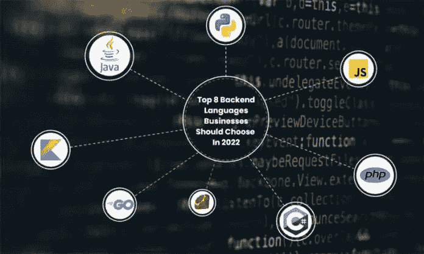
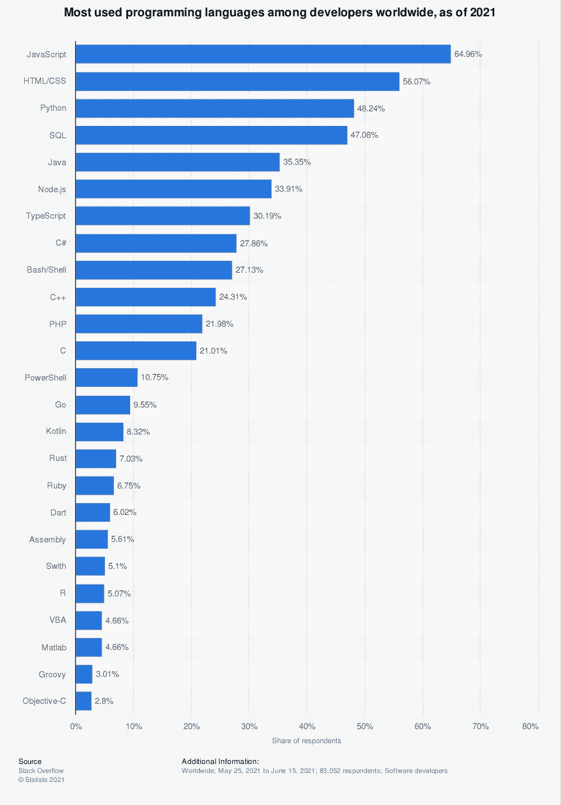

# 将在 2022 年掀起浪潮的 8 大后端语言——欧洲商业评论

> 原文：<https://medium.com/codex/top-8-backend-languages-that-will-make-wave-in-2022-the-european-business-review-b58904d3960d?source=collection_archive---------2----------------------->

随着技术的进步，我们已经看到网站和移动应用变得更加用户友好和创新。我们从外面看到的是在它的节目背后投入的巨大努力的结果。如你所知，发展发生在前面和后面。前者被称为“前端开发”，而后者被称为“后端开发”

不管前端看起来有多酷，神奇的事情发生在后端。这两种类型的开发都涉及不同的方法、开发人员和编程语言。由于不断的创新，就编程技术而言，趋势总是在变化。

在这篇博文中，我们将介绍 2022 年你必须警惕的八种最好的后端编程语言。在我们深入研究后端开发之前，让我们先了解一下它的含义。

# 什么是后端开发？

后端开发相当于餐厅的厨房。当你去餐馆时，你会感受到美丽的氛围，并吃到(希望)美味的食物。所有这些都可能发生，因为厨师和他们的员工正在厨房里准备菜肴。

就像餐馆的厨房工作人员一样，后端开发人员编写代码来确保最终用户能够准确无误地按时获得他们所请求的数据或服务。后端开发人员负责服务器端的 web 应用程序功能，如编写 API、创建库、维护数据库以及使用系统组件，而不是前端开发。

简单地说，后端开发人员准备后端编码结构，作为数据库和应用程序之间的链接。这就是为什么后端开发是一个独立的分支，需要特殊的技能。

现在你已经理解了什么是后端开发，让我们来看看你为什么在这里:2022 年最好的后端编程语言。我们开始吧！

大约 26 年前推出的 JavaScript 一直是最可靠的后端编程语言之一。通常被称为“JS”，它是一种用于服务器端和前端任务的语言。你必须注意‘JavaScript’和‘Java’不是一回事；它们都是完全不同的语言。

在 [Statista](https://www.statista.com) 查找更多统计数据

如上图所示，JS 是最受欢迎的编程语言。NodeJS、Express 和 MeteorJS 是使用最多的 JS 框架，其中 NodeJS 最为引人注目。NodeJS 框架的流行在 JS 的扩散中起到了关键作用。

由于其与人工智能(AI)、机器学习(ML)、数据科学和物联网(IoT)等技术的兼容性，Python 一直是开发人员社区中的热门语言。这就是为什么你总是会发现公司贴出招聘 Python 开发者的广告。

这打开了新的机会之门，这也是为什么我们看到许多 python 开发公司出现的原因。谷歌、脸书、IBM、Spotify 等巨头依赖 Python 不足为奇。

## **Python 的特点和优势:**

额外提示:python 是一门简单易学的语言，你会发现甚至大学生都称自己为“Python 开发者”这就是为什么你必须警惕雇佣合适的 python 开发者。

虽然比其他编程语言推出的晚，但是 PHP 感觉是老手了。原因是多年来，它一直是服务器端应用程序中最受欢迎的语言。

PHP 在 HTML 中根深蒂固，定制 PHP 开发是会话跟踪、设计电子商务网站、管理数据库和动态内容的首选。它是一种解释语言，因此不需要编译器。你可以在几乎所有主流操作系统上运行 PHP，如 Windows、Linux、macOS、Unix 等。

## **PHP 的特点和优势:**

即使你不熟悉编程领域，你也有可能听说过 Java。它已经成为领先的编程语言不是几年而是几十年了。尽管我们已经看到了最近出现的其他技术，Java 仍然是第五大最流行的编程语言。Java 几乎永远不会过时，这就是为什么我们看到对离岸 Java 开发人员的需求不断上升。

Java 是一种面向对象的编程语言，而 [Java 开发服务](https://www.inexture.com/services/java-development/)经常承担开发企业级 web 应用、android 应用、桌面应用、科学应用等任务。使用 Java 最大的好处就是它的代码可以在任何支持 Java 的平台上运行。

## **Java 特性&优点:**

Ruby 由 Yukihiro Matsumoto 于 1995 年推出，是一种开源的后端编程语言。它是一种通用的解释型编程语言，初学者更喜欢这种语言，因为它比其他语言更容易学习。它支持各种编程范例，如过程式、函数式和面向对象的编程。

Ruby 因其框架“Ruby on Rails”而闻名，它的主要优势是开发速度快。它是一种丰富的语言，有 60000 多个库。

## **Ruby 的特点和优势:**

C#是一种后端编程语言，主要由微软公司为。Net 框架。然而，C#也用于其他领域，如 Windows 应用程序、CLI 应用程序、服务器端应用程序和游戏开发。众所周知，C#运行代码的速度很快。像 Intellectsoft、凯捷等公司。，也在他们的业务中使用 C#。

## **C#的特点和优势:**

尽管对于非开发人员来说，Go 可能不那么受欢迎，但它已经被列为世界上最受欢迎的编程语言之一。由 Google 开发的 Go 允许开发者高效地构建可扩展的安全的 web 应用程序。它的语法非常类似于 C 语言。

## **围棋特色和优势:**

谈到 android 应用程序开发，Kotlin 是一个相当受欢迎的名字。毕竟官方宣称它是 Android 应用开发的首选语言。Kotlin 是一种通用编程语言，支持面向对象和函数式编程特性。Kotlin 提供的一个主要优势是它与 Java 的完全互操作性，并且它支持所有的 Java 库。

## **科特林特点及优势:**

*   简单易学
*   Android 应用程序开发
*   支持 web 和桌面应用程序开发
*   流行的框架，如 Javalin、KTor 和 Vertex

后端开发在 web 和移动应用程序中起着至关重要的作用。这就是为什么选择正确的编程语言至关重要。当你打算选择合适的技术时，你应该评估你的需求，而不是研究趋势或者看看有没有熟练的开发人员。例如，在决定[雇佣一家 Python 开发公司](https://www.inexture.com/guide-hire-python-development-company/)之前，你应该清楚为什么你会选择 Python。

一旦你确定了你的需求和你要使用的平台，下一个关键的步骤就是雇佣合适的开发公司，因为他们会帮助你获得技术的全部好处。这是让自己获得应得的技术升级的最佳时机。

*原载于 2021 年 12 月 27 日 https://www.europeanbusinessreview.com**的* [*。*](https://www.europeanbusinessreview.com/top-8-backend-languages-that-will-make-wave-in-2022/)