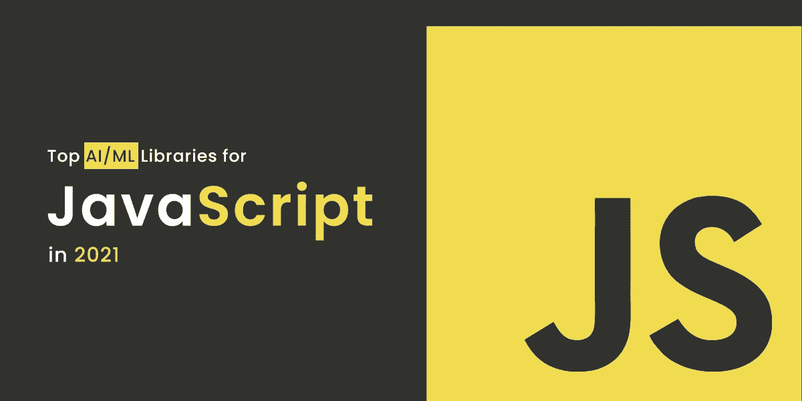
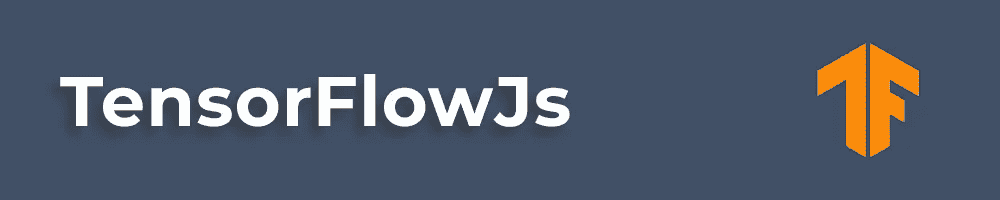
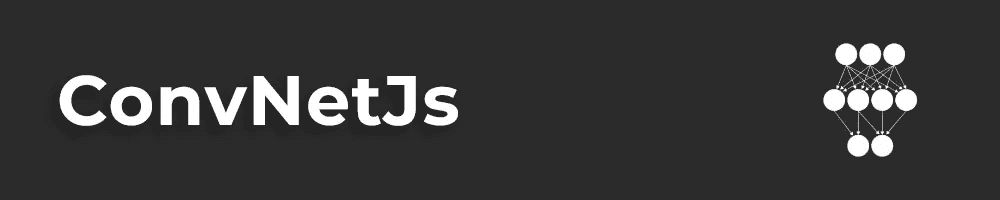
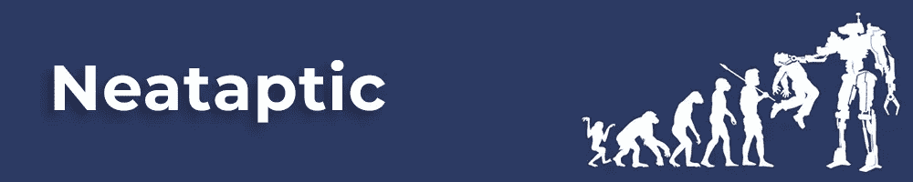

# 2021 年 JavaScript 的顶级 AI/ML 库

> 原文：<https://medium.com/codex/top-ai-ml-libraries-for-javascript-in-2021-1aa105fa6fbe?source=collection_archive---------5----------------------->

2021 年 JavaScript 的顶级 AI/ML 库

看完一部心爱的连续剧后，在网飞上找到相关的标题来娱乐你有多方便？或者当你在亚马逊上购买智能手机时，看到手机外壳的产品页面就在它的下方，有时甚至是定制的包装，以获得一些甜蜜的折扣！？这种我们有时认为理所当然的日常便利背后的魔力来自于机器学习的概念。机器学习是一个比挑选下一个值得狂欢的系列更广泛的概念；这是一个充满机遇和面向未来的解决方案的广阔领域。语音导航和在 Android 和苹果智能手机上分别使用谷歌助手和 Siri 形式的个人助理也是机器学习。

那么到底什么是机器学习呢？机器学习是人工智能的一个子集，它使任何系统能够理解和优化流程，而无需一致的编程。机器学习使用数据、统计和试错法来“学习”特定的任务，而无需被编码来执行该特定的任务。

Web 应用是为企业创造智能、创新、现代和面向未来的解决方案的未来，以吸引客户的注意力和兴趣。JavaScript 是大多数应用程序开发人员用来创建 web 应用程序的主要编程语言之一。因此，在 JavaScript 中集成机器学习功能是让您的 web 应用程序为未来做好准备并在这个竞争激烈的市场中有竞争力的可靠方法。

**以下是 2021 年最受欢迎的 JavaScript that 库**

# 1.张量流

TensorFlowJS

GitHub—【https://github.com/tensorflow/tensorflow 

https://www.npmjs.com/package/@tensorflow/tfjs NPM—

[**TensorFlow**](https://www.tensorflow.org/) 是一个端到端的开源机器学习平台，是在浏览器和 NodeJS 中训练和部署深度学习模型的 JavaScript 库。这个 AI ML JavaScript 库旨在为初学者和专家更容易地创建移动、桌面、云和 web 的机器学习模型。Tensorflow 的核心是一个数据流编程库。它利用了多种优化技术，使复杂的数学计算和表达式更容易理解，性能更高。

# TensorFlow 的主要特性–

*   对深度神经网络和机器学习概念的巨大支持。
*   跨机器和庞大数据集的计算技能的高可扩展性。
*   GPU/CPU 计算，可以在两种架构上执行相同的代码。
*   具有多维数组的数学表达式的高效流程。

# 关键使用领域–

**语音/声音识别**

*   声音识别
*   语音搜索
*   情感分析
*   探伤检验

**基于文本的应用**

*   语言检测
*   文本摘要
*   智能回复

**图像识别**

**时间序列**

*   建议

**视频检测**

*   运动检测、实时线程检测、安全、机场

# 2.布赖恩斯

布赖恩斯

GitHub—[https://github.com/brainjs/brain.js](https://github.com/brainjs/brain.js)

https://www.npmjs.com/package/brain.js?activeTab=readme NPM

[**BrainJS**](https://brain.js.org/#/) 是一个 JavaScript 编写的，GPU 加速的神经网络库。该库易于使用，使用 GPU 执行计算，如果 GPU 不可用，则返回纯 JS。拥有多个神经网络实现，BrainJS 允许开发人员训练不同的神经网络来做其他事情。

# BrainJS 的主要特点——

*   用高级语言创建一个简单的神经网络，以利用大量开源库。
*   创建各种神经网络，如前馈神经网络、递归神经网络、长短期记忆神经网络等。

# 关键使用领域–

*   构建和训练神经网络
*   创建节点应用程序
*   对于创建浏览器内游戏非常有用
*   广告位置
*   字符电子识别

# 3.ConvNetJS

ConvNetJS

GitHub—[https://github.com/karpathy/convnetjs](https://github.com/karpathy/convnetjs)

https://www.npmjs.com/package/convnetjs NPM

[**ConvNetJS**](https://cs.stanford.edu/people/karpathy/convnetjs/) 是一个完全在浏览器中用于深度学习模型/神经网络的 JavaScript 库。斯坦福大学的一名研究员写的。ConvNetJS 允许开发人员在没有任何软件依赖性的情况下，用 JS 来公式化和求解神经网络和深度学习。你所需要的只是一个浏览器来使用这个 AI ML JavaScript 库。它具有与普通神经网络相关的模块，这些神经网络具有非线性稀有性和完全连接的层。

# ConvNetJS 的主要特性–

*   支持回归(L2)成本函数和分类(SVM/Softmax)。
*   可用于训练和指定处理图像的卷积网络。
*   支持基于深度 Q 学习的实验强化学习模块。

# 关键使用领域–

*   为图像训练卷积网络。
*   训练强化学习代理。
*   神经网络分类。
*   神经网络回归。

# 4.标准库

Stdlibjs

github—[https://github.com/stdlib/lib](https://github.com/stdlib/lib)

https://www.npmjs.com/package/@stdlib/stdlib NPM—

[**Stdlib**](https://stdlib.io/) 是 Standard Lib 的简称，是 JS 和 NodeJS 的标准库。它为您的机器学习应用程序提供了一系列科学和数值计算功能。该库拥有大量数学函数，可帮助构建统计模型，并具有数据可视化功能，可将您的数据转换为吸引人的视觉效果，从而使提取见解变得更加容易。该库还具有其他实用程序，使应用程序开发和库开发过程更加容易。Stdlib 可以被视为一个伟大的一体化通用软件包，其中包含大量的文档和基准，可以帮助您开发机器学习。

# stdlib 的主要特性–

*   帮助开发人员利用高性能，严格和强大的统计和数学功能。
*   具有绘图和图形功能，帮助开发人员可视化他们的数据。
*   具有在浏览器和服务器上断言、分组、映射、过滤、提取和转换开发人员数据的功能。

# 关键使用领域–

*   具有数据可视化功能。
*   帮助开发人员建立统计模型。
*   有助于简化应用程序开发和库开发过程。

# 5.头脑

明基斯

GitHub—[https://github.com/stevenmiller888/mind](https://github.com/stevenmiller888/mind)

https://www.npmjs.com/package/node-mind NPM

[**Mind**](https://stevenmiller888.github.io/mindjs.net/) 是一个灵活的基于 JavaScript 的神经网络库，用于 NodeJS 和浏览器。这个库利用矩阵实现来有效地处理训练数据。它允许开发者个性化网络拓扑。Mind 也是可插拔的，这使得开发人员可以轻松地上传或下载插件，轻松地配置预先训练好的网络，这些网络可用于创建某些预测。

# 思维的主要特征——

*   使用矩阵实现来处理培训数据。
*   它是可插拔的，因此可以下载/上传先前学习过的记忆。
*   它允许您自定义网络拓扑。

# 关键使用区域-

*   训练神经网络。

# 6.neaptic–

Neataptic

GitHub—[https://github.com/wagenaartje/neataptic](https://github.com/wagenaartje/neataptic)

https://www.npmjs.com/package/neataptic NPM

[**neaptic**](https://wagenaartje.github.io/neataptic/)是一个流行的 AI ML JavaScript 库，具有灵活的神经网络。它有助于用一条代码线移除突触和神经元。这些神经网络的运行根本不需要固定的架构。您可以利用使用多线程执行的神经进化，为您的数据集塑造和重新塑造它们。

# Neataptic 的主要特点–

*   允许开发人员创建前馈神经网络。
*   它通过利用先前的输入及其相应的输出值作为隐藏层的下一个输入，帮助进行精确的时间序列预测。

# 关键使用区域-

*   可用于训练神经网络。
*   可用于神经网络归一化。
*   可用于网络可视化。
*   可用于网络演进。

# 最后

这些是用于 JavaScript 的顶级 AI ML 库，可以帮助您满足项目需求的各个方面。在 [web 应用开发](https://aglowiditsolutions.com/web-app-development/)中继续探索更多的 AIML 库，以增强 JavaScript 能力和实现机器学习。JavaScript 正在成为用于深度学习和机器学习等主题的最重要的语言之一。由于 JS 是最受欢迎的基础编程语言之一，它为开发人员使用算法和为许多挑战开发新的解决方案带来了难以置信的便利。