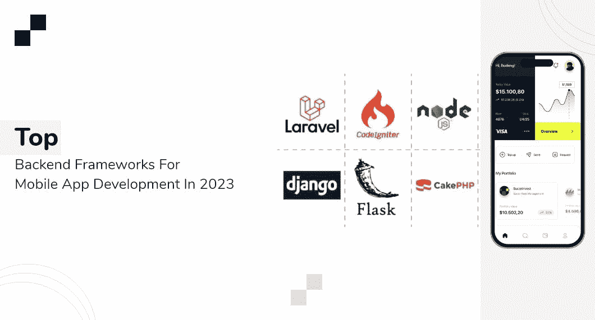
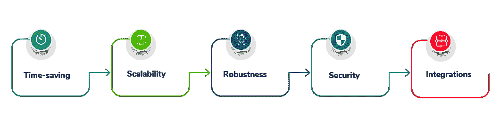

# 2023 年移动应用开发的顶级后端框架

> 原文：<https://medium.com/codex/top-backend-frameworks-for-mobile-app-development-in-2023-92d4ca29a179?source=collection_archive---------2----------------------->

你有没有考虑过让你的生活变得更简单的移动应用程序是由什么组成的？从每天早上醒来到准时到达办公室，一切都通过几个手指和触摸一些漂亮的智能手机应用程序来完成。今天可用的大多数应用是所谓的基于位置的服务。

有几个框架和库可用于开发移动应用程序。你需要一个框架来执行新概念，并在这个快速变化的生态系统中跟上竞争对手。

为了给你提供最好的用户体验，数以千计的开发移动应用程序框架正在这些有趣的应用程序的背景下工作。预计从 **2020** 到 **2030** 末，移动应用开发行业将以超过 **23.80%** 的 CAGR 扩张。

这些最好的移动应用开发框架将在 **2023** 提升你的应用设计和开发知识，让你有机会保持领先。

# 后端框架的优势

既然您已经了解了基础知识，让我们快速浏览一下在创建移动应用程序后端时利用框架的优势(这也适用于 web 开发)。

*   **省时**

当然，当开发人员可以从已经编写好的原子组件中构建应用程序功能时，开发过程会快得多。结果是产生了更少的错误，加速了开发过程并增强了产品的最终性能。

*   **可扩展性**

该框架的每个组件都已经过预先测试，因此扩展简单而快速。这使得开发能够适当扩展组件以应对需求激增的应用变得更加简单。

*   **鲁棒性**

您可以利用预先编写的代码，并用框架对其进行扩展。这使得您的工程师可以用简单、明确的架构创建可靠的产品，而不必发明轮子。

*   **安全**

安全问题得到了充分的解决，因为大多数框架都是开源的，并且每个框架背后都有一个强大而忠诚的社区。许多知名网站和应用程序，如 Instagram、Pinterest、Shopify、Coursera 和 Reddit，都是使用 Django、Ruby on Rails、Laravel、Node.js 和 ASP.NET 等技术创建的。这些人非常重视安全。

*   **集成**

向现有应用程序添加新功能比创建一个独立的应用程序更实际。后端开发框架使得集成 RESTful API 或 GraphQL 变得更加容易。这将显著改善用户体验，并允许您将新应用程序集成到蓬勃发展的软件生态系统中。

连接的列表是无止境的；你可以用你的脸书或谷歌账户登录，直接从 Instagram 或 Pinterest 提交内容，利用谷歌地图到达那里，并给出评论，等等。

你可能已经意识到后端框架的优势太大了，不容忽视，你是对的。因此，下一步是从列表中选择最好的后端框架；此外，你可以[为你未来的网络应用雇佣专门的印度开发者](https://www.quytech.com/hire-dedicated-developers.php)。

# 移动应用程序开发的顶级后端框架

让我们探索一些能够简化流程的顶级移动应用程序开发框架:

*   **姜戈:**

在最广泛使用的框架中，Django(基于 Python)是在 2005 年推出的。它是一个开放源代码的高级框架，拥有开发人员可能需要的一切，并且具有可伸缩性和适应性。

Django 建立在干式编码理念之上，强调代码重用以使其快速有效。它也坚持 MVC 设计。此外，该框架支持 JSON、XML 和 HTML 文件类型。

它主要用于快速开发在线应用程序，使用广受欢迎的 Python 功能，提供管理界面来执行 CRUD(创建、读取、更新、删除)操作。

谷歌、YouTube、Instagram、Spotify、Pinterest、DropBox、Mozilla 和国家地理都是基于 Django 的热门应用。

**姜戈的特色:**

*   受保护的认证
*   包含电池
*   中间件辅助
*   针对 SEO 进行了优化
*   大量的社区支持
*   与其他来源的应用程序简单集成

**拉勒韦尔:**

Laravel 是一个 PHP 框架，它是开源的，使用 MVC(模型-视图-架构)设计模式。它于 2011 年出版。它有一个清晰的界面，以及全面的库和 API 支持。它主要负责创建新闻、电子商务和博客网站。

此外，它还提供了包括 ORM(对象关系映射器)在内的数据库工具，帮助开发人员利用 PHP 漂亮而富于表现力的语法构建令人难以置信的定制在线应用程序。此外，它还支持通过本地或基于云的解决方案快速传输应用程序邮件。

> **读也:** [**为什么印度是最好的离岸目的地**](https://www.whatech.com/og/development/blog/732026-reasons-why-india-is-the-best-offshoring-destination-for-software-development) **。**

由于 Laravel 像 Ruby on Rails 一样具有可伸缩性和安全性，并且使用 MVC 架构来开发像 Django 这样的网站，因此可以将它与这两种框架进行比较。一个完整的服务器端架构控制着数据修改的管理。

许多企业都在使用 Laravel，包括 9GAG、辉瑞、Crowdcube 和 Razorpay。

**Laravel 的特点:**

*   拥有 CLI(命令行界面)
*   与 MySQL、SQL Server、SQLite 和 Postgres 集成
*   数据库迁移
*   简单 API
*   模板引擎

**快递:**

Express 是一个基于 JavaScript 的 Nodejs web 应用框架，支持 REST API 应用。该书于 2010 年首次出版。均值和 MERN 堆栈的后端部分用于创建交互式移动和在线应用程序，因为它快速、公正和轻量级。

此外，JS 开发人员使用 Express 是因为它提供了高度的应用程序灵活性。开发人员可以使用 NodeJS framework Express 设计单页面、多页面甚至混合页面。

为了处理 GET、PUT、POST 和 DELETE 请求，它集成了 NoSQL、MongoDB 和 Nodejs。埃森哲、贝宝、推特、优步和 IBM 只是少数利用 Express 作为其后端框架的企业。

**快递的特点:**

按指定路线发送

中间件

排除故障

插件支持

丰富的模板

HTTP 实用程序方法

**Spring Boot:**

2014 年，面向 Java 的开源轻量级 Spring Boot 框架发布。创建独立应用程序时会用到它。它包括一个名为 spring core container 的模块，提供容器。

它是最流行的框架之一，利用 CRUD 操作，并遵循 MVC 模式。它为创建 web 应用程序提供了定制的安全保护和扩展。

开发人员利用惰性初始化来创建基于该语言的 bean。事务管理、监控、缓存和安全性都是非常有用的特性。之所以选择 Spring Boot，是因为它支持微服务，易于安装，开发速度快。

亚马逊、谷歌和微软是利用 Spring Boot 的一些企业。

**跳趾的特征:**

*   简单 API
*   依赖性管理
*   避免复杂的 XML 配置
*   微服务

**Ruby on Rails:**

2004 年，引入了用于服务器端开发的开源 Ruby on Rails 框架。它遵循 MVC 设计，并为 web 服务提供了一个默认的框架。

它还制作了一个没有错误的数据库，并使用 HTML、CSS 和 JavaScript 开发应用程序。它的运作原则是 DRY(不要重复自己)和 CoC。(约定优于配置)。

第一个用于防止代码重复，第二个为解决问题提供了尽可能多的选项。Ruby on Rails 是一个非常流行的移动应用开发框架，你可以雇佣印度最好的应用开发者来开发你的应用。

Shopify、网飞、Airbnb、Crunchbase 和 GitHub 都在使用 Ruby on Rails。

**Ruby on Rails 的特点:**

*   良好的社区支持
*   可靠和高质量
*   简单测试
*   脚手架
*   本地化

**烧瓶:**

Flask 是一个快速的开源 Python 框架，可用于创建可靠的 web 应用程序。它于 2010 年发布。

这是一个“初学者友好”的框架，没有依赖性，易于构建。理解和使用起来也很简单。它提供单元测试、安全 cookies 和 RESTful 请求分派。它也被归类为微框架，因为它没有任何库和实用程序。验证、对象关系映射和上传都受到支持。

LinkedIn 和 Pinterest 是两家使用 Flask 作为其后端框架的知名公司，使用它来创建小型和大型应用程序。

**烧瓶特征:**

*   Unicode 后端
*   开发服务器
*   迅速发展
*   简约主义
*   良好的文档

**ASP。NET:**

ASP.NET(Active Server Pages)发布于 2002 年，是一个用 C#创建的免费、开源、开放的框架。这是一个模块化框架，可与 Windows 和 the.NET 框架一起工作。

它具有丰富的 API 服务和微服务，使其成为创建实时在线应用程序的完美框架。开发者的平台。NET 是 ASP.NET 的改进版本，由工具、库和编程语言组成。

它与 Linux、macOS 和 Windows 兼容。Slack、SpaceX、阿里旅行和万事达卡使用的后台框架是 ASP.NET。

**ASP.NET 的特色是:**

*   有多个版本
*   最小编码
*   异步的
*   集装箱支架
*   生命周期的各种支持选项

# 最后的想法！

总而言之，我在考虑了许多变量(包括操作系统、开发时间等等)后，精心挑选了这份最佳移动应用程序开发框架列表。

此外，移动应用程序开发每天都在变化，从单平台到跨平台。由于在代码、脚本、平台、集成、开发方法和部署方面的进步，移动开发趋势已经经历了重大的范式转变。

此外，为了开发您的应用程序，您还可以联系印度一家知名的顶级[移动应用程序开发公司](https://www.quytech.com/mobile-application-development.php)。

当我走向混合、原生和开发 web 应用程序时，物联网、人工智能、ML 和区块链技术正在被调整，以尽可能提供最智能、最安全和最好的用户体验。随着技术适应的快速发展，观察我们的应用程序如何混合发展将是一件有趣的事情。