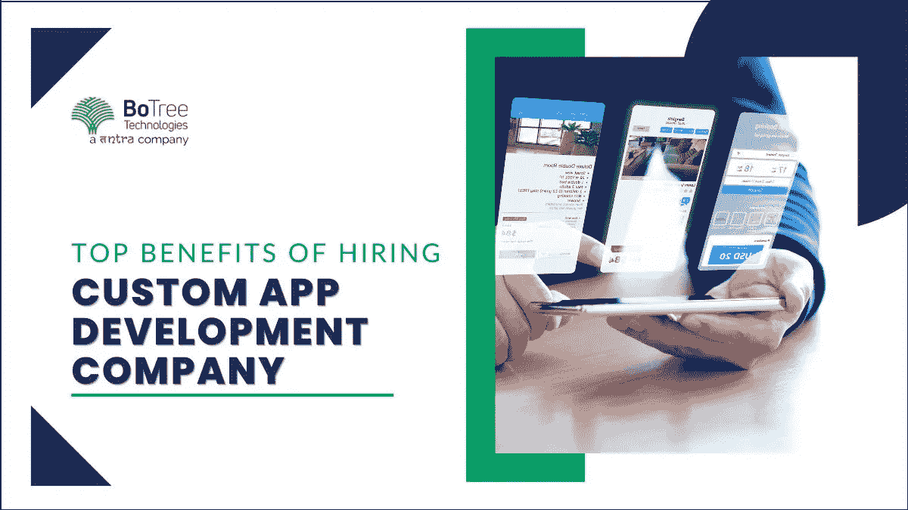

# 雇佣定制应用开发公司的 7 大好处

> 原文：<https://medium.com/codex/top-benefits-of-hiring-custom-app-development-company-44f5607eb745?source=collection_archive---------11----------------------->

今天，定制软件解决方案是数字化的第一步。无论是企业解决方案还是以客户为中心的应用程序，应用程序对于在数字世界中取得进步都至关重要。

非常需要定制应用程序开发。企业需要一个能够满足他们特定需求的软件开发公司。此外，他们需要能够向客户交付产品和服务的应用程序。

# 什么是定制应用程序开发？

定制应用程序开发指的是设计、开发、部署和维护软件的最常见方式，这种方式处理显式的业务问题。[定制软件](https://www.botreetechnologies.com/blog/customized-software-what-is-it-types-and-examples/)围绕一个特定的利益群体。例如，为 Google 定制的 ERP 解决方案将包含处理组织中显式问题的功能。定制软件是实现商业目标的一种较小的方法，没有现成软件的干扰。

> **阅读更多:** [**为您的企业使用定制应用程序开发服务的几大理由？**](https://www.botreetechnologies.com/blog/reasons-to-use-custom-app-development-services/)

# 定制应用程序开发的 7 大优势

既然定制应用程序开发是什么以及它与现成软件的不同之处已经变得如此明显，那么让我们来看看它的关键优势。

1.  **独特的企业软件:**

*   一家[企业软件开发公司](https://www.botreetechnologies.com/enterprise-software-development-company)开发定制软件，使其独一无二，并根据企业需求进行良好定义。组织可以添加或删除功能，处理数据，操作各种功能，并根据需要进行调整。
*   客户可以给出重要的反馈，这对做出改变很有价值。对于企业来说，这是一个独特的解决方案，不能一概而论，否则会浪费企业的时间和金钱。它使组织从竞争者中脱颖而出。

**2。更好的可扩展性:**

*   考虑企业选择扩张和招募更多专家的可能性。定制软件解决方案允许设计者展示新的特性，并增加框架的可伸缩性。只需少量的额外投资，组织就可以毫无问题地改进定制软件的功能。
*   现成的解决方案只是提供预定数量的用户，之后每个新用户都要花费大量的现金。适应性强的基础设施对扩展至关重要。

**3。运行效率更高:**

*   定制应用程序的最大好处之一是它们提供了很高的效率。一个广泛的应用程序可以执行系统中的许多功能。该应用程序由[定制软件开发](https://topappdevelopmentcompanies.com/software/custom-software-development-which-industries-does-it-benefit)服务公司定制，以满足业务需求并顺利解决业务问题。
*   不同的部门可以同时使用该应用程序，并协调他们的能力以实现最高的效率。

> **阅读更多:**[**2022 年定制软件开发指南**](https://www.botreetechnologies.com/blog/what-to-know-about-custom-software-development/)

**4。更好的应用个性化:**

*   一家可信的[定制应用程序开发公司](https://www.botreetechnologies.com/custom-application-development)如 BoTree，提供高度定制的应用程序。现成的软件伴随着一堆企业无法改变的特性。
*   在任何情况下，定制应用程序都是定制的，允许企业实现最大程度的个性化。
*   [定制应用程序开发公司](https://botreetechnologies.medium.com/top-10-custom-application-development-companies-for-enterprise-software-17b2f59f1ed3)可以根据需要添加许多功能，根据需要推出任何更改，并从本质上做他们需要做的任何事情来取得进展。

**5。更多提升机会:**

*   独特的想法通常需要特殊的定制[软件开发过程](https://www.botreetechnologies.com/blog/steps-to-define-software-development-process/)。因此，它提供了更多的机会来推进和发展新事物。
*   制造以客户为中心的软件的组织经常构建非凡的应用程序，并利用有问题的进步来实现它。
*   他们正在推动经济和 IT 世界的发展。优步、Airbnb 和 Instagram 等应用程序是推动技术发展的定制应用程序的几个例子。

6。维护简单:

*   当一个现成的、预先构建好的应用程序出现 bug 时，你会如何应对？第一步是联系客户支持小组，然后暂停。解决这个问题需要几天时间。
*   与此相反，定制软件应用程序的开发一直在进行，这意味着持续的维护。
*   设计师可以在问题出现时解决问题。他们不断检查和筛选应用程序中的任何错误，并毫不费力地修复它们。

7 .**。更高的安全性:**

*   总而言之，[定制软件工程](https://www.tntra.io/engineering)比准备使用的软件更安全。当企业[外包定制应用程序开发管理](https://www.botreetechnologies.com/blog/what-project-managers-should-know-to-outsource-software-development/)时，他们招募在定制软件中实现安全性的专家。他们提出了 SQL 注入和不同的功能，可以防止网络攻击。
*   现成的软件比定制的应用程序更容易出现安全漏洞。因此，对于拥有机密数据的组织，如 FinTech 和 HealthTech 组织，招募能够构建定制软件解决方案的专家是一个好主意。

> **查看我们的成功案例:** [**可定制企业内容管理系统网站**](https://www.botreetechnologies.com/case-studies/customizable-enterprise-cms)

## 结论

定制应用程序开发是需要在先进世界中胜出的组织的优先事项。这篇文章重点介绍了什么是[定制软件解决方案](https://www.botreetechnologies.com/blog/custom-software-development-mistakes/)，它与离岸软件的对比方式以及它提供的主要优势。定制应用程序是合理的和通用的，并向企业传达数字化的最佳效果。企业可以将本文作为一种视角来理解定制应用程序可以为他们实现的奇迹。

[**联系我们**](https://www.botreetechnologies.com/contact) **今天免费咨询。**

*原载于 2022 年 12 月 21 日 https://technoscriptz.com**的* [*。*](https://technoscriptz.com/top-7-benefits-of-hiring-a-custom-app-development-company/)