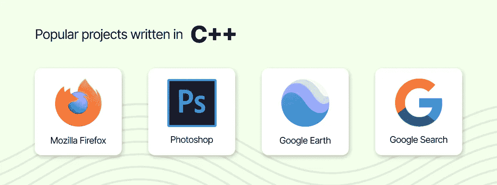
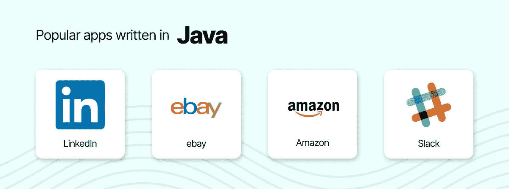
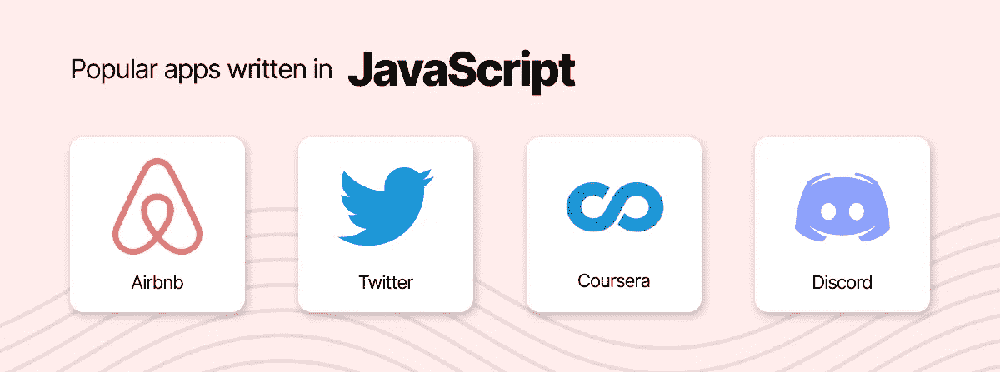
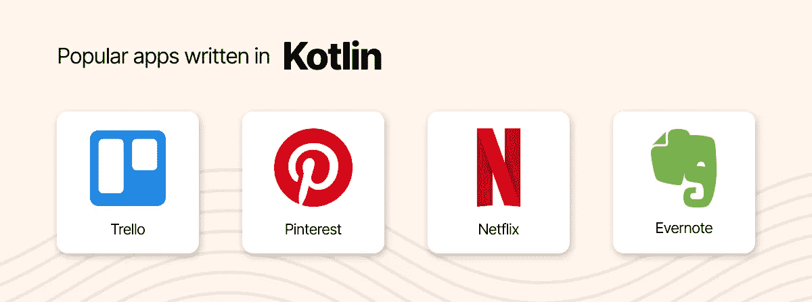
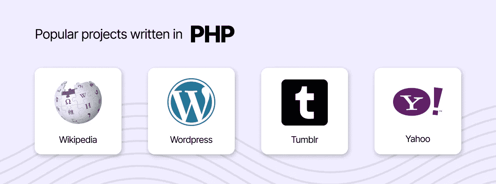
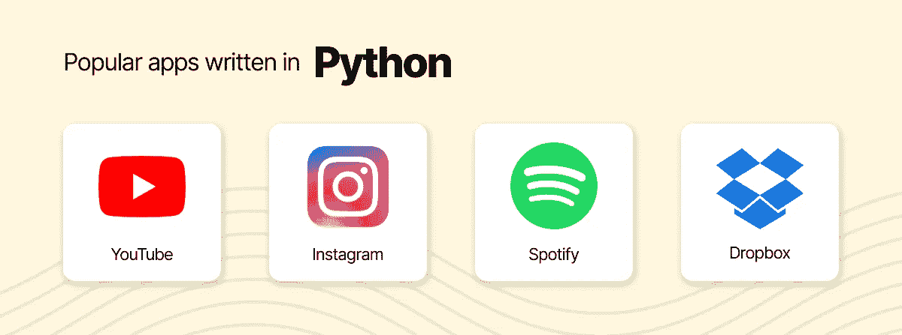

# 2022 年为你的未来项目选择的顶级编程语言

> 原文：<https://medium.com/codex/top-programming-languages-to-choose-for-your-future-project-in-2022-868f11aa7495?source=collection_archive---------8----------------------->

如果选择正确的话，你将要选择的编程语言对你工作的未来成功有很大的影响。只要在搜索栏中输入“2021 年顶级编程语言”，你就会得到另一个人气排名。令人震惊的是，一般来说，企业不会像开发人员那样从这些数据中获益。企业真正需要的是为他们即将到来的项目设置技术和编程语言的堆栈。

为此，我们避免了无聊的流行度竞赛，并根据应用领域和目标列出了顶级编程语言。以下是 2021 年 9 种领先的编码语言，请你在项目中牢记在心(这些语言按字母顺序排列):

*   **C#**
*   **C++**
*   **Java**
*   **JavaScript**
*   **科特林**
*   **PHP**
*   **Python**
*   **生锈**
*   **Swift**

因此，让我们来分解每一种语言，为您即将到来的项目找出最合适的语言。

## C#

根据微软的 C#记录，你可以看出 C#是一种当代的、类型安全的、面向对象的编程语言。C#语言出自一个 C 家族。这就是为什么程序员会在基于 C#的作品中立刻看到 C、C++、Java 和 JavaScript 的提示。

是为微软的。NET 平台，C#主要用于构建运行在 Windows 上的桌面应用程序。除此之外，C#也可以用来构建网络和移动应用。但是，C#在 web 开发上不是 JavaScript 的对手，在 iOS/Android 开发上也不是 Swift/Kotlin 的对手。

值得一提的是，C#是 Unity 平台的基础。因此，你可以在游戏中经常遇到它。所以，如果你打算做一个基于 Windows 或 Unity 的项目，试试 C#吧。

## C++

C++是一种高级、通用的编码语言，最初是作为 C 编程语言或“带类的 C”的扩展而创建的。今天，C++在应用历史上挑战其他语言，在学习难度上挑战用户。

除此之外，C++是一种快速、强大、跨平台的语言，用于制作大量不同的软件。让 C++的特性大放异彩的领域是云计算和游戏开发，其中速度是关键要求。

综上所述，C++是一种用于创建应用程序的全能编程语言，如果你的项目高度依赖于速度，它将是完美的。

*用 C++构建的应用*

## Java 语言(一种计算机语言，尤用于创建网站)

Java 是另一种通用的编程语言。它是一种 1995 年的跨平台、面向对象的语言。在使用它的时候，你不必重新编译 Java 代码，以防你想要运行它的平台支持 Java。Java 应用程序可以被编译成字节码，并可以进一步在 Java 虚拟机(或 JVM)上运行。

简单地说，Java 是一种平台无关的语言，运行在支持 JVM 的设备上。因此，它在国际开发社区中很受欢迎。桌面、web、大数据、Android 项目都可以借助 Java 轻松开发。

*用 Java 构建的应用程序*

## Java Script 语言

JavaScript 可能会被误认为是 Java 扩展，它是一种动态的、高级的、多范例的编程语言。因为它被证明是容易学习的，你可以经常看到人们称它为“最流行的编程语言”。

现在，JavaScript 确实是最受欢迎的编码语言之一。因此，它是编程语言中的一个时髦词。Java 在全球开发社区中备受青睐，这要归功于它处理某些事情的非传统方式。

JavaScript 主要是为在浏览器中运行而创建的，广泛应用于 web 开发的前端。尽管如此，JavaScript 拥有大量的库和框架，可以让您创建更多的库和框架。此外，您可以使用 node.js、桌面计算机和移动设备在服务器上运行 JavaScript，此外，您还可以使用 JavaScript 来驱动微控制器。

*用 JavaScript 构建的应用*

## 科特林

[Kotlin 的官方网站](https://developer.android.com/kotlin)声称它是一种增加开发者快乐的当代编程语言。即使一些开发人员可能不完全接受它，Kotlin 正在 Android 应用程序的开发人员中获得更多的认可。虽然 Java 仍然是 Android 运行应用程序的最常用语言，但 Kotlin 正在这个领域取代它，因为它的语法简单明了。

Kotlin 是一种通用的跨平台语言，可以在许多领域实现，包括 Android 开发、前端和后端 web 开发以及数据科学。Kotlin 与 Java 的互操作性也很好。运行在 JVM 之上，Kotlin 可以添加到现有的 JVM 库中，使其应用程序的可能性多样化。

最重要的是，Kotlin 正在成为 Android 领域的质量概念。许多开发移动应用程序的公司都在为他们新的 Android 项目寻找 Kotlin。然而，它不会让 Java 被 Android 开发遗忘。它仍然用于运行现有的 Android 应用程序和构建新的应用程序。

*用 Kotlin 构建的应用*

## 服务器端编程语言（Professional Hypertext Preprocessor 的缩写）

PHP 被认为是一种受欢迎的通用脚本语言，你可以在 [web 开发](https://orangesoft.co/services/web)中找到它。根据其[官方网站](https://www.php.net/)的说法，快速、灵活、实用的 PHP 是一切的基础，从你的博客到世界上访问量最大的网站。

尽管专家认为这种语言的受欢迎程度已经落后于 JavaScript，但 PHP 在 web 开发中扮演着重要角色。PHP 的丰富性可以从它在 WordPress 中的使用中看出。

*用 PHP 构建的应用*

## 计算机编程语言

[Python 的官方网站](https://www.python.org/)声明 Python 是一种能让你快速有效工作的编程语言。换句话说，它的语法非常简单，但仍然是一种强大的编码语言。这就是 Python 在国际开发者中广受欢迎的原因。

Python 是当今人们广泛学习的语言。由于 Python 的简单性，一些专家建议新手在学习其他语言之前先学习 Python。现代 IT 行业已经看到了 Python 的许多不同用途，从自动化、脚本编写、前端和后端 web 开发到数据科学和机器学习。

*用 Python 构建的应用*

## 锈

Rust 在 2010 年看到了曙光。Rust 的创造者 Mozilla 和 Graydon Hoare 声称这是最适合创建高效可靠软件的语言。尽管发布时间不长，但它一直是发展最快的编程语言之一。

Rust 的支持者将这种安全、快速、内存高效的语言定位为 C/C++的一种相当好的替代语言。你可能还会看到一些开发人员认为这是系统开发人员中最受欢迎的语言。

Rust 的优势使其成为制作 VR 应用程序、游戏引擎、开发操作系统以及其他对性能至关重要的类似系统的常见选择。之所以有这样的性能，是因为 Rust 和 C++一样，可以生成被视为 CPU“原生”的代码。简单来说，Rust 是为数不多的不需要任何像虚拟机一样的中间层直接运行的编程语言。

## 迅速发生的

Swift 于 2014 年由苹果推出，是你为苹果生态系统开发应用程序时的选择。尽管 Objective-C 仍然支持现有的应用程序，Swift 已经成为从零开始编写这些应用程序的优点。

Swift 在 2015 年成为开源，这让开发者可以在苹果生态系统之外使用它。得益于 [Vapor](https://github.com/vapor/vapor) 、 [Kitura](https://www.kitura.io/) 等框架，可以应用于服务器端开发。最重要的是，由于 Swift 的 [TensorFlow](https://www.tensorflow.org/) ，它被预测为机器学习的优点之一。

# 未来值得关注的编程语言

随着我们进入 2021 年顶级编程语言，是时候我们继续走向未来以及对它的期望了。根据罗伯特·с的说法。Martin(你可能知道他是 Bob 叔叔)，一位有着 50 多年专业知识的受人尊敬的编程专家，函数式编程可能会在更遥远的将来接管 IT 行业。

更具体地说，Martin 一直支持 Clojure。他的博客文章会给你更多关于为什么要考虑转换到 Clojure 的细节。

Clojure 从 2007 年就出现了，现在你可以用它来替代 Java 或 JavaScript，它也很好地兼容了 Java 或 JavaScript。JVM 支持 Clojure，它可以使用所有现有的 Java 库。

# 如何为你即将到来的项目选择合适的编程语言

给定编程语言的描述，你不能说一种是好的，另一种是坏的，因为每一种都有自己的目的和领域。然而，当你有了一个具体的目标和想法，你就可以看出哪种语言更适合这个项目。

在选择合适的编程语言之前，有许多不同的因素需要考虑。除了从你工作领域的主流语言中挑选一种，你还应该考虑该语言的库和框架以及围绕该语言的社区。