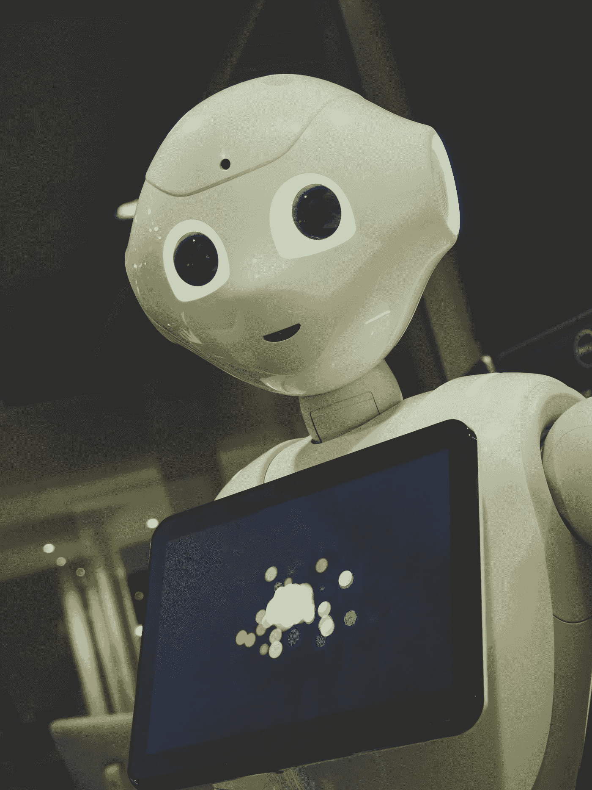

# 顶级 Python GUI 包

> 原文：<https://medium.com/codex/top-python-gui-packages-f2b19cbc62eb?source=collection_archive---------7----------------------->

用户打开应用程序或网站后，首先看到并与之交互的是图形用户界面，简称 GUI。作为计算机软件的一组可视组件，GUI 显示信息并代表用户采取行动的能力。当用户与对象交互时，对象的颜色、大小和可见性可以改变。图标、光标和按钮都是可以在图形用户界面(GUI)中找到的图形元素的例子。

欧文·比尔德在 [Unsplash](https://unsplash.com/s/photos/python-programming?utm_source=unsplash&utm_medium=referral&utm_content=creditCopyText) 上的照片